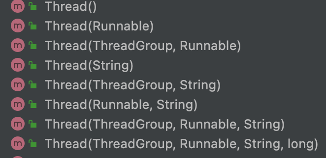
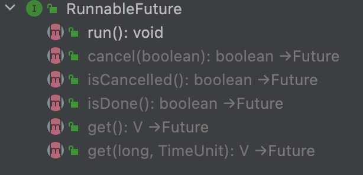
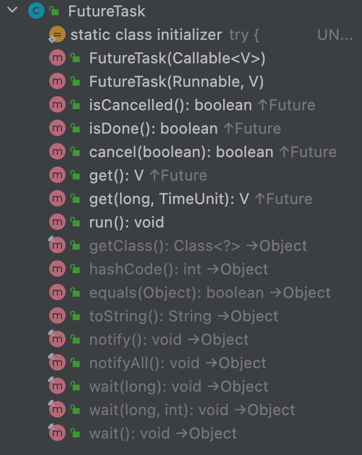
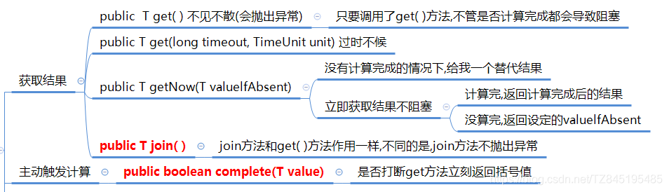
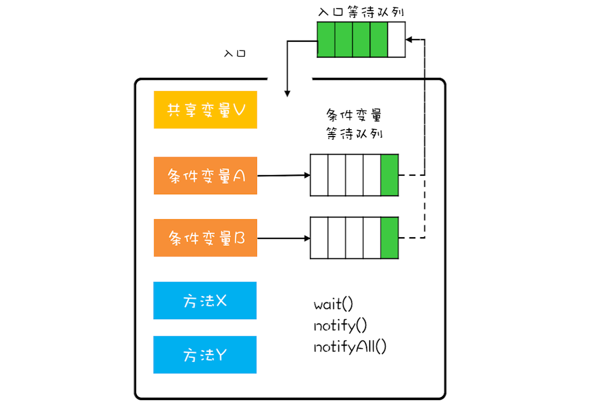
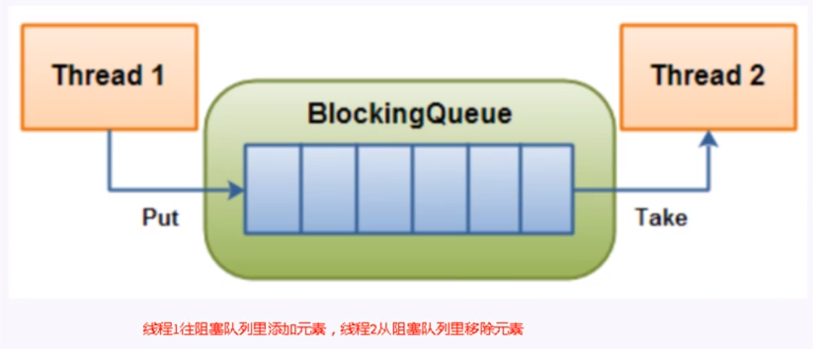
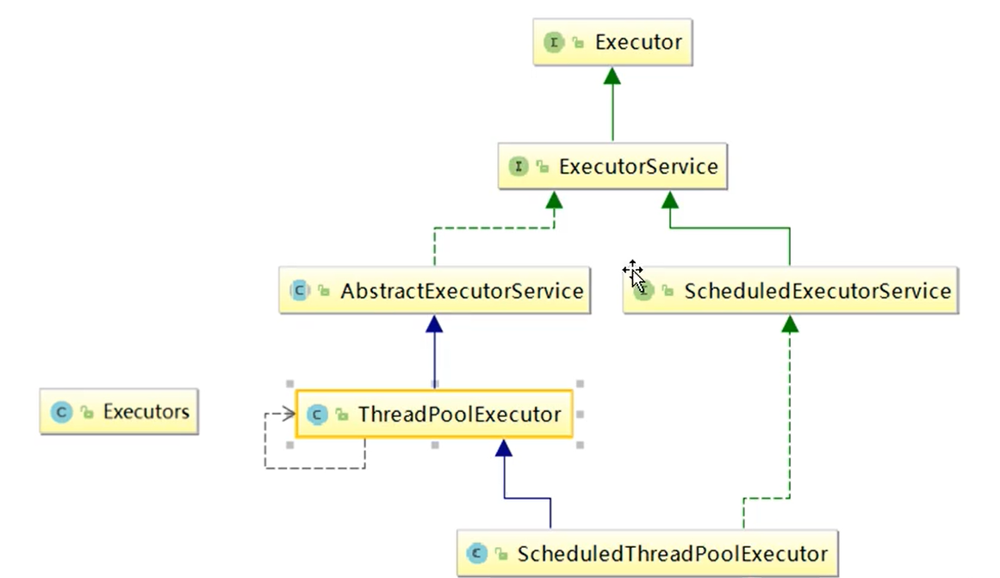
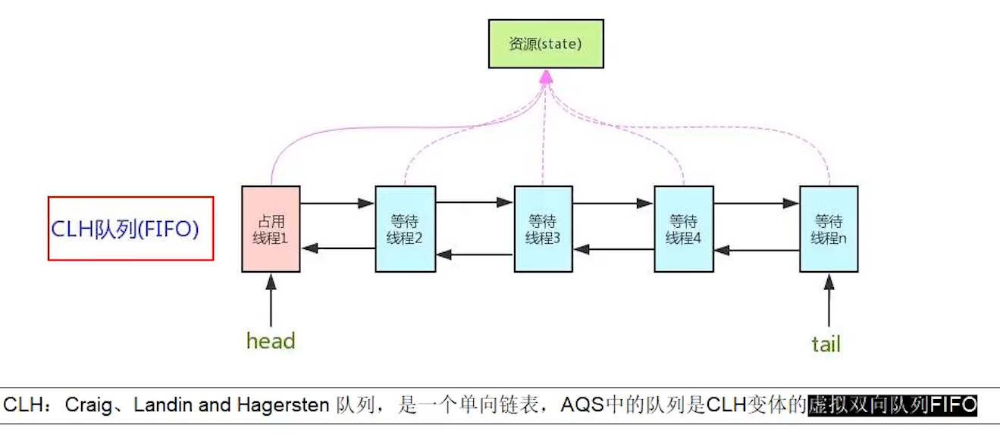
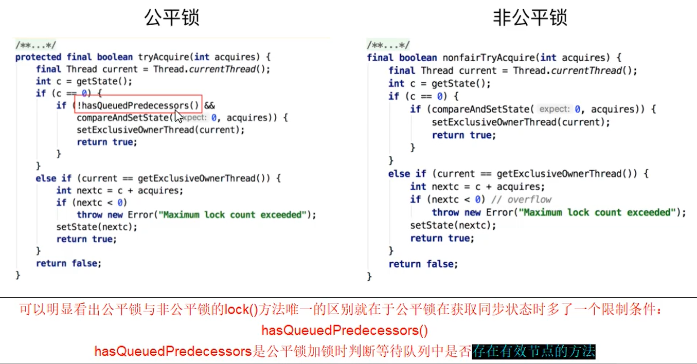

# JUC概述
## 创建线程的四种方式
1. 实现 Runnable 接口；
2. 实现 Callable 接口；
3. 继承 Thread 类(很少使用，单继承原因)。
4. 线程池
实现 Runnable 和 Callable 接口的类只能当做一个可以在线程中运行的任务，不是真正意义上的线程，因此最后还需要通过 Thread 来调用

### Runnable
使用 Runnable 实例再创建一个 Thread 实例，然后调用 Thread 实例的 start() 方法来启动线程。
```java
public class MyRunnable implements Runnable {
    @Override
    public void run() {
        // ...
    }
}
public static void main(String[] args) {
    MyRunnable instance = new MyRunnable();
    Thread thread = new Thread(instance);
    thread.start();
}
```
Thread 类本身也是实现了 Runnable 接口，Thread 类中持有 Runnable 的属性，执行线程 run 方法底层是调用 Runnable的run()：
```java
public class Thread implements Runnable {
    private Runnable target;
    
    public void run() {
        if (target != null) {
          	// 底层调用的是 Runnable 的 run 方法
            target.run();
        }
    }
}
```

### Callable
与 Runnable 相比，Callable 可以有返回值，返回值通过 FutureTask 进行封装，多个FutureTask 进行同样的计算，只会运行一次。
```java
public class MyCallable implements Callable<Integer> {
	//重写线程任务类的 call 方法，这个方法可以直接返回执行的结果
    public Integer call() {
        return 123;
    }
}

public static void main(String[] args) throws ExecutionException, InterruptedException {
    MyCallable mc = new MyCallable();
    //FutureTask 就是 Runnable 对象，因为 Thread 类只能执行 Runnable 实例的任务对象，所以把 Callable 包装成未来任务对象

    FutureTask<Integer> ft = new FutureTask<>(mc);
    Thread thread = new Thread(ft);
    thread.start();
    System.out.println(ft.get());
}
```
缺点：get()的行为取决于任务的状态，如果任务已经完成，那么get会立刻返回结果，否则get将**阻塞直到任务完成**，然后返回结果或者抛出异常。
### Thread 
- 当调用 start() 方法启动一个线程时，虚拟机会将该线程放入就绪队列中等待被调度，当一个线程被调度时会执行该线程的 run() 方法
- 线程的启动**必须**调用 start() 方法，如果线程直接调用 run() 方法，相当于变成了普通类的执行，此时主线程将只有执行该线程
- 建议线程先创建子线程，主线程的任务放在之后，否则主线程（main）永远是先执行完
```java
public class MyThread extends Thread {
    public void run() {
        // ...
    }
}

public static void main(String[] args) {
    MyThread mt = new MyThread();
    mt.start();
}
```
Thread 类 API：


| 方法                                        | 说明                                                         |
| :------------------------------------------ | :----------------------------------------------------------- |
| public void start()                         | 启动一个新线程，Java虚拟机调用此线程的 run 方法              |
| public void run()                           | 线程启动后调用该方法                                         |
| public void setName(String name)            | 给当前线程取名字                                             |
| public void getName()                       | 获取当前线程的名字 线程存在默认名称：子线程是 Thread-索引，主线程是 main |
| public static Thread currentThread()        | 获取当前线程对象，代码在哪个线程中执行                       |
| public static void sleep(long time)         | 让当前线程休眠多少毫秒再继续执行 **Thread.sleep(0)** : 让操作系统立刻重新进行一次 CPU 竞争 |
| public static native void yield()           | 提示线程调度器让出当前线程对 CPU 的使用                      |
| public final int getPriority()              | 返回此线程的优先级                                           |
| public final void setPriority(int priority) | 更改此线程的优先级，常用 1 5 10                              |
| public void interrupt()                     | 中断这个线程，异常处理机制                                   |
| public static boolean interrupted()         | 判断当前线程是否被打断，清除打断标记                         |
| public boolean isInterrupted()              | 判断当前线程是否被打断，不清除打断标记                       |
| public final void join()                    | 等待这个线程结束                                             |
| public final void join(long millis)         | 等待这个线程死亡 millis 毫秒，0 意味着永远等待               |
| public final native boolean isAlive()       | 线程是否存活（还没有运行完毕）                               |
| public final void setDaemon(boolean on)     | 将此线程标记为守护线程或用户线程                             |

### Runnable，Callable与Future关系

Thread只能接受Runnable参数，因此使用有返回值的Callable需要封装。



而Future接口提供了打断线程、获取返回值等功能。


```java
public interface RunnableFuture<V> extends Runnable, Future<V> {
    /**
     * Sets this Future to the result of its computation
     * unless it has been cancelled.
     */
    void run();
}

public class FutureTask<V> implements RunnableFuture<V> {

}
```
FutureTask接口通过构造函数注入，将Future于Callable结合。



## CompletableFuture
CompletableFuture出现原因：
1. `Future.get()`会出现阻塞现象
2. `Future.isDone()`会耗费CPU空转

因此在jdk8出现了CompletableFuture接口，在Future处理完毕**自动调用回调函数**，展现了一种观察者模式的机制。 它可能代表一个明确完成的Future,也有可能代表一个完成阶段(CompletionStage),它支持在计算完成以后触发一些函数或执行某些动作
```java
public class CompletableFuture<T> implements Future<T>, CompletionStage<T> {
    /**
     * Creates a new incomplete CompletableFuture.
     */
     //无参构造
    public CompletableFuture() {
    }
}
```
### CompletableFuture创建
~~默认构造方法不建议使用~~
```java
	//runAsync方法不支持返回值
	public static CompletableFuture<Void> runAsync(Runnable runnable)
	public static CompletableFuture<Void> runAsync(Runnable runnable, Executor executor)
	//supplyAsync可以支持返回值
	public static <U> CompletableFuture<U> supplyAsync(Supplier<U> supplier)
	public static <U> CompletableFuture<U> supplyAsync(Supplier<U> supplier, Executor executor)
```

| 函数式接口名称 | 方法名称 | 参数     | 返回值   |
| -------------- | -------- | -------- | -------- |
| Runnable      | run      | 无参     | 无返回值 |
| Function       | apply    | 1个参数  | 有返回值 |
| Consume     | accept   | 1个参数  | 无返回值 |
| Supplier       | get      | 没有参数 | 有返回值 |
| BiConsume  | accept   | 2个参数  | 无返回值 | 


**使用实例**
```java
public class CompletableFutureTest2 {
    public static void main(String[] args)throws Exception {
        /**
         1.当一个线程依赖另一个线程时,可以使用thenApply()方法来把这两个线程串行化(第二个任务依赖第一个任务的结果)
         public <U> CompletableFuture<U> thenApply(Function<? super T,? extends U> fn)
         2.它可以处理正常的计算结果,或者异常情况
         public CompletableFuture<T> whenComplete(BiConsumer<? super T,? super Throwable> action)
         3.异常的处理操作
         public CompletableFuture<T> exceptionally(Function<Throwable,? extends T> fn)
         */
        CompletableFuture<Integer> future = CompletableFuture.supplyAsync(() -> {
            try { TimeUnit.SECONDS.sleep(2);  } catch (InterruptedException e) {e.printStackTrace();}
            return 1;
        }).thenApply(result -> {
            return result+3;
        // whenComplete虽然得到异常信息,但是无法修改返回数据
        }).whenComplete((v,e)->{
            if(e==null){
                System.out.println(Thread.currentThread().getName()+"\t"+"result = " + v);
            }
        })
        // exceptionally: 同时感知异常,同时返回默认值
        .exceptionally(e->{
            e.printStackTrace();
            return null;
        });
        System.out.println(Thread.currentThread().getName()+"\t"+"over...");
        //主线程不要立即结束,否则CompletableFuture默认使用的线程池会立即关闭,暂停几秒
        try { TimeUnit.SECONDS.sleep(3);  } catch (InterruptedException e) {e.printStackTrace();}
    }
}
```
### API
#### 获得结果和触发计算(get、getNow、join、complete)
1. public T get( ) 不见不散(会抛出异常) 只要调用了get( )方法,不管是否计算完成都会导致阻塞
2. public T get(long timeout, TimeUnit unit) 过时不候
3. public T getNow(T valuelfAbsent):没有计算完成的情况下给一个替代结果，计算完返回计算完成后的结果、没算完,返回设定的valuelfAbsent。**立刻获取结果不阻塞**
4. public T join( ):join方法和get( )方法作用一样,不同的是,join方法不抛出异常
5. public boolean complete(T value ):若计算完成则正常返回，否则打断计算并返回value。


#### 对计算结果进行处理(thenApply、handle)
1. `public <U> CompletableFuture<U> thenApply`
计算结果存在依赖关系,这两个线程串行化
由于存在依赖关系(当前步错,不走下一步),当前步骤有异常的话就叫停
2. `public <U> CompletableFuture<U> handle(BiFunction<? super T, Throwable, ? extends U> fn)`
有异常也可以往下一步走,根据带的异常参数可以进一步处理
3. `whenComplete`:是执行当前任务的线程执行继续执行whenComplete的任务
4. `whenCompleteAsync`:是执行把whenCompleteAsync这个任务继续提交给线程池来进行执行

#### 对计算结果进行消费(thenRun、thenAccept、thenApply)
1. `thenRun(Runnable runnable)`
任务A执行完执行B,并且B不需要A的结果
2. `CompletableFuture<Void> thenAccept(Consumer<? super T> action)`
任务A执行完成执行B,B需要A的结果,但是任务B无返回值
3. `public <U> CompletableFuture<U> thenApply(Function<? super T,? extends U> fn)`
任务A执行完成执行B,B需要A的结果,同时任务B有返回值
4. 线程串行化
带了Async的方法表示的是:会重新在线程池中启动一个线程来执行任务
```java
public <U> CompletableFuture<U> thenApply(Function<? super T,? extends U> fn)
public <U> CompletableFuture<U> thenApplyAsync(Function<? super T,? extends U> fn)
public <U> CompletableFuture<U> thenApplyAsync
(Function<? super T,? extends U> fn, Executor executor)

public CompletableFuture<Void> thenAccept(Consumer<? super T> action)
public CompletableFuture<Void> thenAcceptAsync(Consumer<? super T> action)
public CompletableFuture<Void> thenAcceptAsync(Consumer<? super T> action,
                                                   Executor executor)

public CompletableFuture<Void> thenRun(Runnable action)
public CompletableFuture<Void> thenRunAsync(Runnable action)
public CompletableFuture<Void> thenRunAsync(Runnable action,Executor executor)         
```
#### 对计算速度进行选用(applyToEither、acceptEither、runAfterEither)
1. applyToEither:两个任务有一个执行完成,获取它的返回值,处理任务并有新的返回值,谁快就用谁的结果
2. acceptEither:两个任务有一个执行完成,获取它的返回值,处理任务,没有新的返回值
3. runAfterEither:两个任务有一个执行完成,不需要获取 future 的结果,处理任务,也没有返回值

```java
public <U> CompletableFuture<U> applyToEither(
        CompletionStage<? extends T> other, Function<? super T, U> fn)
public <U> CompletableFuture<U> applyToEitherAsync(
        CompletionStage<? extends T> other, Function<? super T, U> fn)
public <U> CompletableFuture<U> applyToEitherAsync(
        CompletionStage<? extends T> other, Function<? super T, U> fn,
        Executor executor)

public CompletableFuture<Void> acceptEither(
        CompletionStage<? extends T> other, Consumer<? super T> action)
public CompletableFuture<Void> acceptEitherAsync(
    CompletionStage<? extends T> other, Consumer<? super T> action)
public CompletableFuture<Void> acceptEitherAsync(
    CompletionStage<? extends T> other, Consumer<? super T> action,
    Executor executor)

public CompletableFuture<Void> runAfterEither(CompletionStage<?> other,Runnable action)
                                                  
public CompletableFuture<Void> runAfterEitherAsync(CompletionStage<?> other,Runnable action)   

public CompletableFuture<Void> runAfterEitherAsync(CompletionStage<?> other,
                                                       Runnable action,
                                                       Executor executor)

```
#### 对计算结果进行合并(thenCombine、thenAcceptBoth、runAfterBoth)
1. `public <U,V> CompletableFuture<V> thenCombine(CompletionStage<? extends U> other,BiFunction<? super T,? super U,? extends V> fn)`
两个CompletionStage任务都完成后,最终把两个任务的结果一起交给thenCombine来处理
先完成的先等着,等待其他分支任务

## 进程和线程
### 死锁
```java
class resourse implements Runnable {
    private Object lockA;
    private Object lockB;

    public resourse(Object lockA, Object lockB) {
        this.lockA = lockA;
        this.lockB = lockB;
    }

    @Override
    public  void run() {
        synchronized (lockA) {
            System.out.println(Thread.currentThread().getName() + "持有"+lockA+"尝试"+lockB);
            try {
                TimeUnit.SECONDS.sleep(1);
            } catch (InterruptedException e) {
                e.printStackTrace();
            }
            synchronized (lockB) {
                System.out.println(Thread.currentThread().getName() + "持有"+lockB+"尝试"+lockA);
            }
        }
    }
}

public class DeadLock {
    public static void main(String[] args) {
        new Thread(new resourse("A", "B"), "线程A").start();
        new Thread(new resourse("B", "A"), "线程B").start();
    }
}
```
#### 死锁条件
多个线程同时被阻塞，它们中的一个或者全部都在等待某个资源被释放。由于线程被无限期地阻塞，因此程序不可能正常终止。
1. 互斥条件：该资源任意一个时刻只由一个线程占用。
2. 请求与保持条件：一个进程因请求资源而阻塞时，对已获得的资源保持不放。
3. 不剥夺条件:线程已获得的资源在未使用完之前不能被其他线程强行剥夺，只有自己使用完毕后才释放资源。
4. 循环等待条件:若干进程之间形成一种头尾相接的循环等待资源关系。

#### 预防死锁
1. 破坏请求与保持条件 ：一次性申请所有的资源。
2. 破坏不剥夺条件 ：占用部分资源的线程进一步申请其他资源时，如果申请不到，可以主动释放它占有的资源。
3. 破坏循环等待条件 ：靠按序申请资源来预防。按某一顺序申请资源，释放资源则反序释放。破坏循环等待条件。

### 管程
Monitor是一种同步机制，为了保证只有一个线程能访问到被保护的资源。JVM中同步是基于进入和退出监视器对象（ Monitor 管程对象）来实现的，每个对象实例都有一个Monitor对象。管程内部可以有多个条件变量，如果进入管程的线程发现条件不满足便会进入到对应的条件变量等待队列中。

Monitor对象会和Java对象一起创建和销毁，底层由C++实现。管程发展到现在共出现过三种不同的模型：Hasen 模型、Hoare 模型和 MESA 模型。Java 中管程的实现使用的就是MESA 模型，synchronized使用管程模型的方法，在代码编译的时候会自动封装起共享变量并提供一个线程安全的方法来访问，如下图所示。不过Java中synchronized使用的管程只有一个条件变量，Lock 接口下可以创建多个条件变量。




### 进程
进程是程序的一次执行过程，是**系统进行资源分配的基本单位**，因此进程是动态的。系统运行一个程序即是一个进程从创建，运行到消亡的过程。

在 Java 中，当启动 main 函数时其实就是启动了一个 JVM 的进程，而 main 函数所在的线程就是这个进程中的一个线程，也称主线程。

### 线程
线程与进程相似，但线程是一个比进程更小的执行单位。一个进程在其执行的过程中可以产生多个线程。与进程不同的是同类的多个线程**共享进程的堆和方法区资源**，但每个线程有自己的程序计数器、虚拟机栈和本地方法栈，所以系统在产生一个线程，或是在各个线程之间作切换工作时，**负担要比进程小得多**，也正因为如此，线程也被称为轻量级进程。

线程的作用：使多道程序更好的并发执行，提高资源利用率和系统吞吐量，增强操作系统的并发性能

#### 线程分类

1. 用户线程
   开发者自定义使用的线程
   主线程结束，用户线程还在运行，jvm存活
2. 守护线程
   系统使用的线程，如垃圾回收

用户线程和主线程都结 束，只剩守护线程运行，jvm结束

#### 线程的不同状态

线程在运行的生命周期中的指定时刻只可能处于下面 6 种不同状态的其中一个状态


1. NEW(新建)
   表示线程被创建出来还没真正启动的状态，可以认为它是个 Java 内部状态。

2. RUNABLE(准备就绪)
   表示该线程已经在 JVM 中执行，当然由于执行需要计算资源，它可能是正在运行，也可能还在等待系统分配给它 CPU 片段，在就绪队列里面排队。

3. BLOCKED(阻塞)
   阻塞状态,表明线程阻塞于锁.要结束该状态从而进入 RUNABLE 需要其他线程释放锁

4. WAITING(不见不散)
   表示正在等待其他线程采取某些操作。一个常见的场景是类似生产者消费者模式，发现任务条件尚未满足，就让当前消费者线程等待（wait），另外的生产者线程去准备任务数据，然后通过类似 notify 等动作，通知消费线程可以继续工作了。
   阻塞和等待的区别在于，阻塞是被动的，它是在等待获取 monitor lock。而等待是主动的，通过调用 Object.wait() 等方法进入

|                  进入方法                  |               退出方法               |
| :----------------------------------------: | :----------------------------------: |
| 没有设置 Timeout 参数的 Object.wait() 方法 | Object.notify() / Object.notifyAll() |
| 没有设置 Timeout 参数的 Thread.join() 方法 |         被调用的线程执行完毕         |
|          LockSupport.park() 方法           |      LockSupport.unpark(Thread)      |

5. TIMED_WAITING(过期不候)
   超时等待状态,无需等待其它线程显式地唤醒，在一定时间之后会被系统自动唤醒

|                           进入方法                           |                    退出方法                     |
| :----------------------------------------------------------: | :---------------------------------------------: |
|                     Thread.sleep() 方法                      |                    时间结束                     |
|           设置了 Timeout 参数的 Object.wait() 方法           | 时间结束 / Object.notify() / Object.notifyAll() |
|           设置了 Timeout 参数的 Thread.join() 方法           |         时间结束 / 被调用的线程执行完毕         |
|                 LockSupport.parkNanos() 方法                 |           LockSupport.unpark(Thread)            |
|                 LockSupport.parkUntil() 方法                 |           LockSupport.unpark(Thread)            |
| 调用 Thread.sleep() 方法使线程进入超时等待状态时，常常用“使一个线程睡眠”进行描述。调用 Object.wait() 方法使线程进入超时等待或者无限期等待时，常常用“挂起一个线程”进行描述。睡眠和挂起是用来描述行为，而阻塞和等待用来描述状态 |                                                 |

6. TERMINATED(终结)
   不管是意外退出还是正常执行结束，线程已经完成使命，终止运行

### 进程和线程的关系


线程是进程划分成的更小的运行单位。线程和进程最大的不同在于基本上各进程是独立的，而各线程则不一定，因为同一进程中的线程极有可能会相互影响。线程执行开销小，但不利于资源的管理和保护；而进程正相反。

### 线程原理
Java Virtual Machine Stacks（Java 虚拟机栈）：每个线程启动后，虚拟机就会为其分配一块栈内存，不同的线程拥有不同的虚拟机栈
- 每个栈由多个栈帧（Frame）组成，对应着每次方法调用时所占用的内存
- 每个线程只能有一个活动栈帧，对应着当前正在执行的那个方法

线程上下文切换（Thread Context Switch）：一些原因导致 CPU 不再执行当前线程，转而执行另一个线程
- 线程的 CPU 时间片用完
- 垃圾回收
- 有更高优先级的线程需要运行
- 线程自己调用了 sleep、yield、wait、join、park 等方法
- 程序计数器（Program Counter Register）：记住下一条 JVM 指令的执行地址，是线程私有的

当 Context Switch 发生时，需要由操作系统保存当前线程的状态（PCB 中），并恢复另一个线程的状态，包括程序计数器、虚拟机栈中每个栈帧的信息，如局部变量、操作数栈、返回地址等

JVM 规范并没有限定线程模型，以 HotSopot 为例：

Java 的线程是内核级线程（1:1 线程模型），每个 Java 线程都映射到一个操作系统原生线程，需要消耗一定的内核资源（堆栈）
**线程的调度是在内核态运行的，而线程中的代码是在用户态运行**，所以线程切换（状态改变）会导致用户与内核态转换进行系统调用，这是非常消耗性能
Java 中 main 方法启动的是一个进程也是一个主线程，main 方法里面的其他线程均为子线程，main 线程是这些线程的父线程

### 并行和并发
- 并发： 是在同一实体上的多个事件，一台处理器同时处理多个任务，同一时刻只有一个事件在发生。多个线程对一个点（秒杀商品）
- 并行：是在不同实体上的多个事件，多台处理器处理多个任务，同一时刻多个事件一起发生

# 线程间通信
## 线程中断机制
一个线程不应该由其他线程来强制中断或停止，**而应该由自己决定自己的命运**。因此，Thread.stop()等方法已经被废弃。

Java中没有办法立刻停止一个线程，然而停止线程却又非常重要，如取消一个耗时操作。因此Java提供了一种用于停止线程的协商机制-中断，**即中断标识协商机制**。

中断只是一种协商机制，中断的具体过程需要自己编写程序实现，若要中断一个线程，需要手动调用interrupt方法，该方法仅仅将线程的中断标识设为true。**中断已经停止的线程不会产生任何影响**
1. `void interrupt( )`
Thread提供了interrupt()，每个线程都有一个布尔类型的属性用来表示线程的中断状态，当中断线程时将设置这个状态。
2. `boolean isInterrupted( )`
判断当前线程是否被中断(通过检查中断标识位)
3. `static boolean interrupted( )`
返回当前线程的中断状态 并**将当前线程的中断状态设为false**

如果线程处于被阻塞状态(例如处于sleep、wait、join等状态),在别的线程中调用当前线程对象的interrupt方法,那么抛出一个InterruptedException异常并且**中断标识也被清空**置为false
## LockSupport
1. 通过park()和unpark(thread)方法来实现阻塞和唤醒线程的操作,解决了必须获取锁再阻塞的痛点
2. LockSupport是一个线程阻塞工具类,所有的方法都是静态方法,可以让线程在任意位置阻塞,阻塞之后也有对应的唤醒方法。归根结底,LockSupport调用的Unsafe中的native代码
3. LockSupport类使用了一种名为Permit(许可)的概念来做到阻塞和唤醒线程的功能,每个线程都有一个许可(permit),permit只有两个值1和零,默认是零

## yield()
Thread.yield()方法作用是：暂停当前正在执行的线程对象，并执行其他线程。

yield()应该做的是让当前运行线程回到可运行状态，以允许具有相同优先级的其他线程获得运行机会。因此，使用yield()的目的是让相同优先级的线程之间能适当的轮转执行。但是，实际中无法保证yield()达到让步目的，因为让步的线程还有可能被线程调度程序再次选中。

**结论**：yield()从未导致线程转到等待/睡眠/阻塞状态。在大多数情况下，yield()将导致线程从运行状态转到可运行状态，但有可能没有效果。**会放弃 CPU 资源，锁资源不会释放**

## join()
在线程中调用另一个线程的 join() 方法，会将当前线程挂起，而不是忙等待，直到目标线程结束

对于以下代码，虽然 b 线程先启动，但是因为在 b 线程中调用了 a 线程的 join() 方法，b 线程会等待 a 线程结束才继续执行，因此最后能够保证 a 线程的输出先于 b 线程的输出

```java
public class JoinExample {

    private class A extends Thread {
        @Override
        public void run() {
            System.out.println("A");
        }
    }

    private class B extends Thread {

        private A a;

        B(A a) {
            this.a = a;
        }

        @Override
        public void run() {
            try {
                a.join();
            } catch (InterruptedException e) {
                e.printStackTrace();
            }
            System.out.println("B");
        }
    }

    public void test() {
        A a = new A();
        B b = new B(a);
        b.start();
        a.start();
    }
}
```

## wait() notify() notifyAll()

调用 wait() 使得线程等待某个条件满足，线程在等待时会被挂起，当其他线程的运行使得这个条件满足时，其它线程会调用 notify() 或者 notifyAll() 来唤醒挂起的线程(虚假唤醒问题,在哪里等待在哪里唤醒,因此wait需要放在循环中)。

它们都属于 Object 的一部分，而不属于 Thread。

只能用在同步方法或者同步控制块中使用，否则会在运行时抛出 IllegalMonitorStateException。

使用 wait() 挂起期间，线程会释放锁。这是因为，如果没有释放锁，那么其它线程就无法进入对象的同步方法或者同步控制块中，那么就无法执行 notify() 或者 notifyAll() 来唤醒挂起的线程，造成死锁。

```java
public class WaitNotifyExample {

    public synchronized void before() {
        System.out.println("before");
        notifyAll();
    }

    public synchronized void after() {
        try {
            wait();
        } catch (InterruptedException e) {
            e.printStackTrace();
        }
        System.out.println("after");
    }
}
```

```java
public static void main(String[] args) {
    ExecutorService executorService = Executors.newCachedThreadPool();
    WaitNotifyExample example = new WaitNotifyExample();
    executorService.execute(() -> example.after());
    executorService.execute(() -> example.before());
}
```

```java
before
after
```

## await()  signalAll()
只能用在同步方法或者同步控制块中使用，否则会在运行时抛出 IllegalMonitorStateException。
```java
    private int num = 0;
    private Lock lock=new ReentrantLock();
    private Condition condition = lock.newCondition();

    lock.lock();
    while (num != 0) {
            condition.await();
    }
    num++;
    condition.signalAll();
    lock.unlock();
```

await(), signal()，signalAll() 的功能和 wait(), notify(), notifyAll() 基本相同， 区别是，基于 Condition 的 await(), signal(), signalAll() 使得我们可以在同一个锁的代码块内，优雅地实现基于多个条件的线程间挂起与唤醒操作

## wait() 和 sleep() 的区别

- wait() 是 Object 的方法，而 sleep() 是 Thread 的静态方法；
- wait() 会释放锁，sleep() 不会释放锁
- 可以被interruped方法中断，这时 sleep 方法会抛出 InterruptedException

# 同步工具类

## 减少计数CountDownLatch

`CountDownLatch`类可以设置一个计数器,然后通过`countDown()`方法来进行减1的操作,使用`await()`方法等待计数器变为0，如果计数器的值非0，那么`await()`会一直阻塞，或者等待中的线程中断或等待超时

- `CountDownLatch`主要有两个方法,当一个或多个线程调用`await()`方法时,这些线程会阻塞
- 其他线程调用`countDown()`方法会将计数器减1(调用`countDown()`方法的线程不会阻塞)
- 当计数器的值变为0时,因`await()`方法阻塞的线程会被唤醒,继续执行

## 循环栅栏CycliBarrier

`CycliBarrier`构造方法的第一个参数是目标障碍数,每次执行`CycliBarrier`障碍数会加一,如果达到了目标障碍数,才会执行`cycliBarrier.await()`之后的语句

让一组线程到达一个屏障时被阻塞，直到最后一个线程到达屏障时，所有被阻塞的线程才能继续工作，线程通过`cycliBarrier.await()`方法

## 信号量Semaphore

信号量主要有两个目的：一个是用于多个共享资源的互斥使用，另一个是用于并发线程数的控制

Semaphore构造方法的参数是目标信号灯个数,每次执行`acquire()`会申请一个信号灯,`release()`会释放一个信号灯,申请不到灯就一直阻塞线程

# 线程安全的实现

> 当多个线程同时访问一个对象时，如果不用考虑这些线程在运行环境下的调度和交替执行，也不需要进行额外的同步，或者在调用方进行任何其他的协调操作，调用这个对象的行为都可以获得正确的结果，那么就称这个对象时线程安全的。
-- Java并发编程实战

管程（锁）：一种同步机制，保证同一时间，只有一个线程访问被保护的资源

**jvm同步基于进入和退出，使用管程对象实现**

## 互斥同步(悲观)

除非需要使用 ReentrantLock 的高级功能，比如可定时的、可轮询的、可中断的、公平队列，否则优先使用 synchronized。这是因为 synchronized 是 JVM 实现的一种锁机制，JVM 原生地支持它，而 ReentrantLock 不是所有的 JDK 版本都支持。并且使用 synchronized 不用担心没有释放锁而导致死锁问题，因为 JVM 会确保锁的释放。

### synchronized(JVM 实现)

synchronized关键字经过编译后，会在同步块的前后分别形成monitorenter和monitorexit两个字节码指令，这两个指令都需要一个引用类型的参数来指明要锁定和解锁的对象。
被synchronized修饰的同步块在持有锁的线程执行完毕并释放锁之前，会无条件阻塞后边其他线程的进入。

synchronized 修饰的方法**不具备继承性**，所以子类是线程不安全的，如果子类的方法也被 synchronized 修饰，两个锁对象其实是一把锁，而且是子类对象作为锁

#### 1. 同步代码块

```java
    public void func() {
        synchronized (this) {                
		// ...        
        }
    }
```
指定加锁对象，对给定对象/类加锁。`synchronized(this|object)`表示进入同步代码库前要获得给定对象的锁。`synchronized(类.class)`表示进入同步代码前要获得当前class的锁

#### 2. 同步一个方法

```java
    public synchronized void func() {
        // ...
    }
```

作用于同一个对象

#### 3. 同步一个类

```java
    public void func() {
        synchronized (SynchronizedExample.class) {
            // ...
        }
    }
```

作用于整个类，也就是说两个线程调用同一个类的不同对象上的这种同步语句，也会进行同步。

#### 4. 同步一个静态方法

```java
    public synchronized static void fun() {
        // ...
    }
```

作用于整个类。但是对于其他线程调用非静态方法不会产生影响，因为访问静态 synchronized方法占用的锁是当前类的锁，而访问非静态synchronized方法占用的锁是当前实例对象锁

### Lock接口(JDK实现)

Lock锁相比`synchronized`增加了一些高级功能，可以允许更灵活的结构，主要有：等待可中断、可实现公平锁、锁可以绑定多个条件

ReentrantLock 是 java.util.concurrent（J.U.C）包中的锁。

```java
public class LockExample {
    private Lock lock = new ReentrantLock();

    public void func() {
        lock.lock();
        try {
            for (int i = 0; i < 10; i++) {
                System.out.print(i + " ");
            }
        } finally {
            lock.unlock(); // 确保释放锁，从而避免发生死锁。                
        }
    }
}
```

### 对比

1. 两者都是可重入锁（递归锁）
   **可重入锁** 指的是同一线程外层函数获得锁之后，再进入该线程的内层方法会自动获取锁（前提，锁对象得是同一个对象），不会因为之前已经获取过还没释放而阻塞。也就是说，**线程可以进入任何一个它已经拥有的锁所同步着的代码块**。同一个线程每次获取锁，锁的计数器都自增 1，所以要等到锁的计数器下降为 0 时才能释放锁。如果加锁次数和释放次数不一样，第二个线程始终无法获取到锁，导致一直再等待

   可重入锁最大的最用就是避免死锁

2. 等待可中断
   当持有锁的线程长期不释放锁的时候，正在等待的线程可以选择放弃等待，改为处理其他事情。可中断特性对处理执行时间非常长的同步块很有帮助。

   使用synchronized 时,等待的线程会一直等待下去,不能够响应中断，除非抛出异常或正常运行完成

   ReentrantLock 可中断：
   1. 设置超时方法
   2. 调用interrupt()方法可中断

3. 公平锁
   公平锁是指多个线程在等待同一个锁时，必须按照申请锁的时间顺序来依次获得锁。
   synchronized 中的锁是非公平的，ReentrantLock 默认情况下也是非公平的，但是也可以是公平的

   非公平锁的优点在于吞吐量比公平锁大

4. 原始构成
   Lock是一个接口，而synchronized是关键字。Lock在发生异常时，如果没主动`unlock()`去释放锁，则很可能造成死锁现象；synchronized是内置实现，jvm原生支持，由jvm保证不会发生死锁现象，只有在同步代码块中才能调用wait/notify方法。

5. 通过Lock可以知道有没有成功获取到锁,而synchronized无法办到。

6. 锁绑定多个条件
   synchronized不能精确唤醒，与wait()和notify()/notifyAll()方法相结合可以实现一个等待/通知机制

   ReentrantLock可以和多个条件关联，只需多次调用newCondition()方法即可，Condition实例的signalAll()方法只会唤醒注册在该Condition实例中的所有等待线程。如ArrayBlockingQueue 


## 非阻塞同步(乐观)

互斥同步最主要的问题就是线程阻塞和唤醒所带来的性能问题，因此这种同步也称为阻塞同步。

**互斥同步**属于一种**悲观**的并发策略，总是认为只要不去做正确的同步措施，那就肯定会出现问题。无论共享数据是否真的会出现竞争，它都要进行加锁

**乐观并发策略**：先进行操作，如果没有其它线程争用共享数据，那操作就成功了，否则采取补偿措施（不断地重试，直到成功为止）。这种乐观的并发策略的许多实现都不需要将线程阻塞，因此这种同步操作称为**非阻塞同步**

> 参考JVM中关于CAS部分

## 无同步方案
同步与线程安全没有必要联系，同步只是保证存在共享数据争用时正确性的手段，若能让一个方法本来就不设计共享数据，那么它自然就是安全的。

线程本地存储(ThreadLocal)：把共享数据的可见范围限制在同一个线程之内。在Java中，如果一个变量要被多线程访问，可以使用volatile关键字声明；如果一个变量只要被一个线程独享，可以通过ThreadLocal来实现线程本地存储的功能。

每个线程的Thread对象中都有一个ThreadLocalMap对象，这个对象存储了一组以ThreadLocalHashCode为键，以本地线程变量为值的K-V键值对，使用每个ThreadLocal对象的hashcode值就能找回对应的本地线程变量。

# 阻塞队列

通过一个共享的队列,可以使得数据由队列的一段输入,从另一端输出。阻塞队列内部包含了足够的内部同步机制，可以安全的入队出队



当队列是空的,从队列中获取元素的操作将会被阻塞

当队列是满的,从队列中添加元素的操作将会被阻塞

试图从空的队列中获取元素的线程将会被阻塞,直到其他线程往空队列中插入新的元素

试图向已满的队列中添加元素的线程将会被阻塞,直到其他线程从队列中移除一个或多个元素,使队列变得空闲起来并后续新增

## 分类

1. **ArrayBlockingQueue**
基于数组的阻塞队列,除了维护一个定长数组外,ArrayBlockingQueue内部还保存两个整形变量,分别表示队列的头部和尾部，FIFO。使用Lock的条件变量绑定多个条件，将 wait、notify、notifyAll 等操作转化为相应的对象
```java
/** Condition for waiting takes */
private final Condition notEmpty;
 
/** Condition for waiting puts */
private final Condition notFull;
 
public ArrayBlockingQueue(int capacity, boolean fair) {
	if (capacity <= 0)
    	throw new IllegalArgumentException();
	this.items = new Object[capacity];
	lock = new ReentrantLock(fair);
	notEmpty = lock.newCondition();
	notFull =  lock.newCondition();
}

//	使用条件 notEmpty 完成take阻塞操作
public E take() throws InterruptedException {
	final ReentrantLock lock = this.lock;
	lock.lockInterruptibly();
	try {
    	while (count == 0)
        	notEmpty.await();
    	return dequeue();
	} finally {
    	lock.unlock();
	}
}
```

2. **LinkedBlockingQueue**
基于链表的阻塞队列,由链表结构组成的有界(大小默认值为integer.MAX_VALUE)阻塞队列，慎用，FIFO

3. DelayQueue
使用优先级队列实现的延迟无界阻塞队列

4. PriorityBlockingQueue
支持优先级排序的无界阻塞队列

5. **SynchronousQueue**
不存储元素的阻塞队列，即单个元素的队列。每个put操作必须等待一个take操作，否则不能继续添加元素，`Executors.newCachedThreadPool()`根据需要创建新的线程

6. LinkedTransferQueue
由链表组从的无界阻塞队列

7. LinkedBlockingDeque
由链表组成的**双向**阻塞队列

## 常用方法

| 方法类型 | 抛出异常  |  特殊值  |  阻塞  |        超时        |
| :------: | :-------: | :------: | :----: | :----------------: |
|   插入   |  add(e)   | offer(e) | put(e) | offer(e,time,unit) |
|   移除   | remove()  |  poll()  | take() |  poll(time,unit)   |
|   检查   | element() |  peek()  | 不可用 |       不可用       |

# 线程池


优点：
1. 降低资源消耗
2. 提高响应速度
3. 提高线程的可管理性

## 创建线程池
《阿里巴巴Java开发手册》中强制线程池不允许使用`Executors`去创建，而是通过`ThreadPoolExecutor`的方式，这样的处理方式可以更加明确线程池的运行规则，规避资源耗尽的风险

### 1. 通过构造方法实现


### 2. 通过工具类`Executors`来实现

工具类中的方法内部实际调用了ThreadPoolExecutor的构造方法

- FixedThreadPool ： 该方法返回一个固定线程数量的线程池。该线程池中的线程数量始终不变。当有一个新的任务提交时，线程池中若有空闲线程，则立即执行。若没有，则新的任务会被暂存在一个任务队列中，待有线程空闲时，便处理在任务队列中的任务。
- SingleThreadExecutor： 方法返回一个只有一个线程的线程池。若多余一个任务被提交到该线程池，任务会被保存在一个任务队列中，待线程空闲，按先入先出的顺序执行队列中的任务。
- CachedThreadPool： 该方法返回一个可根据实际情况调整线程数量的线程池。线程池的线程数量不确定，但若有空闲线程可以复用，则会优先使用可复用的线程。若所有线程均在工作，又有新的任务提交，则会创建新的线程处理任务，线程池的规模不受限制。所有线程在当前任务执行完毕后，将返回线程池进行复用。

shutdown()方法将执行平稳的关闭过程：不再接受新的任务，同时等待已提交的任务执行完成——包括那些还未开始执行的任务。
## ThreadPoolExecutor类分析

```java
/**
 * 用给定的初始参数创建一个新的ThreadPoolExecutor。
 */
public ThreadPoolExecutor(int corePoolSize,int maximumPoolSize,
        long keepAliveTime,TimeUnit unit,BlockingQueue<Runnable> workQueue,ThreadFactory
        threadFactory,RejectedExecutionHandler handler){
        if(corePoolSize< 0||maximumPoolSize<=0||maximumPoolSize<corePoolSize ||keepAliveTime< 0)
        throw new IllegalArgumentException();
        if(workQueue==null||threadFactory==null||handler==null)throw new NullPointerException();
        this.corePoolSize=corePoolSize;
        this.maximumPoolSize=maximumPoolSize;
        this.workQueue=workQueue;
        this.keepAliveTime=unit.toNanos(keepAliveTime);
        this.threadFactory=threadFactory;
        this.handler=handler;
        }
```

### 构造函数参数分析

- **corePoolSize**: 常驻线程数量(核心线程数)
- **maximumPoolSize**: 当队列中存放的任务达到队列容量的时候，当前可以同时运行的线程数量变为**最大线程数量**。
- **workQueue**: 当新任务来的时候会先判断当前运行的线程数量是否达到核心线程数，如果达到的话，新任务就会被存放在队列中。
- keepAliveTime:当线程池中的线程数量大于 corePoolSize 的时候，如果这时没有新的任务提交，核心线程外的线程不会立即销毁，而是会等待，直到等待的时间超过了 keepAliveTime才会被回收销毁；
- unit : keepAliveTime 参数的时间单位。
- threadFactory :表示生成线程池中工作线程的线程工厂，用于创建线程一般用默认的即可。
	- 默认的线程工厂方法将创建一个新的、非守护的线程，并且不包含特殊的配置信息。通过指定一个线程工厂方法，可以定制线程池的配置信息。
- handler:拒绝策略

### 拒绝策略

当前同时运行的线程数量达到最大线程数量并且队列也已经被放满了任务,则会按照策略执行

- ThreadPoolExecutor.AbortPolicy(默认)： 抛出 RejectedExecutionException来拒绝新任务的处理。
- ThreadPoolExecutor.CallerRunsPolicy： “调用者运行”调节机制，该策略既不会抛弃任务，也不会抛出异常，而是将任务回退到调用者，如果执行程序已关闭，则会丢弃该任务。因此这种策略会降低对于新任务提交速度，影响程序的整体性能。
- ThreadPoolExecutor.DiscardPolicy： 不处理新任务，直接丢弃掉。
- ThreadPoolExecutor.DiscardOldestPolicy： 此策略将丢弃等待最久的任务请求,然后把当前任务加入队列。

> 如果在代码中模拟了10个任务，配置的核心线程数为5、等待队列容量为100，> > 所以每次只可能存在5个任务同时执行，剩下的5个任务会被放到等待队列中去。> 当前的5个任务中如果有任务被执行完了，线程池就会去拿新的任务执行。

## execute方法和submit方法

```java
//execute方法，无返回值
void execute(Runnable command);
//submit方法
<T> Future<T> submit(Callable<T> task);
<T> Future<T> submit(Runnable task, T result);
Future<?> submit(Runnable task);
```

`execute()` 提交没有返回值，也就不能判断是否执行成功。

`submit()`会返回一个`Future`对象，通过future的get方法来获取返回值，不过get方法会阻塞住直到任务完成。

# Fork/Join

Fork/Join可以将一个大的任务拆分成多个子任务进行并行处理,最后将子任务结果合并成最后的计算结果,并进行输出


# AQS
> Java并发编程实战P253

## 前置:LockSupport
用于创建锁和其他同步类的基本线程阻塞原语,LockSupport类使用了一种名为Permit(许可)的概念来做到**阻塞和唤醒线程**,每个线程都有一个Permit,Permit只有1和0,默认是0

可以把Permit看成是一种(0,1)信号量,但与信号量不同的是,Permit的累加上限是1.

唤醒线程:
1. 使用Object中的wait()方法让线程等待,使用Object中的notify()方法唤醒线程
	1. 必须在同步代码块中使用wait()方法和notify()方法,否则会出现异常
	2. 将notify()方法放在wait()前面,程序无法执行,无法唤醒
2. 使用JUC包中Condition的await()方法让现场等待,使用signal()方法唤醒线程
	1. 必须在同步代码块中使用,否则会出现异常
	2. signal()方法放在await()方法前面,程序无法执行,无法唤醒
3. LockSupport的park()和unpark()作用分别是阻塞线程和解除阻塞线程

### 常用方法
1. park()/park(Object blocker)
permit默认是0,所以一开始调用park()方法,当前线程就会阻塞,直到别的线程将当前线程的permit设置为1时,park()方法会被唤醒,然后会将permit再次设置为0并返回
2. unpark(Thread thread)
调用unpark(thread)方法后,就会将thread线程的permit设置成1(多次调用不会累加,最大为1)会自动唤醒thread线程,即之前阻塞中的park()方法会立即返回

```java
public static void park() {
    UNSAFE.park(false, 0L);
}

public static void unpark(Thread thread) {
    if (thread != null)
    UNSAFE.unpark(thread);
}
```
LockSupport是一个线程阻塞工具类,所有的方法都是静态方法,可以让线程在任意位置阻塞,阻塞后也有对应的唤醒方法.归根到底,LockSupport调用的Unsafe中的native代码.

## AQS入门
`AbstractQueuedSynchronizer`简称AQS，是一个抽象类(模板设计模式)，作为顶层设计供其余类继承，是用来构建锁或者其他同步器组件的**重量级基础框架以及整个JUC体系的基石**。

AQS使用一个volatile的int类型的成员变量state来表示同步状态，通过内置的FIFO队列来完成资源获取的排队工作将每条要去抢占资源的线程封装呈一个Node节点来实现锁的分配，通过CAS完成对State值的修改
> 例如ReentrantLock用state来表示所有者线程已经重复获取该锁的次数，Semaphore用它来表示剩余的许可数。

根据同步器的不同，获取操作可以是独占的(ReentrantLock.tryRelease)，也可以是非独占操作的(Semaphore.tryReleaseShared)。


AQS具有头尾指针,前后指针.Node内部类的等待状态变量`waitStatus`
```java
//AbstractQueuedSynchronizer的内部Node类

static final class Node {
	//共享
        static final Node SHARED = new Node();

	//独占
        static final Node EXCLUSIVE = null;

	//线程被取消了
        static final int CANCELLED =  1;

	//后继线程需要唤醒
        static final int SIGNAL    = -1;

	//等待condition唤醒
        static final int CONDITION = -2;

	//共享式同步状态获取将会无条件传播下去
        static final int PROPAGATE = -3;

	//初始0,状态是以上介绍
        volatile int waitStatus;

	//前置节点
        volatile Node prev;

	//后置节点
        volatile Node next;


        volatile Thread thread;
}
```
## AQS解读(Lock)
Lock接口的实现类,基本都是通过**聚合**了一个**队列同步器**的子类完成线程访问控制的
```java
public class ReentrantLock implements Lock, java.io.Serializable {

    public ReentrantLock(boolean fair) {
        sync = fair ? new FairSync() : new NonfairSync();
    }

    abstract static class Sync extends AbstractQueuedSynchronizer {}

    static final class FairSync extends Sync {}

    static final class NonfairSync extends Sync {}

}
```


存储线程的双向链表中,第一个节点为虚节点(哨兵节点),并不存储任何信息,只是占位.真正的第一个有数据的节点,是从第二个节点开始的


# 总结代码
```java
import java.util.concurrent.ArrayBlockingQueue;
import java.util.concurrent.BlockingQueue;
import java.util.concurrent.TimeUnit;
import java.util.concurrent.atomic.AtomicInteger;

class share {
    private volatile boolean flag = true;
    private AtomicInteger atomicInteger = new AtomicInteger();
    BlockingQueue<String> blockingQueue = null;

    public share(BlockingQueue<String> blockingQueue) {
        this.blockingQueue = blockingQueue;
    }

    public void pro() throws Exception {
        String data = null;
        boolean res;
        while (flag) {
            data = atomicInteger.incrementAndGet() + "";
            res = blockingQueue.offer(data, 2, TimeUnit.SECONDS);
            if (res) {
                System.out.println(Thread.currentThread().getName() + data + "插入队列成功");
            } else {
                System.out.println(Thread.currentThread().getName() + "插入队列失败");
            }
            TimeUnit.SECONDS.sleep(1);
        }
        System.out.println(Thread.currentThread().getName() + "生产结束");
    }

    public void cus() throws Exception {
        String res = null;
        while (flag) {
            res = blockingQueue.poll(2, TimeUnit.SECONDS);

            if (res == null || res.equalsIgnoreCase("")) {
                flag = false;
                System.out.println(Thread.currentThread().getName() + "超过两秒没有取到,退出");
                return;
            }
            System.out.println(Thread.currentThread().getName() + res + "消费队列成功");
        }
    }

    public void stop() {
        this.flag = false;
    }
}

//volatile/CAS/AtomicInteger/BlockingQueue/线程交互/原子引用
public class NewDemo {
    public static void main(String[] args) throws InterruptedException {
        share share = new share(new ArrayBlockingQueue<>(10));
        new Thread(() -> {
            System.out.println(Thread.currentThread().getName() + "生产启动");
            try {
                share.pro();
            } catch (Exception e) {
                e.printStackTrace();
            }
        }, "生产者").start();

        new Thread(() -> {
            System.out.println(Thread.currentThread().getName() + "消费启动");
            try {
                share.cus();
                System.out.println();
                System.out.println();
            } catch (Exception e) {
                e.printStackTrace();
            }
        }, "消费者").start();

        TimeUnit.SECONDS.sleep(5);
        System.out.println();
        System.out.println("结束");
        share.stop();
    }
}
```

