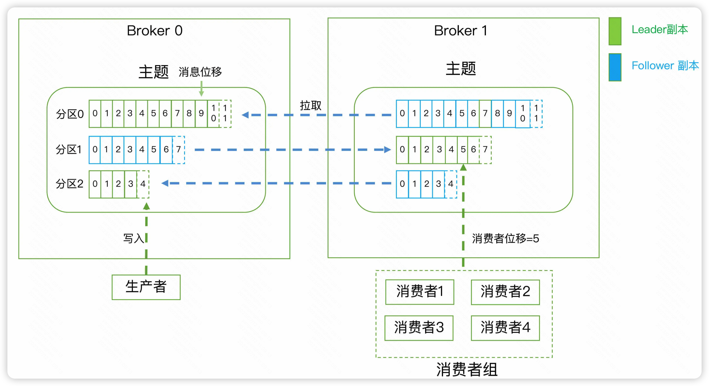
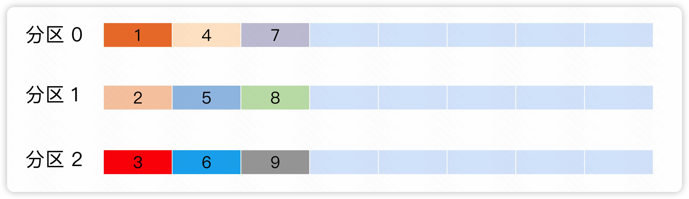
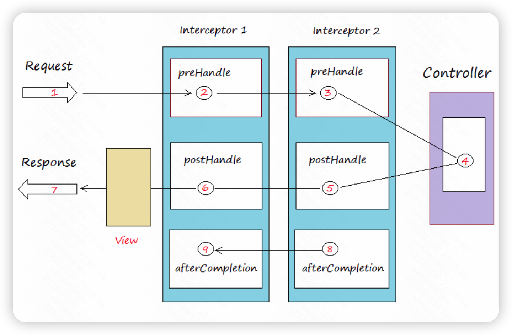
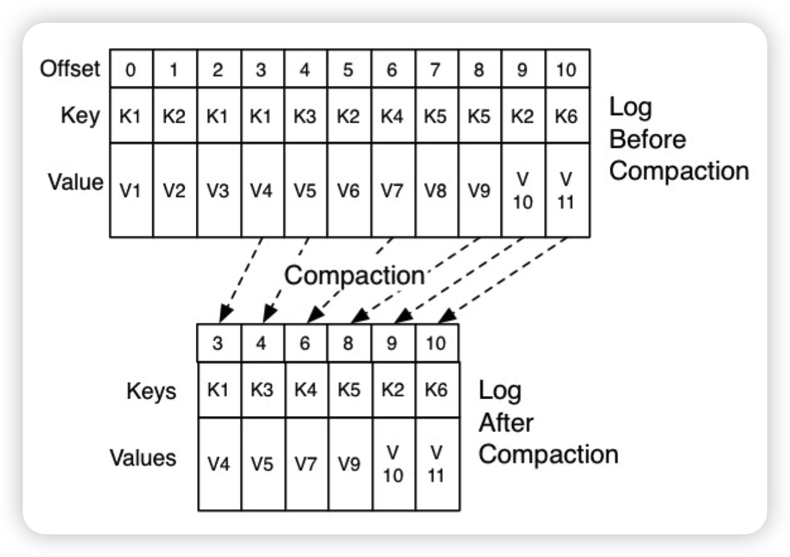

## kafka介绍

Apache Kafka 是消息引擎系统，也是一个分布式事件流处理平台，企业利用它可以在A、B两个系统之间传递**消息**，实现松耦合的异步数据传输。总的来说，消息引擎具有两个重要能力：

- 消息引擎传输的对象是**消息**
- 定义了传输消息的**规范**

消息引擎不在乎A、B两个系统是否相同，它可以在不同系统间传递消息，因此消息的通用格式以及如何传输消息至关重要。kafka的消息格式化使用的是二进制字节序列，消息还是结构化的，只是在使用之前都要将其转换成二进制的字节序列。kafka支持两种常用的消息引擎模型：

- 点对点模型：也叫消息队列模型，消息只能由A系统发出，由B系统接收，其他模型无权生产与消费消息，简单来说是一对一的模型。
- 发布 / 订阅模型：有一个topic的概念，可以有多个生产者向topic中生产消息，同时允许多个消费者订阅topic进行消费，简单来说就是一种**多对多**的模型。

### 概念说明

向目标topic发送消息的客户端被称为消费者，消费者源源不断的向**一个或多个**主题发送消息，而订阅这些topic的客户端被称为消费者，消费者同样订阅**一个或多个**topic。生产者和消费者统称为**客户端**，客户端可以运行多个实例，这些实例不停地进行生产和消费行为。

Kafka 的服务器端由被称为 Broker 的服务进程构成，即**一个 Kafka 集群由多个 Broker 组成**，Broker 负责接收和处理客户端发送过来的请求，以及对**消息进行持久化**。虽然多个 Broker 进程能够运行在同一台机器上，但更常见的做法是将不同的 Broker 分散运行在不同的机器上，这样如果**集群**中某一台机器宕机，即使在它上面运行的所有 Broker 进程都挂掉了，其他机器上的 Broker 也依然能够对外提供服务。这就是 Kafka 提供高可用的手段之一。

为了实现高可用目标，kafka还会对消息进行备份，这些备份的数据在kafka中叫做**副本**。副本的数量可以配置，这些副本保存着相同的数据，但却有不同的角色和作用。Kafka 定义了两类副本：

- 领导者副本（Leader Replica）：领导者副本对客户端**提供服务**。
- 追随者副本（Follower Replica）：**不对外提供服务**，只是被动的追随领导者副本。

生产者总是向领导者副本写消息；而消费者总是从领导者副本读消息。至于追随者副本，它只向领导者副本发送请求，请求领导者把最新生产的消息发给它，这样它能保持与领导者的同步。**副本机制保证了消息的持久化**。为了保证领导者副本保存的内容不会爆满，kafka对每个topic划分为多个分区，每个分区是一组有序地消息日志。生产者生产的消息只会被发送到同一topic下的某一个分区中，kafka的分区编号从0开始。

副本是在分区这个级别下定义的。每个分区可以配置n个副本，其中领导者副本只能有1个，其余都是追随者副本。生产者向分区写入消息，每条消息在分区内由一个偏移量（offset）来表示其位置，其中偏移量编号从0开始，一旦消息被成功写入到一个分区上，它的位移值就是固定的了。

总的来说，Kafka 使用消息日志（Log）来保存数据，一个日志就是磁盘上一个只能追加写（Append-only）消息的物理文件。因为只能追加写入，故避免了缓慢的随机 I/O 操作，改为性能较好的顺序 I/O 写操作，这也是实现 Kafka 高吞吐量特性的一个重要手段。因此kafka通过日志段（Log Segment）机制来定期地删除消息以回收磁盘。在 Kafka 底层，一个日志又进一步细分成多个日志段，消息被追加写到当前最新的日志段中，当写满了一个日志段后，Kafka 会自动切分出一个新的日志段，并将老的日志段封存起来。Kafka 在后台还有定时任务会定期地检查老的日志段是否能够被删除，从而实现回收磁盘空间的目的。

每个消费者在消费消息的过程使用消费者位移（Consumer Offset）字段记录它当前消费到了分区的哪个位置，消费者位移可能是随时变化的，每个消费者有着自己的消费者位移。


- 消息：Record。Kafka 是消息引擎，这里的消息就是指 Kafka 处理的主要对象。
- 主题：Topic。主题是承载消息的逻辑容器，在实际使用中多用来区分具体的业务。
- 分区：Partition。一个有序不变的消息序列。每个主题下可以有多个分区，一个分区通常只有一个消费者消费。
- 消息位移：Offset。表示分区中每条消息的位置信息，是一个单调递增且不变的值。
- 副本：Replica。Kafka 中同一条消息能够被拷贝到多个地方以提供数据冗余，这些地方就是所谓的副本。副本还分为领导者副本和追随者副本，各自有不同的角色划分。副本是在分区层级下的，即每个分区可配置多个副本实现高可用。
- 生产者：Producer。向主题发布新消息的应用程序。
- 消费者：Consumer。从主题订阅新消息的应用程序。
- 消费者位移：Consumer Offset。表征消费者消费进度，每个消费者都有自己的消费者位移。
- 消费者组：Consumer Group。多个消费者实例共同组成的一个组，同时消费多个分区以实现高吞吐。
- 重平衡：Rebalance。消费者组内某个消费者实例挂掉后，其他消费者实例自动重新分配订阅主题分区的过程。Rebalance 是 Kafka 消费者端实现高可用的重要手段。




## 客户端

### 消息分区机制

kafka的主题是承载消息的逻辑容器，在每个主题下还有很多个分区，消息最终保存在不同的分区下，主题下的消息只会保存在一个分区中，而不会在多个分区中保存多份。分区的目的就是为了负载均衡、实现系统的高伸缩性，不同的分区可以放在不同的机器上，数据的读写操作针对分区进行，即使某一分区挂掉也不影响其他分区继续提供服务。

**分区策略可以决定消费者将消息发送到哪个分区。**kafka提供多种分区策略，同时支持自定义分区策略，只需配置生产端的参数`partitioner.class`以及实现`org.apache.kafka.clients.producer.Partitioner`接口。

#### 轮询策略

也就是顺序分配，即消息按照分区挨个发送。



轮询策略是 Kafka Java 生产者 API 默认提供的分区策略。轮询策略有非常**优秀的负载均衡表现**，它总是能保证消息最大限度地被平均分配到所有分区上，故默认情况下它是最合理的分区策略，也是最常用的分区策略之一。

#### 随机策略

随机的将消息发送到某一分区。本质上看随机策略也是力求将数据均匀地打散到各个分区，但从实际表现来看，它要**逊于轮询策略**，所以如果追求数据的均匀分布，还是使用轮询策略比较好。

#### 按消息键保存策略

Kafka 允许为每条消息定义消息键，简称为 Key。Key可以是一个有着明确业务含义的字符串，比如客户代码、部门编号或是业务 ID 等；也可以用来表征消息元数据。一旦消息被定义了 Key，那么你就可以保证同一个 Key 的所有消息都进入到相同的分区里面，由于每个分区下的消息处理都是有顺序的，故这个策略被称为按消息键保序策略。

如果指定了 Key，那么kafka默认实现按消息键保序策略；如果没有指定 Key，则使用轮询策略。

### 消息压缩

压缩秉承了时间换空间的经典思想，指的是用少量的cpu时间去换磁盘或网络传输量。因此启用压缩的条件就是：

- Producer 程序运行机器上的 CPU 资源要很充足。
- 网络带宽资源实在有限。

kafka的消息包含两层：消息集合以及消息。一个消息集合包含若干条日志项，**日志项是真正封存消息的地方**，kafka底层的消息日志由若干消息集合组成，它通常不会操作具体的某条消息，总是在消息集合层面进行写入操作。

在kafka中，消息压缩可能发生在两个地方：生产者端和broker端。

生产者端设置了消息压缩格式后，任何消息集合都会经过压缩后发送给broker，可以很好的节省网络贷款。通常情况下，broker只会原封不动的接收消息，除了以下条件：

- broker端指定了和生产者端不同的压缩算法：此时只能解压缩后再次压缩。
- broker发生了消息格式转换。为了兼容老版本的格式，Broker 端会对新版本消息执行向老版本格式的转换。这个过程中会涉及消息的解压缩和重新压缩。

多数情况下压缩发生在生产端，压缩后的消息发送到broker之后保存下来，当消费者请求这些消息时，broker会把消息发送出去，当消息到达消费端时自行解压缩还原成原来的消息。Kafka 会将启用了哪种压缩算法**封装**进消息集合中，这样当 Consumer 读取到消息集合时，它自然就知道了这些消息使用的是哪种压缩算法。

### Kafka消息交付可靠性保证

#### 消息无丢失的保证

Kafka只对**已提交**的消息做**有限度**的持久化保存。

- 已提交的消息：当Kafka的**若干个broker**接收到消息并写入日志文件中，会返回一个成功消息给生产者，此时Kafka认为消息已经成功提交。若干个取决于客户端的配置，可以是一个也可以是多个。
- 有限度：Kafka不丢失消息的前提是保存消息的多个broker**最少要有一个**存活，只有这样，Kafka才能保证消息不会丢失。

容易丢失消息的场景：

1. 客户端发送消息是异步的，在没有成功接收到返回值时，Kafka不认为这个消息是成功提交的，因此通常用`producer.send(msg, callback)`来进行调用，回调函数可以告诉客户端消息是否成功发送到broker。
2. 消费者要维持先消费消息，再移动offset的顺序进行操作，防止offset偏离，这样做可以最大程度保证消息不丢失，但是可能出现消费端重复消费的问题。
3. 如果是多线程异步处理消费消息，Consumer 程序不要开启自动提交位移，而是要应用程序手动提交位移。

#### 消息交付可靠性

Kafka对生产者和消费者要消费的消息具有三种承诺能力：

- 最多一次：broker最多发送一次消息，消息可能会丢失，但绝不会重复；
- 最少一次：broker可以发送多次消息，消息可能会重复，但绝不会丢失；
- 精确一次：消息精准发布，不会丢失也不会重复。

Kafka默认使用第二种策略，若客户端没有收到broker的成功消息，便会进行重试操作。此时如果禁用掉重试，就变成了第一种策略，这个时候消息可能会重复，但性能是最高的。Kafka的精确一次策略通过幂等性和事务实现。

##### 幂等性生产者

> “幂等”这个词原是数学领域中的概念，指的是某些操作或函数能够被执行多次，但每次得到的结果都是不变的。
>
> 幂等性的好处在于可以安全的重复这些操作，不会对系统造成任何改变。

Kafka的默认生产者不是幂等性的，要启用幂等性功能，只需设置一个参数即可: `props.put(ProducerConfig.ENABLE_IDEMPOTENCE_CONFIG， true)`。开启幂等性服务后，broker使用空间换时间思路，对每条消息额外保存一些字段，通过这些字段进行去重操作。


幂等性生产者只能保障单一分区上的要求，即一个幂等性 Producer 能够保证某个主题的一个分区上不出现重复消息，它无法实现多个分区的幂等性。其次，它只能实现**单会话上**的幂等性，不能实现跨会话的幂等性。当重启了 Producer 进程之后，这种幂等性保证就丧失了。

##### 事务型生产者

事务型 Producer 能够保障原子地将消息发送到不同分区中，这批消息要么全部成功，要么全部失败，同时不惧 Producer 进程的重启。

开启事务型生产者需要两个步骤：

1. 开启 enable.idempotence = true
2. 设置 Producer 端参数 transactional. id

```java
producer.initTransactions();
try {
            producer.beginTransaction();
            producer.send(record1);
            producer.send(record2);
            producer.commitTransaction();
} catch (KafkaException e) {
            producer.abortTransaction();
}
```

事务型 Producer 的显著特点是调用了一些事务 API，如 initTransaction、beginTransaction、commitTransaction 和 abortTransaction，它们分别对应事务的初始化、事务开始、事务提交以及事务终止。

事务执行一半中止，执行失败的消息也会被Kafka写入到底层的日志中，也就是说消费者仍然可以看得到这些消息，不过可以通过 isolation.level 参数控制这个行为，共有两个取值：

1. read_uncommitted：这是默认值，表明 Consumer 能够读取到 Kafka 写入的任何消息，不论事务型 Producer 提交事务还是终止事务，其写入的消息都可以读取。
2. read_committed：表明 Consumer 只会读取 Producer 成功提交事务写入的消息（包括非事务的 Producer 的所有提交消息）。


**事务型生产者的性能更差，要根据实际生产环境特点去选择使用。**

### Kafka拦截器

拦截器的基本思想就是在应用程序不修改逻辑的情况下，动态的实现一组**可插拔的事件处理逻辑链**，它可以在主业务操作的前后多个时间点插入处理对应的拦截逻辑。



**Kafka拦截器分为生产者拦截器和消费者拦截器**。生产者拦截器允许你在消息发送前以及提交消息后进行拦截处理；消费者拦截器允许你在消息消费前以及提交位移后编写拦截逻辑。这些拦截器允许组成链式形式，按照添加链的先后顺序依次执行。

生产者拦截器需要实现`org.apache.kafka.clients.producer.ProducerInterceptor` 接口。该接口是 Kafka 提供的，里面有两个核心的方法。

- onSend：该方法会在消息发送之前被调用。
- onAcknowledgement：该方法会在消息成功提交或发送失败之后被调用。onAcknowledgement 的调用要早于 callback 的调用。值得注意的是，这个方法和 onSend **不是在同一个线程中**被调用的。这个方法处在 Producer 发送的主路径中，因此避免放一些太重的逻辑，否则会导致 Producer TPS 直线下降。

消费者拦截器要实现`org.apache.kafka.clients.consumer.ConsumerInterceptor`接口，这里面也有两个核心方法。

- onConsume：该方法在消息返回给 Consumer 程序之前调用。也就是说在开始正式处理消息之前，拦截器会先拦一道，搞一些事情，之后再返回给消费者。
- onCommit：Consumer 在提交位移之后调用该方法。通常可以在该方法中做一些记账类的动作，比如打日志等。

### Kafka的TCP连接

Kafka的生产者、消费者、broker所有通信都是基于TCP协议的。

> TCP具有多路复用请求能力，即 multiplexing request，是指将两个或多个数据流合并到底层单一物理连接中的过程。TCP 的多路复用请求会在一条物理连接上创建若干个虚拟连接，每个虚拟连接负责流转各自对应的数据流。其实严格来说，***TCP 并不能多路复用，它只是提供可靠的消息交付语义保证***，比如自动重传丢失的报文。

#### 连接创建时机

```java
				// 1. 构建参数对象
				Properties config = new Properties();
        config.put(ProducerConfig.BOOTSTRAP_SERVERS_CONFIG, "localhost:9092");
        config.put(ProducerConfig.KEY_SERIALIZER_CLASS_CONFIG, StringSerializer.class.getName());
        config.put(ProducerConfig.VALUE_SERIALIZER_CLASS_CONFIG, StringSerializer.class.getName());

				// 2. 创建生产者
        KafkaProducer<String, String> producer = new KafkaProducer<>(config);
        for (int i = 0; i < 100; i++) {
          	// 3. 发送数据
            producer.send(new ProducerRecord<>("yph", "test" + i));
        }
				// 4. 关闭连接
        producer.close();
```

- 在创建KafkaProducer实例时，生产者会在后台创建一个名为sender的线程，该线程会负责初始化生产者和broker的连接，它会连接 bootstrap.servers 参数指定的所有 Broker，因此生产环境通常指定三四个就可以了，生产者连接到集群中的一台broker，会自动拿到集群的元数据即所有的集群数据。生产者拉取元数据信息有两种方式：
  - Producer 通过 metadata.max.age.ms 参数定期地去更新元数据信息。
  - Producer 给一个不存在的 topic 发送消息时，Broker会告诉他不存在，此时生产者会去请求最新的集群元数据信息。

- 当生产者拿到所有的集群数据后，会依次与没有建立连接的broker进行TCP连接。
- 同时当生产者向目标发送消息时，倘若发现没有与之建立连接，这时也会进行TCP连接操作。

#### 连接关闭时机

- 用户主动关闭

  可以使用close方法，也可以直接杀掉进程。

- Kafka自动关闭

  Producer 端参数 connections.max.idle.ms 的值决定了无通信时连接的最大存活时间，当超过最大存活时间后仍然没有新的通信，broker会主动关闭TCP连接。

### 消费者组

Consumer Group 是 Kafka 提供的可扩展且具有容错性的消费者机制。组内有多个消费者实例，它们具有共同的Group ID，一个组结合起来消费订阅主题下的所有分区，**其中一个分区最多只能被同组内的一个消费者消费，但是可以被其他组的实例消费。**因此一个消费者组的实例数在理想情况下应该等于它所订阅主题的分区总数。

当 Consumer Group 订阅了多个主题后，组内的每个实例**不要求一定要订阅主题的所有分区**，它只会消费部分分区中的消息。Consumer Group **之间彼此独立**，互不影响，它们能够订阅相同的一组主题而互不干涉。如果所有实例都属于同一个 Group，那么它实现的就是消息队列模型；如果所有实例分别属于不同的 Group，那么它实现的就是发布 / 订阅模型。

#### 位移主题

消费者在消费的过程中需要记录自己的消费位置信息，对于消费者组来说，这些数据以键值对的方式保存，其中键是分区、值是该分区的最新消费位移。这些位置数据存放的具体位置因客户端版本的不同而不同，老版本存放在zookeeper中，当 Consumer 重启后，它能自动从 ZooKeeper 中读取位移数据，从而在上次消费截止的地方继续消费。这种设计使得 Kafka Broker 不需要保存位移数据，减少了 Broker 端需要持有的状态空间，因而有利于实现高伸缩性。但是位移数据需要频繁更新，**大吞吐量的写操作会极大地拖慢 ZooKeeper 集群的性能**，因此新版本的客户端修改了存放地址，把位移信息放在了Kafka 内部主题—__consumer_offsets中。

新版本将consumer的位移数据看作是一条普通的Kafka消息，然后提交到__consumer_offsets主题中，也就是说 _consumer_offsets的主要作用就是用来保存位移信息的。虽说位移主题是一个普通的 Kafka 主题，但它的消息格式却是 Kafka 自定义的，用户不能修改，也就是说不能随意地向这个主题写消息，因为一旦写入的消息不满足 Kafka 规定的格式，那么 Kafka 内部无法成功解析，就会造成 Broker 的崩溃。事实上，Kafka Consumer 有 API 向位移主题写消息。

位移主题的消息格式有三种：

1. **普通消息**。由键值对构成，其中位移主题的 Key 中保存 3 部分内容：**<Group ID，主题名，分区号 >**，Value保存具体的消息信息；
2. 用于保存 Consumer Group 信息的消息。它是用来**注册 Consumer Group** 的；
3. 用于删除 Group 过期位移甚至是**删除 Group** 的消息。tombstone 消息，即墓碑消息，也称 delete mark，它的主要特点是它的消息体是 null，即空消息体。一旦某个 Consumer Group 下的所有 Consumer 实例都停止了，而且它们的位移数据都已被删除时，Kafka 会向位移主题的对应分区写入 tombstone 消息，表明要彻底删除这个 Group 的信息。

通常来说，当 Kafka 集群中的第一个 Consumer 程序启动时，Kafka 会**自动**创建位移主题。位移主题就是普通的Kafka主题，它的分区数由Broker端参数`offsets.topic.num.partitions`控制，副本数由`offsets.topic.replication.factor`控制。不过也可以在Kafka集群所有消费者实例未启动前使用 Kafka API 创建它，自己创建时可以指定分区数、副本数。

目前Kafka提交位移信息的方式有两种：

- **手动提交位移**。由开发者调用相关API，Kafka 就会向位移主题写入相应的消息；
- **自动提交位移**。设置`enable.auto.commit`为true，就能保证消息消费不会丢失，但是丧失了很大的灵活性和可控性，无法把控 Consumer 端的位移管理。只要 Consumer 一直启动着，它就会**无限期**（可能撑爆内存）地向位移主题写入消息。

Kafka 使用 **Compact 策略**来删除位移主题中的过期消息，避免该主题无限期膨胀。对于同一个 Key 的两条消息 M1 和 M2，如果 M1 的发送时间早于 M2，那么 M1 就是过期消息。Compact 的过程就是扫描日志的所有消息，剔除那些过期的消息，然后把剩下的消息整理在一起，整理后的结果如下所示。



Kafka 提供了专门的**后台线程**称为 Log Cleaner定期地巡检待 Compact 的主题，看看是否存在满足条件的可删除数据。

#### Rebalance

Rebalance 本质上是一种协议，规定了一个 Consumer Group 下的所有 Consumer 如何达成一致，来分配订阅 Topic 的每个分区。Rebalance 发生时，Group 下所有的 Consumer 实例都会协调在一起共同参与。Rebalance的触发条件有三个：

1. **组成员数发生变更**。比如有新的 Consumer 实例加入组或者离开组，抑或是有 Consumer 实例崩溃被“踢出”组。
2. **订阅主题数发生变更**。若Consumer Group 订阅所有以字母 t 开头、字母 c 结尾的主题，在 Consumer Group 的运行过程中，新创建了一个满足这样条件的主题，那么该 Group 就会发生 Rebalance。
3. **订阅主题的分区数发生变更**。Kafka 当前只能允许增加一个主题的分区数。当分区数增加时，就会触发订阅该主题的所有 Group 开启 Rebalance。

**在 Rebalance 过程中，所有 Consumer 实例都会停止消费，等待 Rebalance 完成，其次目前 Rebalance 的设计是所有 Consumer 实例共同参与，全部重新分配所有分区。**