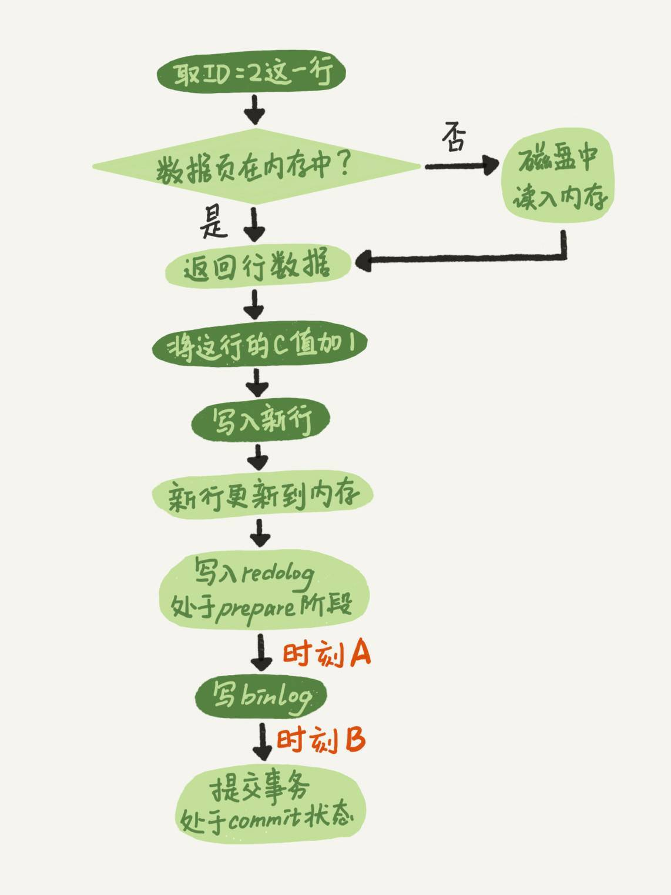
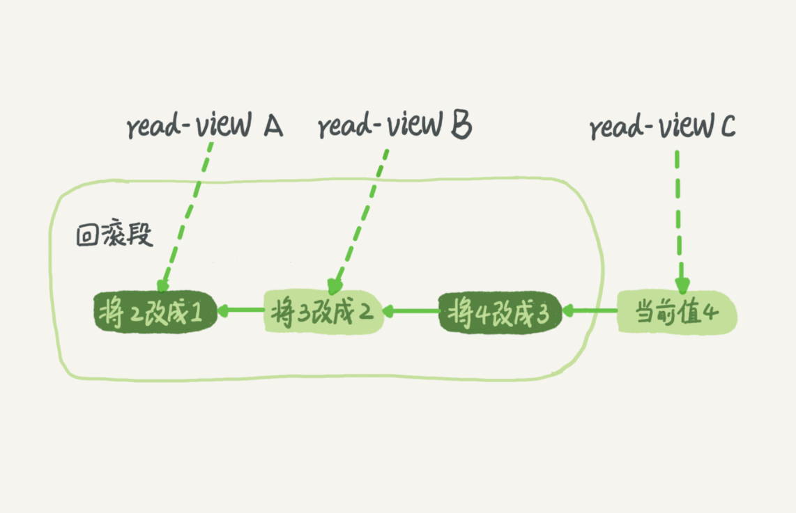
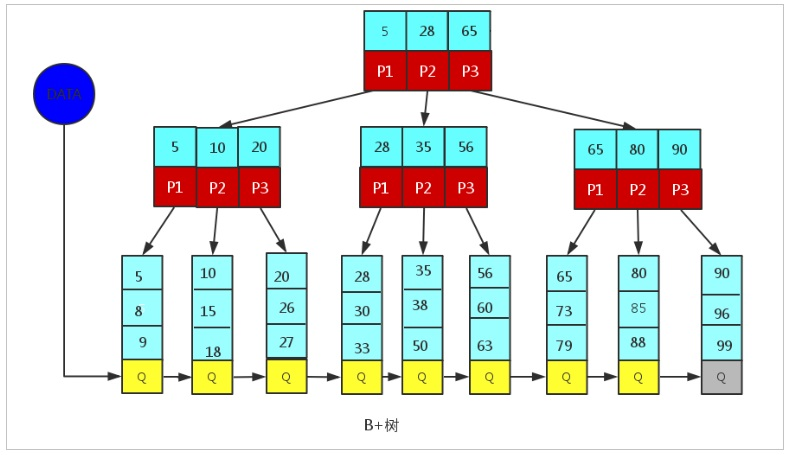
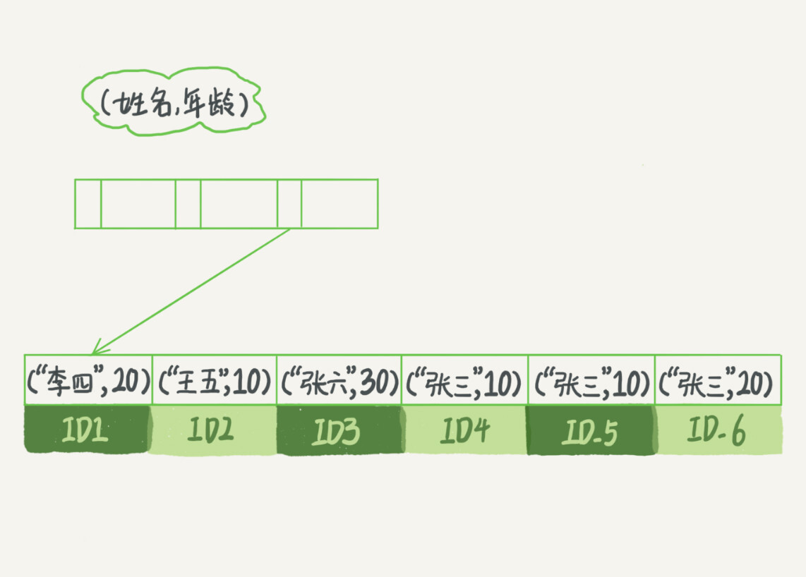
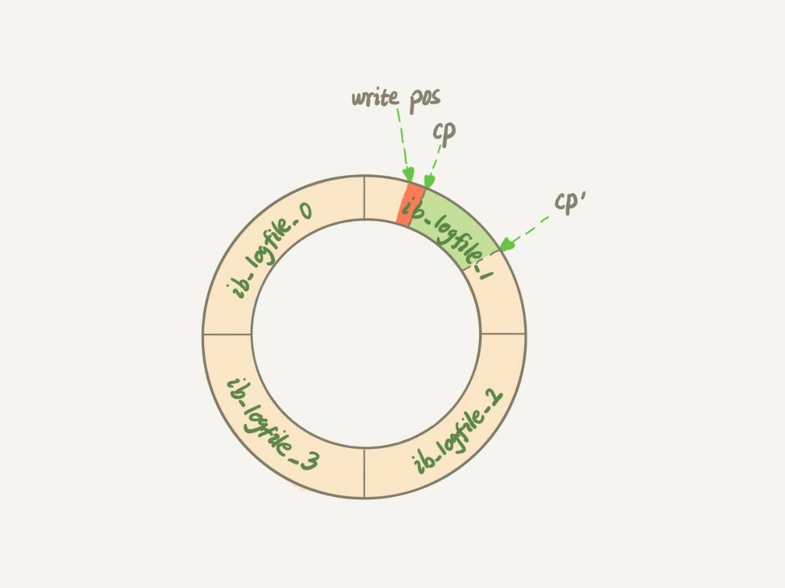
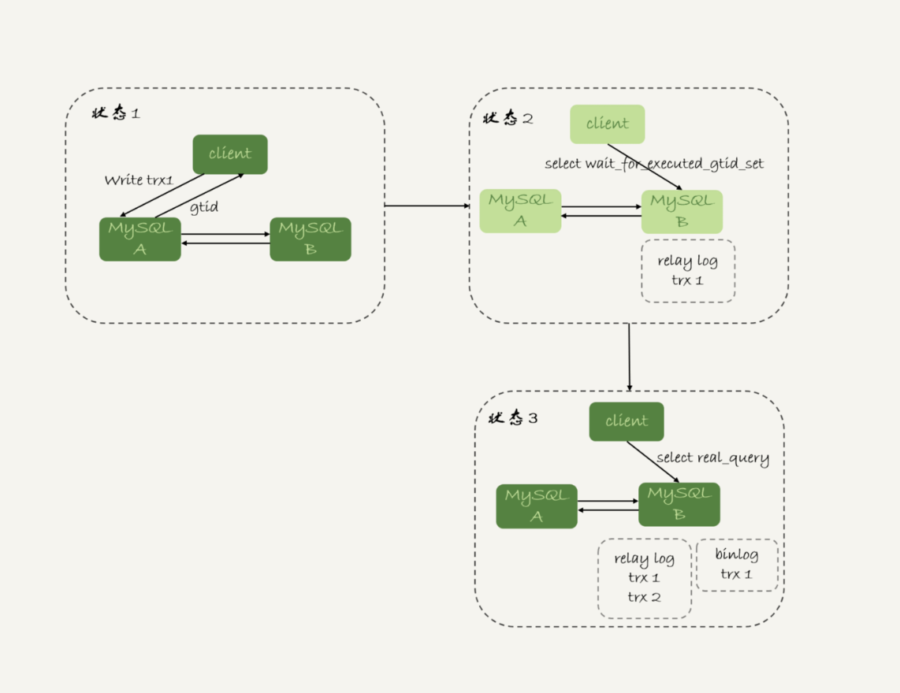

> 参考mysql实战45讲

# 数据库

## MySQL中的数据类型

|       类型       |                           类型举例                           |
| :--------------: | :----------------------------------------------------------: |
|     整数类型     | TINYINT(1Byte)、SMALLINT(2Byte)、MEDIUMINT(3Byte)、**INT**(4Byte)、BIGINT(8Byte) |
|    浮点数类型    |                 FLOAT(4Byte)、DOUBLE(8Byte)                  |
|    定点数类型    |                      **DECIMAL(9Byte)**                      |
|      位类型      |                             BIT                              |
|   日期时间类型   |        YEAR、TIME、DATE、**DATETIME**、**TIMESTAMP**         |
|  文本字符串类型  |   CHAR、**VARCHAR**、TINYTEXT、TEXT、MEDIUMTEXT、LONGTEXT    |
|     枚举类型     |                             ENUM                             |
|     集合类型     |                             SET                              |
| 二进制字符串类型 |   BINARY、VARBINARY、TINYBLOB、BLOB、MEDIUMBLOB、LONGBLOB    |
|     json类型     |                      JSON对象、JSON数组                      |
|   空间数据类型   | 单值类型:GEOMETRY、POINT、LINESTRING、POLYGON; 集合类型:MULTIPOINT、MULTILINESTRING、MULTIPOLYGON、 GEOMETRYCOLLECTION |
> 1. float、double都是近似值，存储的时候都存在精度丢失的问题，一般使用decimal类型。如果数据范围超过decimal，建议把数据拆分为整数部分和小数部分，分别存储。
> 2. Int(1)和int(11)不同于varchar，在计算和存储空间上无区别，其中1和11代表的是展示的长度，当打开zerofill配置时，不足的位置会补0，如010。
> 3. varchar是不定长，需要额外空间记录长度，容易产生碎片，不预先分配存储空间，存储长度不要超过5000，否则建议用text类型并新建表，避免影响其他索引 。对于短得列，char效率更高

## 数据库范式

### 1NF(第一范式)

属性（对应于表中的字段）不能再被分割，也就是这个字段只能是一个值，不能再分为多个其他的字段了。**1NF 是所有关系型数据库的最基本要求** ，也就是说关系型数据库中创建的表一定满足第一范式。

### 2NF(第二范式)

第二范式（2NF）要求实体的属性完全依赖于主关键字。所谓完全依赖是指不能存在仅依赖主关键字一部分的属性，如果存在，那么这个属性和主关键字的这一部分应该分离出来形成一个新的实体，新实体与原实体之间是一对多的关系。为实现区分通常需要为表加上一个列，以存储各个实例的唯一标识。简而言之，第二范式就是在第一范式的基础上属性完全依赖于主键。

不符合 2NF 的设计容易产生冗余数据。 


### 3NF(第三范式)
3NF 在 2NF 的基础之上，消除了非主属性对于码的传递函数依赖 。符合 3NF 要求的数据库设计，基本上解决了数据冗余过大，插入异常，修改异常，删除异常的问题。比如在关系 R(学号 , 姓名, 系名，系主任)中，学号 → 系名，系名 → 系主任，所以存在非主属性系主任对于学号的传递函数依赖，所以该表的设计，不符合 3NF 的要求。

**总结**
- 1NF：属性不可再分。
- 2NF：1NF 的基础之上，消除了非主属性对于码的部分函数依赖。
- 3NF：3NF 在 2NF 的基础之上，消除了非主属性对于码的传递函数依赖 。

## explain使用

explain是mysql生成的查询指令树，用它可以看到sql的执行计划，是优化sql的利器。


执行计划各字段详解：
- type：连接的类型（**越往下性能越低定要在range内，避免index和all**）
  1. const,system： 最多一个匹配行，使用主键或者unique索
  2. eq_ref ：一行数据，通常在联接时出现，使用主键或者unique索
  3. ref：使用key的最左前缀，且key不是主键或者unique键
  4. range： 索引范围扫描，对索引的扫描开始于某一点，返回匹配的行
  5. index：以索引的顺序进行全表扫描，优点是不用排序，缺点是还要全表扫描
  6. all:：全表扫描，必须避免
- extra（**不允许出行using temporaryusing filesort !**）
  1. using index：索引覆盖，查询只需要用索引即可，不需要读取数据块
  2. using where：存储引擎返回数据后再做过滤
  3. using temporary：使用临时表,通常在使用group by, order by的时候出现
  4. using flesort：用到非索引顺序的额外排序，当order by未用到索引时发生
- possible_keys：显示本次查询可能用到的索引
- key：优化器决定采用哪个索引来优化对该表的访问，可通过use index 给出建议（**为空表示没用索引，应该避免**）
- rows：mysql估算的为了找到所需记录而需要检索的行数，作为优化器选择key的参考
- key_len : 使用的索引左前缀的长度(Bytes)，亦可理解为使用了索引中哪些字段

# 01基础架构：一条SQL查询语句是如何执行的

SQL语句在MySQL的各个功能模块中的执行过程：

大体来说，MySQL可以分为Server层和存储引擎层两部分

- Server层包括连接器、查询缓存、分析器、优化器、执行器等，涵盖MySQL的大多数核心服务功能，以及所有的内置函数（如日期、时间、数学和加密函数等），所有跨存储引擎的功能都在这一层实现，比如存储过程、触发器、视图等。
- 存储引擎负责数据的存储和提取，常用的存储引擎InnoDB、MyISAM
不同的存储引擎**共用一个Server层**

## 连接器

第一步会先连接到这个数据库上，连接器负责跟客户端建立连接、获取权限、维持和管理连接。连接完成后，如果没有后续的动作，这个连接就处于空闲状态。客户端如果太长时间没动静，连接器就会自动将它断开。数据库里面，长连接是指连接成功后，如果客户端持续有请求，则一直使用同一个连接。短连接则是指每次执行完很少的几次查询就断开连接，下次查询再重新建立一个。
- 如果用户名密码认证通过，连接器会到权限表里面查出你拥有的权限。之后，这个连接里面的权限判断逻辑，都将依赖于此时读到的权限。
因此一个用户成功建立连接后，即使用管理员账号对这个用户的权限做了修改，也不会影响已经存在连接的权限。修改完成后，只有再新建的连接才会使用新的权限设置。

## 查询缓存
连接建立完成后，你就可以执行select语句了。执行逻辑就会来到第二步：查询缓存。
MySQL拿到一个查询请求后，会先到查询缓存看看，之前是不是执行过这条语句。之前执行过的语句及其结果可能会以key-value对的形式，被直接缓存在内存中。如果查询能够直接在这个缓存中找到key，那么这个value就会被直接返回给客户端。

如果语句不在查询缓存中，就会继续后面的执行阶段。执行完成后，执行结果会被存入查询缓存中。如果查询命中缓存，MySQL不需要执行后面的复杂操作，就可以直接返回结果，这个效率会很高。但是只要有对一个表的更新，这个表上所有的查询缓存都会被清空，因此**查询缓存往往弊大于利**。

## 分析器
如果没有命中查询缓存，就要开始真正执行语句了。首先，MySQL需要知道你要做什么，因此需要对SQL语句做解析。分析器先会做`“词法分析”`，词法分析完后就要做`“语法分析”`。根据词法分析的结果，语法分析器会根据语法规则，判断你输入的这个SQL语句是否满足MySQL语法。如果语句不对，就会收到“You have an error in your SQL syntax”的错误提醒

## 优化器
经过了分析器，MySQL就知道你要做什么了。在开始执行之前，还要先经过优化器的处理。

优化器是在表里面有多个索引的时候，决定使用哪个索引；或者在一个语句有多表关联（join）的时候，决定各个表的连接顺序。

## 执行器
- MySQL通过分析器知道了你要做什么，通过优化器知道了该怎么做，于是就进入了执行器阶段，开始执行语句。
- 开始执行的时候，要先判断一下你对这个表T有没有执行查询的权限，如果没有，就会返回没有权限的错误。
- 如果有权限，就打开表继续执行。打开表的时候，执行器就会根据表的引擎定义，去使用这个引擎提供的接口。

# 02日志系统：一条SQL更新语句是如何执行的
与查询流程不一样的是，更新流程还涉及两个重要的日志模块 `redo log`（重做日志）和 `binlog`（归档日志）
## redo log
每一次的更新操作都需要写进磁盘，然后磁盘也要找到对应的那条记录，然后再更新，整个过程IO成本、查找成本都很高。为了解决这个问题，MySQL的设计者WAL技术，WAL的全称是Write-Ahead Logging，它的关键点就是`先写日志`，`再写磁盘`

当有一条记录需要更新的时候，InnoDB引擎就会先把记录写到redo log里面，并更新内存，这个时候更新就算完成了。

同时，`InnoDB`引擎会在适当的时候，将这个操作记录更新到磁盘里面，而这个更新往往是在系统比较空闲的时候做。但是`InnoDB`的`redo log`是固定大小的，比如可以配置为一组4个文件，每个文件的大小是1GB,总共就可以记录4GB的操作。从头开始写，写到末尾就又回到开头循环写，**不持久保存**

在进行`redo log`写入时，有两个重要参数的write pos(当前记录的位置),`checkpoint`是当前要擦除的位置

一边写一边后移，写到第3号文件末尾后就回到0号文件开头,checkpoint也是往后推移并且循环的，擦除记录前要把记录更新到数据文件。write pos和checkpoint之间还空着的部分，可以用来记录新的操作。

有了redo log，InnoDB就可以保证即使数据库发生异常重启，之前提交的记录都不会丢失，这个能力称为crash-safe。
## binlog
最开始MySQL里并没有InnoDB引擎。MySQL自带的引擎是MyISAM，但是MyISAM没有crash-safe的能力，binlog日志只能用于**归档**。而InnoDB是另一个公司以插件形式引入MySQL的，既然只依靠binlog是没有crash-safe能力的，所以InnoDB使用另外一套日志系统——也就是redo log来实现crash-safe能力。

两种日志的不同：
1. redo log是InnoDB引擎特有的；binlog是MySQL的Server层实现的，所有引擎都可以使用。
2. redo log是物理日志，记录的是“在某个数据页上做了什么修改”；binlog是逻辑日志，记录的是这个语句的原始逻辑，比如“给ID=2这一行的c字段加1 ”。
3. redo log是循环写的，空间固定会用完；binlog是可以追加写入的。“追加写”是指binlog文件写到一定大小后会切换到下一个，并不会覆盖以前的日志。

执行器和InnoDB引擎在执行update语句时的内部流程：
1. 执行器先找引擎取ID=2这一行。ID是主键，引擎直接用树搜索找到这一行。如果ID=2这一行所在的数据页本来就在内存中，就直接返回给执行器；否则，需要先从磁盘读入内存，然后再返回。
2. 执行器拿到引擎给的行数据，把这个值加上1，比如原来是N，现在就是N+1，得到新的一行数据，再调用引擎接口写入这行新数据。
3. 引擎将这行新数据更新到内存中，同时将这个更新操作记录到redo log里面，此时redo log处于prepare状态。然后告知执行器执行完成了，随时可以提交事务。
4. 执行器生成这个操作的binlog，并把binlog写入磁盘。
5. 执行器调用引擎的提交事务接口，引擎把刚刚写入的redo log改成提交（commit）状态，更新完成。


redo log的写入拆成了两个步骤：prepare和commit，这就是"两阶段提交"，简单说，redo log和binlog都可以用于表示事务的提交状态，而两阶段提交就是让这两个状态保持逻辑上的一致。**两阶段提交是经典的分布式系统问题**，两阶段提交就是为了给所有人一个机会，当每个人都说“我ok”的时候，再一起提交。

在两阶段提交的不同时刻，MySQL异常重启会出现的现象：
1. 在图中时刻A的地方，也就是写入redo log 处于prepare阶段之后、写binlog之前，发生了崩溃（crash），由于此时binlog还没写，redo log也还没提交，所以崩溃恢复的时候，这个事务会回滚。这时候，binlog还没写，所以也不会传到备库。
2. 在时刻B，也就是binlog写完，redo log还没commit前发生崩溃，崩溃恢复时的判断规则如下
	- 如果redo log里面的事务是完整的，也就是已经有了commit标识，则直接提交；
	- 如果redo log里面的事务只有完整的prepare，则判断对应的事务binlog是否存在并完整：
		- 如果是，则提交事务；
		- 否则，回滚事务。

**总结**：
- Redo log不是记录数据页“更新之后的状态”，而是记录这个页 “做了什么改动”。实际上，redo log并没有记录数据页的完整数据，所以它并没有能力自己去更新磁盘数据页：
	- 如果是正常运行的实例的话，数据页被修改以后，跟磁盘的数据页不一致，称为脏页。最终数据落盘，就是把内存中的数据页写盘。这个过程，甚至与redo log毫无关系。
	- 在崩溃恢复场景中，InnoDB如果判断到一个数据页可能在崩溃恢复的时候丢失了更新，就会将它读到内存，然后让redo log更新内存内容。更新完成后，内存页变成脏页，就回到了第一种情况的状态。
- Binlog有两种模式，statement 格式的话是记sql语句， row格式会记录行的内容，记两条，更新前和更新后都有。

# 03事务隔离：为什么你改了我还看不见
简单来说，事务就是要保证一组数据库操作，要么全部成功，要么全部失败。在MySQL中，事务支持是在引擎层实现的。

## 隔离性与隔离级别
事务是由一组SQL语句组成的逻辑处理单元。关系型数据库的事务有 ACID 特性：
1. 原子性（Atomicity） ： 事务是最小的执行单位，不允许分割。事务的原子性确保动作要么全部完成，要么完全不起作用；
2. 一致性（Consistency）： 执行事务前后，数据保持一致，例如转账业务中，无论事务是否成功，转账者和收款人的总额应该是不变的；
3. 隔离性（Isolation）： 并发访问数据库时，一个用户的事务不被其他事务所干扰，各并发事务之间数据库是独立的；
4. 持久性（Durability）： 一个事务被提交之后。它对数据库中数据的改变是持久的，即使数据库发生故障也不应该对其有任何影响。

| 问题                               | 含义                                                         |
| --------------------------------- | -------------------------------------------- |
| 丢失更新（Lost Update）            | 当两个或多个事务选择同一行，最初的事务修改的值，会被后面的事务修改的值覆盖。 |
| 脏读（Dirty Reads）                | 当一个事务正在访问数据，并且对数据进行了修改，而这种修改还没有提交到数据库中，这时，另外一个事务也访问这个数据，然后使用了这个数据。 |
| 不可重复读（Non-Repeatable Reads） | 一个事务在读取某些数据后的某个时间，再次读取以前读过的数据，却发现和以前读出的数据不一致。 |
| 幻读（Phantom Reads）              | 一个事务按照相同的查询条件重新读取以前查询过的数据，却发现其他事务插入了满足其查询条件的新数据。 |

**不可重复读和幻读区别：**

不可重复读的重点是修改比如多次读取一条记录发现其中某些列的值被修改，幻读指的是一个事务在前后两次查询同一个范围的时候，后一次查询看到了**前一次查询没有看到的行**

1. 读取未提交： 最低的隔离级别，允许读取尚未提交的数据变更，可能会导致脏读、幻读或不可重复读
2. 读取已提交： 允许读取并发事务已经提交的数据，可以阻止脏读，但是幻读或不可重复读仍有可能发生
3. 可重复读： 对同一字段的多次读取结果都是一致的，除非数据是被本身事务自己所修改，可以阻止脏读和不可重复读，但幻读仍有可能发生，InnoDB 存储引擎默认支持的隔离级别
4. 可串行化： 最高的隔离级别，完全服从 ACID 的隔离级别。所有的事务依次逐个执行，这样事务之间就完全不可能产生干扰

| 隔离级别                | 丢失更新 | 脏读 | 不可重复读 | 幻读 |
| ----------------------- | -------- | ---- | ---------- | ---- |
| Read uncommitted        | ×        | √    | √          | √    |
| Read committed          | ×        | ×    | √          | √    |
| Repeatable read（默认） | ×        | ×    | ×          | √    |
| Serializable            | ×        | ×    | ×          | ×    |

在实现上，数据库里面会创建一个视图，访问的时候以视图的逻辑结果为准。在“可重复读”隔离级别下，这个视图是在事务启动时创建的，整个事务存在期间都用这个视图。在“读提交”隔离级别下，这个视图是在每个SQL语句开始执行的时候创建的。这里需要注意的是，“读未提交”隔离级别下直接返回记录上的最新值，没有视图概念；而“串行化”隔离级别下直接用加锁的方式来避免并行访问。

“幻读”的相关说明：
1. 在可重复读隔离级别下，普通的查询是快照读，是不会看到别的事务插入的数据的。因此，幻读在“当前读”下才会出现。
2. 查询都加了for update，就是当前读。而当前读的规则，就是要能读到所有已经提交的记录的最新值。

> MySQL可重复读的隔离级别中并不是完全解决了幻读的问题，而是解决了读数据情况下的幻读问题。而对于修改的操作依旧存在幻读问题，就是说MVCC对于幻读的解决时不彻底的。[MySQL的可重复读与幻读](..MySQL的可重复读级别能解决幻读吗)

在可重复读隔离级别下，每个select语句会把所有查询到的行**都加上写锁**来阻止其他事务对本事务的影响，但是此时仅仅阻止了其他事务修改本事务的值，**即使把所有的记录都加上锁，还是阻止不了新插入的记录**，这也是为什么“幻读”会被单独拿出来解决的原因。

## 事务隔离的实现
在MySQL中，实际上每条记录在更新的时候都会同时记录一条回滚操作。记录上的最新值，通过回滚操作，都可以得到前一个状态的值。假设一个值从1被按顺序改成了2、3、4，在回滚日志里面就会有类似下面的记录。不同时刻启动的事务会有不同的read-view，同一条记录在系统中可以存在多个版本，就是数据库的多版本并发控制（`MVCC`）

回滚日志在不需要的时候才删除。也就是说，系统会判断，当没有事务再需要用到这些回滚日志时，回滚日志会被删除。什么时候才不需要了呢？就是当系统里没有比这个回滚日志更早的read-view的时候。

为什么尽量不要使用长事务?长事务意味着系统里面会存在很老的事务视图，在这个事务提交之前，回滚记录都要保留，这会导致大量占用存储空间。除此之外，长事务还占用锁资源，可能会拖垮库。

### 如何解决幻读
产生幻读的原因是，行锁只能锁住行，但是新插入记录这个动作，要更新的是记录之间的“间隙”。因此，为了解决幻读问题，InnoDB只好引入新的锁，也就是间隙锁(在可重复读隔离级别下才会生效)。**间隙锁，锁的就是两个值之间的空隙**。
这样，当执行 select * from t where d=5 for update的时候，就不止是给数据库中已有的6个记录加上了行锁，还同时加了7个间隙锁。这样就确保了无法再插入新的记录。

**跟间隙锁存在冲突关系的，是“往这个间隙中插入一个记录”这个操作**。间隙锁之间都不存在冲突关系，事务A的间隙锁与事务B的间隙锁可能会互相阻塞。间隙锁的引入，可能会导致**同样的语句锁住更大的范围**，影响了并发度

### 间隙锁的加锁规则
**间隙锁在可重复读隔离级别下才有效**

1. 加锁的基本单位是next-key lock，next-key lock是前开后闭区间。
2. 查找过程中访问到的对象才会加锁。
3. 索引上的等值查询，给唯一索引加锁的时候，next-key lock退化为行锁。
4. 索引上的等值查询，向右遍历时且最后一个值不满足等值条件的时候，next-key lock退化为间隙锁。
5. 唯一索引上的范围查询会访问到不满足条件的第一个值为止。


# 04深入浅出索引
索引（index）是帮助MySQL高效获取数据的数据结构（有序），减少磁盘IO。在数据之外，数据库系统还维护者满足特定查找算法的数据结构，这些数据结构以某种方式引用（指向）数据， 这样就可以在这些数据结构上实现高级查找算法，这种数据结构就是索引。


一般来说索引本身也很大，不可能全部存储在内存中，因此索引往往以索引文件的形式存储在磁盘上。索引是数据库中用来提高性能的最常用的工具。计算机中局部性原理也 是mysql设计**页**概念的重要来源。

优势:
1. 类似于书籍的目录索引，提高数据检索的效率，降低数据库的IO成本。
2. 通过索引列对数据进行排序，降低数据排序的成本，降低CPU的消耗。

劣势:
1. 实际上索引也是一张表，该表中保存了主键与索引字段，并指向实体类的记录，所以索引列也要占用空间。
2. 虽然索引大大提高了查询效率，同时却也降低更新表的速度，如对表进行INSERT、UPDATE、DELETE。因为更新表时，MySQL 不仅要保存数据，还要保存一下索引文件每次更新添加了索引列的字段，都会调整因为更新所带来的键值变化后的索引信息。


## 索引的常见模型

* 索引的出现是为了提高查询效率，常见的三种索引模型分别是`哈希表`、`有序数组`和`搜索树`
* `哈希表`：一种以`key-value` 存储数据的结构，哈希的思路是把值放在数组里，用一个哈希函数把`key`换算成一个确定的位置，然后把`value`放在数组的这个位置。哈希冲突的处理办法是使用`链表`。哈希表适用只有`等值查询`的场景
* `有序数组`：按顺序存储。查询用二分法就可以快速查询，时间复杂度是：O(log(N))。查询效率高，更新效率低（涉及到移位）。在等值查询和范围查询场景中的性能就都非常优秀。有序数组索引只适用于静态存储引擎。
* 二叉搜索树：每个节点的左儿子小于父节点，右儿子大于父节点。查询时间复杂度O(log(N))，更新时间复杂度O(log(N))。数据库存储大多不适用二叉树，因为树高过高，会适用N叉树

### InnoDB 的索引模型
InnoDB使用了B+树索引模型，所以数据都是存储在B+树中的。

由于B+Tree只有叶子节点保存key信息，并且叶子结点是**双向链表**，支持范围查询，查询任何key都要从root走到叶子。所以B+Tree的查询效率更加稳定。

两者区别：
- B 树的所有节点既存放键(key) 也存放 数据(data)，而 B+树只有叶子节点存放 key 和 data，其他内节点只存放 key。
- B 树的叶子节点都是独立的;B+树的叶子节点有一条引用链指向与它相邻的叶子节点。
- B 树的检索的过程相当于对范围内的每个节点的关键字做二分查找，可能还没有到达叶子节点，检索就结束了。而 B+树的检索效率就很稳定，任何查找都是从根节点到叶子节点的过程，叶子节点的顺序检索很明显。

索引类型分为`主键索引`和`非主键索引`。主键索引的叶子节点存的是整行数据。在InnoDB里，主键索引也被称为`聚簇索引`，如果主键不是自增的，那么插入记录时很可能造成叶分裂，影响插入性能。如果表中没有定义主键，那么第一个非空的unique列就是聚簇索引，否则innodb会创建一个隐藏的row-id作为聚簇索引。 

在InnoDB里，非主键索引也被称为`二级索引`，二级索引又称为辅助索引，是因为二级索引的叶子节点存储的数据是主键。也就是说，通过二级索引，可以**定位主键**的位置。

唯一索引，普通索引，前缀索引等索引属于二级索引。

1. 唯一索引(Unique Key) ：唯一索引也是一种约束。唯一索引的属性列不能出现重复的数据，但是允许数据为 NULL，一张表允许创建多个唯一索引。 建立唯一索引的目的大部分时候都是为了该属性列的数据的唯一性，而不是为了查询效率。
2. 普通索引(Index) ：普通索引的唯一作用就是为了**快速查询**数据，一张表允许创建多个普通索引，并允许数据重复和 NULL。
3. 前缀索引(Prefix) ：前缀索引只适用于字符串类型的数据。前缀索引是对文本的前几个字符创建索引，相比普通索引建立的数据更小， 因为只取前几个字符。
4. 全文索引(Full Text) ：全文索引主要是为了检索大文本数据中的关键字的信息，是目前搜索引擎数据库使用的一种技术。Mysql5.6 之前只有 MYISAM 引擎支持全文索引，5.6 之后 InnoDB 也支持了全文索引。

**主键索引和普通索引的查询有什么区别？**

* 如果语句是`select * from T where ID=500`，即主键查询方式，则只需要搜索ID这棵B+树；
* 如果语句是`select * from T where k=5`，即普通索引查询方式，则需要先搜索k索引树，得到ID的值为500，再到ID索引树搜索一次。这个过程称为`回表`。
* 基于非主键索引的查询需要多扫描一棵索引树。因此，我们在应用中应该尽量使用主键查询

**索引维护**

*  `B+树`为了维护索引有序性，在插入新值的时候需要做必要的维护。涉及到数据的移动和数据页的增加和删减
*  一个数据页满了，按照B+Tree算法，新增加一个数据页，叫做`页分裂`，会导致性能下降。空间利用率降低大概50%。当相邻的两个数据页利用率很低的时候会做`数据页合并`，合并的过程是分裂过程的`逆过程`。
## 覆盖索引
如果执行的语句是select ID from T where k between 3 and 5，这时只需要查ID的值，而ID的值已经在k索引树上了，因此可以直接提供查询结果，不需要回表。也就是说，在这个查询里面，索引k已经“覆盖了”我们的查询需求，我们称为覆盖索引。

由于覆盖索引可以减少树的搜索次数，显著提升查询性能，所以使用覆盖索引是一个常用的性能优化手段。

**最左前缀原则**

索引项是按照索引定义里面出现的字段顺序排序的。SQL语句的条件是"where name like ‘张%’"。这时，你也能够用上这个索引，查找到第一个符合条件的记录是ID3，然后向后遍历，直到不满足条件为止。**不只是索引的全部定义，只要满足最左前缀，就可以利用索引来加速检索**。这个最左前缀可以是联合索引的最左N个字段，也可以是字符串索引的最左M个字符。

## 索引设计原则

- 索引字段的选择，最佳候选列应当从where、join、group by、order by子句的条件中提取，如果where子句中的组合比较多，那么应当挑选最常用、过滤效果最好的列的组合。
- 使用唯一索引，不要让索引列的值为null。
- update、delete操作的where子句必须命中索引，否则相当于锁表。 
- 字符串列最好创建前缀索引，而非整列索引。 
- 索引可以有效的提升查询数据的效率，但索引数量不是多多益善，索引越多，维护索引的代价自然也就水涨船高。另外索引过多的话，MySQL也会犯选择困难病，虽然最终仍然会找到一个可用的索引，但无疑提高了选择的代价。
- 使用短索引，索引创建之后也是使用硬盘来存储的，因此提升索引访问的I/O效率，也可以提升总体的访问效率。假如构成索引的字段总长度比较短，那么在给定大小的存储块内可以存储更多的索引值，相应的可以有效的提升MySQL访问索引的I/O效率。
- 利用最左前缀，N个列组合而成的组合索引，那么相当于是创建了N个索引，如果通过调整索引顺序，可以少维护一个索引，那么这个顺序往往就是需要优先考虑采用的。
- 尽量扩展索引，而不是新建索引。索引数量建议不超过5个，单个索引字段建议不超过3个。 
- 区分度高的列优先:区分度的公式是count(distinct col)/count(*)，一般建议区分度至少大于0.1
- 宽度小的列优先:列宽度 = 列的数据类型;宽度越小，单节点的key值越多，索引树的高度越低，查询复杂度越低


```sql
创建复合索引:

	CREATE INDEX idx_name_email_status ON tb_seller(NAME,email,STATUS);

就相当于
	对name 创建索引 ;
	对name , email 创建了索引 ;
	对name , email, status 创建了索引 ;
```
## 索引失效与优化
1. 最佳左前缀法则（带头索引不能死，中间索引不能断）
2. 在索引上做任何操作（**计算、函数、自动/手动类型转换**），会导致索引失效而转向全表扫描
3. 范围查询右边列失效
4. 尽量使用覆盖索引（只查询索引的列（索引列和查询列一致）），减少select *
5. 索引字段上使用（！= 或者 < >）判断时，会导致索引失效而转向全表扫描
6. 索引字段上使用 is null / is not null 判断时，会导致索引失效而转向全表扫描
7. 索引字段使用like以通配符开头（‘%字符串’）时，会导致索引失效而转向全表扫描(**覆盖索引可以解决**)
8. 索引字段是字符串，但查询时不加单引号，会导致索引失效而转向全表扫描
9. 索引字段使用 or 时，会导致索引失效而转向全表扫描
# 05全局锁和表锁
根据加锁的范围，MySQL里面的锁大致可以分成全局锁、表级锁和行锁三类。
## 全局锁
* 对整个数据库实例加锁。MySQL提供加全局读锁的方法：`Flush tables with read lock(FTWRL)`。这个命令可以使整个库处于只读状态。使用该命令之后，数据更新语句、数据定义语句和更新类事务的提交语句等操作都会被阻塞。使用场景：`全库逻辑备份`。
* 风险是如果在主库备份，在备份期间不能更新，业务停摆。如果在从库备份，备份期间不能执行主库同步的binlog，导致主从延迟。官方自带的逻辑备份工具`mysqldump`，当mysqldump使用参数`--single-transaction`的时候，会启动一个事务，确保拿到一致性视图。而由于`MVCC`的支持，这个过程中数据是可以正常更新的。
* 一致性读是好，但是前提是引擎要支持这个隔离级别。如果要全库只读，为什么不使用`set global readonly=true`的方式？在有些系统中，`readonly`的值会被用来做其他逻辑，比如判断主备库。所以修改global变量的方式影响太大。
* 在异常处理机制上有差异。如果执行`FTWRL`命令之后由于客户端发生异常断开，那么MySQL会自动释放这个全局锁，整个库回到可以正常更新的状态。而将整个库设置为`readonly`之后，如果客户端发生异常，则数据库就会一直保持`readonly`状态，这样会导致整个库长时间处于不可写状态，风险较高。

## 表级锁
* MySQL里面表级锁有两种，一种是表锁，一种是元数据所(meta data lock,MDL)。表锁的语法是:`lock tables ... read/write`
* 可以用`unlock tables`主动释放锁，也可以在客户端断开的时候自动释放。`lock tables`语法除了会限制别的线程的读写外，也限定了本线程接下来的操作对象。
* 对于`InnoDB`这种支持`行锁`的引擎，一般不使用`lock tables`命令来控制并发，毕竟锁住整个表的影响面还是太大。
* 另一类表级的锁是`MDL`（metadata lock)。`MDL不需要显式使用`，在访问一个表的时候会被`自动加上`。MDL的作用是，`保证读写的正确性`。当对一个表做增删改查操作的时候，加`MDL读锁`；当要对表做结构变更操作的时候，加`MDL写锁`。`读锁之间不互斥`，因此你可以有多个线程同时对一张表增删改查。`读写锁之间、写锁之间是互斥的`，用来保证变更表结构操作的安全性。因此，如果有两个线程要同时给一个表加字段，其中一个要等另一个执行完才能开始执行。
* `MDL` 会直到事务提交才会释放，在做表结构变更的时候，一定要小心不要导致锁住线上查询和更新。

 **如何安全地给表加字段**

* 给一个表加字段，或者修改字段，或者加索引，需要扫描全表的数据。首先我们要解决长事务，事务不提交，就会一直占着MDL锁。在MySQL的`information_schema` 库的 `innodb_trx` 表中，你可以查到当前执行中的事务。如果你要做`DDL`变更的表刚好有`长事务`在执行，要考虑先暂停DDL，或者`kill`掉这个长事务。
* 如果你要变更的表是一个`热点表`，虽然数据量不大，但是上面的请求很频繁，这时候kill可能未必管用，因为新的请求马上就来了。比较理想的机制是，在`alter table`语句里面设定等待时间，如果在这个指定的等待时间里面能够拿到`MDL写锁`最好，拿不到也不要阻塞后面的业务语句，先放弃。之后开发人员或者DBA再通过重试命令重复这个过程。


执行“查一行”，可能会出现的被锁住和执行慢的情况。这其中涉及到了表锁、行锁和一致性读的概念。

# 06行锁功过：怎么减少行锁对性能的影响
MySQL的行锁是在**引擎层**由各个引擎自己实现的。但并不是所有的引擎都支持行锁，比如MyISAM引擎就不支持行锁。不支持行锁意味着并发控制只能使用表锁，对于这种引擎的表，同一张表上任何时刻只能有一个更新在执行，这就会影响到业务并发度。InnoDB是支持行锁的，这也是MyISAM被InnoDB替代的重要原因之一。

两阶段锁协议：**在InnoDB事务中，行锁是在需要的时候才加上的，但并不是不需要了就立刻释放，而是要等到事务结束时才释放**。++如果事务中需要锁多个行，要把最可能造成锁冲突、最可能影响并发度的锁尽量往后放++。

## 死锁和死锁检测
并发系统中不同线程出现循环资源依赖，涉及的线程都在等待别的线程释放资源时，就会导致这几个线程都进入无限等待的状态，称为死锁。

这时候，事务A在等待事务B释放id=2的行锁，而事务B在等待事务A释放id=1的行锁。 事务A和事务B在互相等待对方的资源释放，就是进入了死锁状态。

**出现死锁以后，有两种策略：**
- 一种策略是，直接进入等待，直到超时。这个超时时间可以通过参数innodb_lock_wait_timeout来设置。
- 另一种策略是，发起死锁检测，发现死锁后，主动回滚死锁链条中的某一个事务，让其他事务得以继续执行。将参数innodb_deadlock_detect设置为on，表示开启这个逻辑(默认开启)。

主动死锁检测在发生死锁的时候，是能够快速发现并进行处理的，但是它也是有额外负担的。每个新来的被堵住的线程，都要判断会不会由于自己的加入导致了死锁，这是一个时间复杂度是O(n)的操作。假设有1000个并发线程要同时更新同一行，那么死锁检测操作就是100万这个量级的。虽然最终检测的结果是没有死锁，但是这期间要**消耗大量的CPU资源**。因此，就会看到CPU利用率很高，但是每秒却执行不了几个事务。

**如何解决由这种热点行更新导致的性能问题?**
- ~~如果你能确保这个业务一定不会出现死锁，可以临时把死锁检测关掉。~~
- 控制并发度，对应相同行的更新，在进入引擎之前排队(利用中间件)。这样在InnoDB内部就不会有大量的死锁检测工作了。
- 将热更新的行数据拆分成逻辑上的多行来减少锁冲突，但是业务复杂度可能会大大提高。

# 07事务到底是隔离的还是不隔离的
在MySQL里，有两个“视图”的概念：
- 一个是view。它是一个用查询语句定义的虚拟表，在调用的时候执行查询语句并生成结果。创建视图的语法是create view ... ，而它的查询方法与表一样。
- 另一个是InnoDB在实现MVCC时用到的**一致性读视图**，即consistent read view，用于支持RC（Read Committed，读提交）和RR（Repeatable Read，可重复读）隔离级别的实现。它没有物理结构，作用是事务执行期间用来定义“我能看到什么数据”。

## “快照”在MVCC里是怎么工作的？
- InnoDB里面每个事务有一个唯一的事务ID，叫作transaction id。它是在事务开始的时候向InnoDB的事务系统申请的，是按申请顺序严格递增的。
- 而每行数据也都是有多个版本的。每次事务更新数据的时候，都会生成一个新的数据版本，并且把transaction id赋值给这个数据版本的事务ID，记为row trx_id。同时，旧的数据版本要保留，并且在新的数据版本中，能够有信息可以直接拿到它。
- 事务在启动时,找到已提交的最大事务ID记为up_limit_id。
- InnoDB为每个事务构造了一个数组，用来保存这个事务启动瞬间，当前正在“活跃”的所有事务ID。“活跃”指的就是，启动了但还没提交。
- 数组里面事务ID的最小值记为低水位，当前系统里面已经创建过的事务ID的最大值加1记为高水位。这个视图数组和高水位，就组成了当前事务的一致性视图（read-view）。


**更新逻辑**
更新数据都是先读后写的，而这个读，只能读当前的值，称为“当前读”（current read）。当事务要去更新数据的时候，就不能再在历史版本上更新了，否则其他事务的更新就丢失了。

InnoDB的行数据有多个版本，每个数据版本有自己的row trx_id，每个事务或者语句有自己的一致性视图。普通查询语句是一致性读，一致性读会根据row trx_id和一致性视图确定数据版本的可见性。

对于可重复读，查询只承认在事务启动前就已经提交完成的数据；
对于读提交，查询只承认在语句启动前就已经提交完成的数据；
而当前读，总是读取已经提交完成的最新版本。

表结构不支持“可重复读”？这是因为表结构没有对应的行数据，也没有row trx_id，因此只能遵循当前读的逻辑。
## 总结
1.innodb支持RC和RR隔离级别实现是用的一致性视图(consistent read view)

2.事务在启动时会拍一个快照,这个快照是基于整个库的.
基于整个库的意思就是说一个事务内,整个库的修改对于该事务都是不可见的(对于快照读的情况)
如果在事务内select t表,另外的事务执行了DDL t表,根据发生时间,要嘛锁住要嘛报错(参考第六章)

3.事务是如何实现的MVCC呢?
(1)每个事务都有一个事务ID,叫做transaction id(严格递增)
(2)事务在启动时,找到已提交的最大事务ID记为up_limit_id。
(3)事务在更新一条语句时,比如id=1改为了id=2.会把id=1和该行之前的row trx_id写到undo log里,
并且在数据页上把id的值改为2,并且把修改这条语句的transaction id记在该行行头
(4)再定一个规矩,一个事务要查看一条数据时,必须先用该事务的up_limit_id与该行的transaction id做比对,
如果up_limit_id>=transaction id,那么可以看.如果up_limit_id<transaction id,则只能去undo log里去取。去undo log查找数据的时候,也需要做比对,必须up_limit_id>transaction id,才返回数据

4.什么是当前读,由于当前读都是先读后写,只能读当前的值,所以为当前读.会更新事务内的up_limit_id为该事务的transaction id

5.为什么rr能实现可重复读而rc不能,分两种情况
(1)快照读的情况下,rr不能更新事务内的up_limit_id,
而rc每次会把up_limit_id更新为快照读之前最新已提交事务的transaction id,则rc不能可重复读
(2)当前读的情况下,rr是利用record lock+gap lock来实现的,而rc没有gap,所以rc不能可重复读

# 08普通索引和唯一索引，应该怎么选择
## 唯一索引和普通索引的区别：
**查询过程**

- 对于普通索引来说，查找到满足条件的第一个记录(5,500)后，需要查找下一个记录，直到碰到第一个不满足k=5条件的记录。
- 对于唯一索引来说，由于索引定义了唯一性，查找到第一个满足条件的记录后，就会停止继续检索。

上面的查询区别对于性能而言是微乎其微的，引擎是按页读写的，也是说当找到k=5的记录的时候，它所在的数据⻚就都在内存里了，那么，对于普通索引来说，要多做的那一次“查找和判断下一条记录”的操作，就只需要一次指针寻找和一次计算，可以认为这个操作成本对于现在的CPU来说可以忽略不计。

**更新过程**

当需要更新一个数据页时，如果数据页在内存中就直接更新，而如果这个数据页还没有在内存中的话，在不影响数据一致性的前提下，InooDB会将这些更新操作**缓存在change buffer中**，这样就不需要从磁盘中读入这个数据页了。在下次查询需要访问这个数据页的时候，将数据页读入内存，然后执行change buffer中与这个页有关的操作。通过这种方式就能保证这个数据逻辑的正确性。需要说明的是，change buffer实际上是可以持久化的数据。也就是说，change buffer**在内存中有拷贝，也会被写入到磁盘上**。

将change buffer中的操作应用到原数据页，得到最新结果的过程称为merge。除了访问这个数据页会触发merge外，系统有后台线程会定期merge。在数据库正常关闭（shutdown）的过程中，也会执行merge操作。

对于**唯一索引**来说，所有的更新操作都要先判断这个操作是否违反唯一性约束。比如，要插入(4,400)这个记录，就要先判断现在表中是否已经存在k=4的记录，而这必须要将数据页读入内存才能判断。如果都已经读入到内存了，那直接更新内存会更快，就**没必要使用change buffer**了。，实际上也**只有普通索引可以使用**。

- 这个记录要更新的目标页在内存中。这时，InnoDB的处理流程如下：
	- 对于唯一索引来说，找到3和5之间的位置，判断到没有冲突，插入这个值，语句执行结束；
	- 对于普通索引来说，找到3和5之间的位置，插入这个值，语句执行结束。

这样看来，普通索引和唯一索引对更新语句性能影响的差别，只是一个判断，只会耗费微小的CPU时间。
- 记录要更新的目标页不在内存中。这时，InnoDB的处理流程如下：

	- 对于唯一索引来说，需要将数据页读入内存，判断到没有冲突，插入这个值，语句执行结束；
	- 对于普通索引来说，则是将更新记录在change buffer，语句执行就结束了。

因为merge的时候是真正进行数据更新的时刻，而change buffer的主要目的就是将记录的变更动作缓存下来，所以在一个数据页做merge之前，change buffer记录的变更越多（也就是这个页面上要更新的次数越多），收益就越大。因此，对于写多读少的业务来说，页面在写完以后马上被访问到的概率比较小，此时change buffer的使用效果最好；反之读多写少，反而增加了change buffer的维护代价。

**++普通索引和change buffer的配合使用，对于数据量大的表的更新优化还是很明显的。++**

**redo log 主要节省的是随机写磁盘的IO消耗（转成顺序写），而change buffer主要节省的则是随机读磁盘的IO消耗。**

# 09MySQL为什么有时候会选错索引
MySQL中一张表其实是可以支持多个索引的。但是，写SQL语句的时候，并没有主动指定使用哪个索引。也就是说，使用哪个索引是由MySQL来确定的。
## 优化器的逻辑
选择索引是优化器的工作。而优化器选择索引的目的，是找到一个最优的执行方案，并用最小的代价去执行语句。在数据库里面，扫描行数是影响执行代价的因素之一。

MySQL在真正开始执行语句之前，并不能精确地知道满足这个条件的记录有多少条，而只能根据统计信息来估算记录数。这个统计信息就是索引的“`区分度`”。一个索引上不同的值越多，这个索引的区分度就越好。而一个索引上不同的值的个数，我们称之为`“基数”`（cardinality）。也就是说，这个基数越大，索引的区分度越好。

如果使用索引a，每次从索引a上拿到一个值，都要回到主键索引上查出整行数据，这个代价优化器也要算进去的。而如果选择扫描10万行，是直接在主键索引上扫描的，没有额外的代价。优化器会估算这两个选择的代价，从结果看来，优化器认为直接扫描主键索引更快。当然，从执行时间看来，这个选择并不是最优的。
## 索引选择异常和处理
- 采用force index强行选择一个索引
- 考虑修改语句，引导MySQL使用期望的索引
- 新建一个更合适的索引，来提供给优化器做选择，或删掉误用的索引。

# 10怎么给字符串字段加索引
**使用前缀索引，定义好长度，就可以做到既节省空间，又不用额外增加太多的查询成本。**
1. 直接创建完整索引，这样可能比较**占用空间**
2. 创建前缀索引，节省空间，但会**增加查询扫描次数，并且不能使用覆盖索引**
3. **倒序存储**，再创建前缀索引，用于绕过字符串本身前缀的区分度不够的问题
4. **创建hash字段索引**，查询性能稳定，有额外的存储和计算消耗，跟第三种方式一样，都不支持范围扫描

# 11为什么有时MySQL会“抖”一下
- 一条SQL语句，正常执行的时候特别快，但是有时也不知道怎么回事，它就会变得特别慢，并且这样的场景很难复现，它不只随机，而且持续时间还很短。看上去，这就像是数据库“抖”了一下
- 在MySQL里，如果每一次的更新操作都需要写进磁盘，然后磁盘也要找到对应的那条记录，然后再更新，整个过程IO成本、查找成本都很高。为了解决这个问题，MySQL的设计者使用了`WAL技术`，WAL的全称是Write-Ahead Logging，它的关键点就是`先写日志，再写磁盘`。
- 利用WAL技术(redo log)，数据库将随机写转换成了顺序写，大大提升了数据库的性能。但是，由此也带来了内存脏页的问题。脏页会被后台线程自动flush，也会由于数据页淘汰而触发flush，而刷脏页的过程由于会占用资源，可能会让你的更新和查询语句的响应时间长一些
- 当内存数据页跟磁盘数据页内容不一致的时候，我们称这个内存页为“脏页”。内存数据写入到磁盘后，内存和磁盘上的数据页的内容就一致了，称为“干净页”
- 平时执行很快的更新操作，其实就是在写内存和日志，而MySQL偶尔“抖”一下的那个瞬间，可能就是在刷脏页（`flush`）。

## 如何触发数据库的flush过程
1. `InnoDB`的`redo log`(重做日志)写满了。这时候系统会停止所有更新操作，把`checkpoint(检查点)`往前推进，`redo log`留出空间可以继续写

2. 系统内存不足。当需要新的内存页，而内存不够用的时候，就要淘汰一些数据页，空出内存给别的数据页使用。如果淘汰的是“脏页”，就要先将脏页写到磁盘。从性能考虑的如果刷脏页一定会写盘，就保证了每个数据页有两种状态：
	- 一种是内存里存在，内存里就肯定是正确的结果，直接返回
	- 另一种是内存里没有数据，就可以肯定数据文件上是正确的结果，读入内存后返回。
	这样的效率最高。
3. MySQL认为系统“空闲”的时候。也要见缝插针地找时间，只要有机会就刷一点`“脏页”`
4. MySQL正常关闭的情况。这时候，MySQL会把内存的脏页都flush到磁盘上，这样下次MySQL启动的时候，就可以直接从磁盘上读数据，启动速度会很快。

## 四种场景对性能的影响
- “redo log写满了，要flush脏页”，这种情况是InnoDB要尽量避免的。因为出现这种情况的时候，整个系统就不能再接受更新了，所有的更新都必须堵住。从监控上看，这时候更新数会跌为0。
- “内存不够用了，要先将脏页写到磁盘”`，这种情况其实是常态。InnoDB用**缓冲池**（buffer pool）管理内存，缓冲池中的内存页有三种状态：第一种是，还没有使用的；第二种是，使用了并且是干净页；第三种是，使用了并且是脏页。

InnoDB的策略是尽量使用内存，因此对于一个长时间运行的库来说，未被使用的页面很少。

而当要读入的数据页没有在内存的时候，就必须到缓冲池中申请一个数据页。这时候只能把最久不使用的数据页从内存中淘汰掉：如果要淘汰的是一个干净页，就直接释放出来复用；但如果是脏页，就必须将脏页先刷到磁盘，变成干净页后才能复用。

所以，刷脏页虽然是常态，但是出现以下这两种情况，都是会明显影响性能的：
1. 一个查询要淘汰的脏页个数太多，会导致查询的响应时间明显变长；
2. 日志写满，更新全部堵住，写性能跌为0，这种情况对敏感业务来说，是不能接受的。

所以，InnoDB需要有控制脏页比例的机制，来尽量避免上面的这两种情况。
## InnoDB刷脏页的控制策略
首先，**要正确地告诉InnoDB所在主机的IO能力**，这样InnoDB才能知道需要全力刷脏页的时候，可以刷多快。这就要用到innodb_io_capacity这个参数了，它会告诉InnoDB你的磁盘能力。这个值建议设置成磁盘的IOPS。

InnoDB的**刷盘速度**就是要参考两个因素：一个是脏页比例，一个是redo log写盘速度。
- 参数`innodb_max_dirty_pages_pct`是`脏页比例上限`，默认值是`75%`。InnoDB会根据当前的脏页比例（假设为M），算出一个范围在0到100之间的数字。`InnoDB`每次写入的日志`都有一个序号`，当前写入的序号跟`checkpoint`对应的序号之间的差值。我们假设为N。InnoDB会根据这个N算出一个范围在0到100之间的数字，这个计算公式可以记为F2(N)。F2(N)算法比较复杂，其中N越大，算出来的值越大
- 然后，**根据上述算得的F1(M)和F2(N)两个值，取其中较大的值记为R，之后引擎就可以按照`innodb_io_capacity`定义的能力乘以`R%`来控制刷脏页的速度**


InnoDB会在后台刷脏页，而刷脏页的过程是要将内存页写入磁盘。所以，无论是查询语句在需要内存的时候可能要求淘汰一个脏页，还是由于刷脏页的逻辑会占用IO资源并可能影响到了更新语句，都可能是造成在业务端感知到MySQL“抖”了一下的原因。如果要尽量避免这种情况，就要合理地设置innodb_io_capacity的值，并且平时要多关注脏页比例，不要让它经常接近75%。

一旦一个查询请求需要在执行过程中先flush掉一个脏页时，这个查询就可能要比平时慢了。而MySQL中的一个机制，可能让你的查询会更慢：在准备刷一个脏页的时候，如果这个数据页旁边的数据页刚好是脏页，就会把这个“邻居”也带着一起刷掉；而且这个把“邻居”拖下水的逻辑还可以继续蔓延，也就是对于每个邻居数据页，如果跟它相邻的数据页也还是脏页的话，也会被放到一起刷。

在InnoDB中，`innodb_flush_neighbors`就是用来控制这个行为的，值为1的时候会有上述的“连坐”机制，值为0时表示不找邻居，自己刷自己的。机械硬盘时代是很有意义的，可以大幅度提升系统性能。

# 12为什么表数据删掉一半，表文件大小不变
一个InnoDB表包含两部分，即：表结构定义和数据。在MySQL 8.0版本以前，表结构是存在以.frm为后缀的文件里。而MySQL 8.0版本，则已经允许把表结构定义放在系统数据表中，表结构定义占用的空间很小，主要是表数据所占用的内存：
- 表数据既可以存在共享表空间里，也可以是单独的文件。这个行为是由参数`innodb_file_per_table`控制的，设置为`OFF`表示的是，表的数据放在`系统共享表空间`，也就是跟数据字典放在一起；设置为`ON`表示的是，每个InnoDB表数据存储在一个以 `.ibd`为后缀的文件中。从`MySQL 5.6.6`版本开始，它的`默认值就是ON`了
- 建议不论使用MySQL的哪个版本，都**将这个值设置为ON**。因为，一个表单独存储为一个文件更容易管理，而且在你不需要这个表的时候，通过`drop table`命令，系统就会直接删除这个文件。而如果是放在共享表空间中，即使表删掉了，空间也是不会回收的。
- 在删除整个表的时候，可以使用drop table命令回收表空间。但是遇到的更多的删除数据的场景是删除某些行，表中的数据被删除了，但是表空间却没有被回收。
## 数据删除流程

- 假设要删掉R4这个记录，InnoDB引擎只会把R4这个记录标记为删除。如果之后要再插入一个ID在300和600之间的记录时，可能会复用这个位置。但是，磁盘文件的大小并不会缩小。
- InnoDB的数据是按页存储的，如果**删掉了一个数据页上的所有记录，整个数据页就可以被复用了**。
- 数据页的复用跟记录的复用是不同的。记录的复用，只限于符合范围条件的数据，比如R4这条记录被删除后，如果插入一个ID是400的行，可以直接复用这个空间。但如果插入的是一个ID是800的行，就不能复用这个位置了。
- 而当整个页从B+树里面摘掉以后，可以复用到任何位置。如果相邻的两个数据页利用率都很小，系统就会把这两个页上的数据合到其中一个页上，另外一个数据页就被标记为可复用。
- 所以如果**用delete命令把整个表的数据删除，结果就是所有的数据页都会被标记为可复用**。但是磁盘上，文件不会变小。也就是说，通过delete命令是不能回收表空间的。这些可以复用，而没有被使用的空间，看起来就像是`“空洞”`。
- 实际上，不止是删除数据会造成空洞，**插入数据也会造成空洞**。如果数据是按照索引递增顺序插入的，那么索引是紧凑的。但如果数据是随机插入的，就可能造成索引的数据页分裂。另外，更新索引上的值，可以理解为删除一个旧的值，再插入一个新值，这也是会造成空洞的。

**重建表**
- 重建表就是新建一个与表A结构相同的表B，然后按照主键ID递增的顺序，把数据一行一行地从表A里读出来再插入到表B中。由于表B是新建的表，所以表A主键索引上的空洞，在表B中就都不存在了。
- 可以使用`alter table A engine=InnoDB`命令来重建表。MySQL 5.5之后会自动完成转存数据、交换表名、删除旧表的操作。
- 重建表的过程中，如果中途有新的数据要写入，就会造成数据丢失。所以在整个`DDL`过程中，表A中不能有更新。也就是说，这个DDL不是`Online`的。在**MySQL 5.6版本开始引入的`Online DDL`，对这个操作流程做了优化**。
- 重建方法都会扫描原表数据和构建临时文件，对于很大的表来说，这个操作是很消耗IO和CPU资源的。想要比较安全的操作的话，推荐使用`GitHub`开源的[gh-ost](..https://github.com/github/gh-ost)来做。

# 13count(*)这么慢，我该怎么办
## count(*)的实现方式
在不同的MySQL引擎中，count(*)有不同的实现方式：
- MyISAM引擎把一个表的总行数存在了磁盘上，因此执行count(*)的时候会直接返回这个数，效率很高；
- 而InnoDB引擎就麻烦了，它执行count(*)的时候，需要把数据一行一行地从引擎里面读出来，然后累积计数。

**由于多版本并发控制（MVCC）的原因，InnoDB表“应该返回多少行”是不确定的。**

这和InnoDB的事务设计有关系，可重复读是它默认的隔离级别，在代码上就是通过多版本并发控制，也就是MVCC来实现的。每一行记录都要判断自己是否对这个会话可见，因此对于count(*)请求来说，InnoDB只好把数据一行一行地读出依次判断，可见的行才能够用于计算“基于这个查询”的表的总行数。

`InnoDB是索引组织表`，`主键索引树的叶子节点是数据`，而`普通索引树的叶子节点是主键值`。所以，普通索引树比主键索引树小很多。对于count(*)这样的操作，遍历哪个索引树得到的结果逻辑上都是一样的。因此，MySQL优化器会找到最小的那棵树来遍历。**在保证逻辑正确的前提下，尽量减少扫描的数据量，是数据库系统设计的通用法则之一。**

MyISAM表虽然count(*)很快，但是不支持事务；show table status命令虽然返回很快，但是不准确；InnoDB表直接count(*)会遍历全表，虽然结果准确，但会导致性能问题。

---
**解决办法**
在数据库保存计数，把这个计数直接放到数据库里单独的一张计数表C中，利用“事务”的特性来解决count记录数的保存问题。

## 不同的count用法
count()是一个聚合函数，对于返回的结果集，一行行地判断，如果count函数的参数不是NULL，累计值就加1，否则不加。最后返回累计值。

所以，count(*)、count(主键id)和count(1) 都表示返回满足条件的结果集的总行数；而count(字段），则表示返回满足条件的数据行里面，参数“字段”不为NULL的总个数。

- **对于count(主键id)来说**，InnoDB引擎会遍历整张表，把每一行的id值都取出来，返回给server层。server层拿到id后，判断是不可能为空的，就按行累加。
- **对于count(1)来说**，InnoDB引擎遍历整张表，但不取值。server层对于返回的每一行，放一个数字“1”进去，判断是不可能为空的，按行累加。
- **对于count(字段)来说**：如果这个“字段”是定义为not null的话，一行行地从记录里面读出这个字段，判断不能为null，按行累加；如果这个“字段”定义允许为null，那么执行的时候，判断到有可能是null，还要把值取出来再判断一下，不是null才累加。
- **count(*)是例外**，并不会把全部字段取出来，而是专门做了优化，不取值。count(*)肯定不是null，按行累加。

**++按照效率排序：count(字段)<count(主键id)<count(1)≈count(*)，因此尽量使用count( * )++**

# 14“orderby”是怎么工作的
```sql
CREATE TABLE `t` (
  `id` int(11) NOT NULL,
  `city` varchar(16) NOT NULL,
  `name` varchar(16) NOT NULL,
  `age` int(11) NOT NULL,
  `addr` varchar(128) DEFAULT NULL,
  PRIMARY KEY (`id`),
  KEY `city` (`city`)
) ENGINE=InnoDB;

select city,name,age from t where city='杭州' order by name limit 1000  ;
```
## 全字段排序
MySQL会给每个线程分配一块内存用于排序，称为`sort_buffer`

通常情况下，全字段排序执行流程如下所示 ：
1. 初始化sort_buffer，确定放入name、city、age这三个字段；
2. 从索引city找到第一个满足city='杭州’条件的主键id，也就是图中的ID_X；
3. 到主键id索引取出整行，取name、city、age三个字段的值，存入sort_buffer中；
4. 从索引city取下一个记录的主键id；
5. 重复步骤3、4直到city的值不满足查询条件为止，对应的主键id也就是图中的ID_Y；
6. 对sort_buffer中的数据按照字段name做快速排序(可能在内存中完成，也可能需要使用外部排序，这取决于排序所需的**内存和参数**`sort_buffer_size`，外部排序一般使用归并排序算法)
7. 按照排序结果取前1000行返回给客户端。

## rowid排序
在全字段排序过程里面，只对原表的数据读了一遍，剩下的操作都是在sort_buffer和临时文件中执行的。但这个算法有一个问题，就是如果查询要返回的字段很多的话，那么sort_buffer里面要放的字段数太多，这样内存里能够同时放下的行数很少，要分成很多个临时文件，排序的性能会很差。

放入sort_buffer的字段，只有要排序的列（即name字段）和主键id，但这时排序的结果因为少了city和age字段的值，不能直接返回了，整个执行流程就变成如下所示：
1. 初始化sort_buffer，确定放入两个字段，即name和id；
2. 从索引city找到第一个满足city='杭州’条件的主键id，也就是图中的ID_X；
3. 到主键id索引取出整行，取name、id这两个字段，存入sort_buffer中；
4. 从索引city取下一个记录的主键id；
5. 重复步骤3、4直到不满足city='杭州’条件为止，也就是图中的ID_Y；
6. 对sort_buffer中的数据按照字段name进行排序；
7. 遍历排序结果，取前1000行，并按照id的值回到原表中取出city、name和age三个字段返回给客户端。

**rowid排序多访问了一次表的主键索引**
**MySQL的设计思想：如果内存够，就要多利用内存，尽量减少磁盘访问**，对于InnoDB表来说，rowid排序会要求回表多造成磁盘读，因此不会被优先选择。


# 15如何正确地显示随机消息
```sql
mysql> CREATE TABLE `words` (
  `id` int(11) NOT NULL AUTO_INCREMENT,
  `word` varchar(64) DEFAULT NULL,
  PRIMARY KEY (`id`)
) ENGINE=InnoDB;


```
## 内存临时表
**对于InnoDB表来说，执行全字段排序会减少磁盘访问，因此会被优先选择。**
**对于内存表，回表过程只是简单地根据数据行的位置，直接访问内存得到数据，根本不会导致多访问磁盘**，所以MySQL这时就会选择rowid排序。

`select word from words order by rand() limit 3;`
随机排序取前3个，执行流程如下：
1. 创建一个临时表。这个临时表使用的是memory引擎，表里有两个字段，第一个字段是double类型，为了后面描述方便，记为字段R，第二个字段是varchar(64)类型，记为字段W。并且，这个表没有建索引。
2. 从words表中，按主键顺序取出所有的word值。对于每一个word值，调用rand()函数生成一个大于0小于1的随机小数，并把这个随机小数和word分别存入临时表的R和W字段中，到此，扫描行数是10000。
3. 现在临时表有10000行数据了，接下来你要在这个没有索引的内存临时表上，按照字段R排序。
4. 初始化 sort_buffer。sort_buffer中有两个字段，一个是double类型，另一个是整型。
5. 从内存临时表中一行一行地取出R值和位置信息（我后面会和你解释这里为什么是“位置信息”），分别存入sort_buffer中的两个字段里。这个过程要对内存临时表做全表扫描，此时扫描行数增加10000，变成了20000。
6. 在sort_buffer中根据R的值进行排序。注意，这个过程没有涉及到表操作，所以不会增加扫描行数。
7. 排序完成后，取出前三个结果的位置信息，依次到内存临时表中取出word值，返回给客户端。这个过程中，访问了表的三行数据，总扫描行数变成了20003。

**++order by rand()使用了内存临时表，内存临时表排序的时候使用了rowid排序方法。++**

## 磁盘临时表
tmp_table_size这个配置限制了内存临时表的大小，默认值是16M。如果临时表大小超过了tmp_table_size，那么内存临时表就会转成磁盘临时表。当使用磁盘临时表的时候，对应的就是一个没有显式索引的InnoDB表的排序过程。

总之，不论是使用哪种类型的临时表，order by rand()这种写法都会让计算过程非常复杂，需要大量的扫描行数，因此排序过程的资源消耗也会很大。所以，在设计的时候要量避开这种写法。
# 16为什么只查一行的语句，也执行这么慢
## 第一类：查询长时间不返回
```sql
mysql> select * from t where id=1;
```
一般碰到这种情况的话，大概率是表t被锁住了。接下来分析原因的时候，一般都是首先执行一下show processlist命令，看看当前语句处于什么状态。

然后再针对每种状态，去分析它们产生的原因、如何复现，以及如何处理。
### 等MDL锁
这个状态表示的是，现在有一个线程正在表t上请求或者持有MDL写锁，把select语句堵住了。

这类问题的处理方式，就是找到谁持有MDL写锁，然后把它kill掉。

但是，由于在show processlist的结果里面，session A的Command列是“Sleep”，导致查找起来很不方便。不过有了performance_schema和sys系统库以后，就方便多了。（MySQL启动时需要设置performance_schema=on，相比于设置为off会有10%左右的性能损失)

通过查询sys.schema_table_lock_waits这张表，我们就可以直接找出造成阻塞的process id，把这个连接用kill 命令断开即可。
### 等flush
MySQL里面对表做flush操作的用法，一般有以下两个：
```sql
flush tables t with read lock;

flush tables with read lock;
```
这两个flush语句，如果指定表t的话，代表的是只关闭表t；如果没有指定具体的表名，则表示关闭MySQL里所有打开的表。

但是正常这两个语句执行起来都很快，除非它们也被别的线程堵住了。

所以，出现Waiting for table flush状态的可能情况是：有一个flush tables命令被别的语句堵住了，然后它又堵住了的select语句。
### 等行锁
```sql
select * from t where id=1 lock in share mode; 
```
由于访问id=1这个记录时要加读锁，如果这时候已经有一个事务在这行记录上持有一个写锁，select语句就会被堵住。

## 第二类：查询慢
```sql
select * from t where c=50000 limit 1;
```
由于字段c上没有索引，这个语句只能走id主键顺序扫描，因此需要扫描5万行。

```sql
select * from t where id=1；//慢
select * from t where id=1 lock in share mode；//快
```
查询的同时有其余事务在修改当前行，带lock in share mode的SQL语句，是当前读，因此会直接读到最新这个结果，所以速度很快；而select * from t where id=1这个语句，是一致性读，因此需要从最新开始，依次执行undo log，执行了多次以后，才将1这个结果返回。


# 17暂时提高性能的方法
## 短连接风暴
MySQL建立连接的过程，成本是很高的。除了正常的网络连接三次握手外，还需要做登录权限判断和获得这个连接的数据读写权限。max_connections参数，用来控制一个MySQL实例同时存在的连接数的上限，超过这个值，系统就会拒绝接下来的连接请求。调高max_connections的值，但这样做是有风险的。因为设计max_connections这个参数的目的是想保护MySQL，如果把它改得太大，让更多的连接都可以进来，那么系统的负载可能会进一步加大，大量的资源耗费在权限验证等逻辑上，结果可能是适得其反，已经连接的线程拿不到CPU资源去执行业务的SQL请求。
解决方法：
1. 先处理掉那些占着连接但是不工作的线程
2. 减少连接过程的消耗

## 慢查询性能问题
在MySQL中，会引发性能问题的慢查询，大体有以下三种可能：
1. 索引没有设计好；
2. SQL语句没写好；
3. MySQL选错了索引。应急方案就是给这个语句加上force index。
## QPS突增问题
1. 一种是由全新业务的bug导致的。假设你的DB运维是比较规范的，也就是说白名单是一个个加的。这种情况下，如果你能够确定业务方会下掉这个功能，只是时间上没那么快，那么就可以从数据库端直接把白名单去掉。
2. 如果这个新功能使用的是单独的数据库用户，可以用管理员账号把这个用户删掉，然后断开现有连接。这样，这个新功能的连接不成功，由它引发的QPS就会变成0。
3. 如果这个新增的功能跟主体功能是部署在一起的，那么我们只能通过处理语句来限制。这时，我们可以使用上面提到的查询重写功能，把压力最大的SQL语句直接重写成"select 1"返回。

# 18MySQL是怎么保证数据不丢的
## binlog的写入机制
binlog的写入逻辑比较简单：事务执行过程中，先把日志写到binlog cache，事务提交的时候，再把binlog cache写到binlog文件中。

一个事务的binlog是不能被拆开的，因此不论这个事务多大，也要确保一次性写入。这就涉及到了binlog cache的保存问题。

系统给binlog cache分配了一片内存，每个线程一个，参数 binlog_cache_size用于控制单个线程内binlog cache所占内存的大小。如果超过了这个参数规定的大小，就要暂存到磁盘。

事务提交的时候，执行器把binlog cache里的完整事务写入到binlog中，并清空binlog cache。

每个线程有自己binlog cache，但是共用同一份binlog文件。

- 图中的write，指的就是指把日志写入到文件系统的page cache，并没有把数据持久化到磁盘，所以速度比较快。
- 图中的fsync，才是将数据持久化到磁盘的操作。一般情况下认为fsync才占磁盘的IOPS。

write 和fsync的时机，是由参数sync_binlog控制的：
- sync_binlog=0的时候，表示每次提交事务都只write，不fsync；
- sync_binlog=1的时候，表示每次提交事务都会执行fsync；
- sync_binlog=N(N>1)的时候，表示每次提交事务都write，但累积N个事务后才fsync。

因此，在出现IO瓶颈的场景里，将sync_binlog设置成一个比较大的值，可以提升性能。在实际的业务场景中，考虑到丢失日志量的可控性，一般不建议将这个参数设成0，比较常见的是将其设置为100~1000中的某个数值。

但是，将sync_binlog设置为N，对应的风险是：如果主机发生异常重启，会丢失最近N个事务的binlog日志。
## redo log的写入机制
事务在执行过程中，生成的redo log是要先写到redo log buffer中，redo log buffer里面的内容，不需要每次生成后都持久化到磁盘，如果事务执行期间MySQL发生异常重启，那这部分日志就丢了。由于事务并没有提交，所以这时日志丢了也不会有损失。

# 19MySQL是怎么保证主备一致的
binlog可以用来归档，也可以用来做主备同步，MySQL几乎所有的高可用架构，都直接依赖于binlog。虽然这些高可用架构已经呈现出越来越复杂的趋势，但都是从最基本的一主一备演化过来的。

## MySQL主备的基本原理

在状态1中，客户端的读写都直接访问节点A，而节点B是A的备库，只是将A的更新都同步过来，到本地执行。这样可以保持节点B和A的数据是相同的。

当需要切换的时候，就切成状态2。这时候客户端读写访问的都是节点B，而节点A是B的备库。

备库设置成只读，readonly设置对超级(super)权限用户是无效的，而用于同步更新的线程，就拥有超级权限。


- 主库接收到客户端的更新请求后，执行内部事务的更新逻辑，同时写binlog。
- 备库B跟主库A之间维持了一个长连接。主库A内部有一个线程，专门用于服务备库B的这个长连接。一个事务日志同步的完整过程是这样的：
	- 在备库B上通过change master命令，设置主库A的IP、端口、用户名、密码，以及要从哪个位置开始请求binlog，这个位置包含文件名和日志偏移量。
	- 在备库B上执行start slave命令，这时候备库会启动两个线程，就是图中的io_thread和sql_thread。其中io_thread负责与主库建立连接。
	- 主库A校验完用户名、密码后，开始按照备库B传过来的位置，从本地读取binlog，发给B。
	- 备库B拿到binlog后，写到本地文件，称为中转日志（relay log）。
	- sql_thread读取中转日志，解析出日志里的命令，并执行。

## binlog的三种格式对比
```sql
mysql> delete from t where a>=4 and t_modified<='2018-11-10' limit 1;
```
### statement
此时binlog里面记录的就是SQL语句的原文，但是这个命令可能是unsafe的
1. 如果delete语句使用的是索引a，那么会根据索引a找到第一个满足条件的行，也就是说删除的是a=4这一行；
2. 但如果使用的是索引t_modified，那么删除的就是 t_modified='2018-11-09’也就是a=5这一行。

由于statement格式下，记录到binlog里的是语句原文，因此可能会出现这样一种情况：在主库执行这条SQL语句的时候，用的是索引a；而在备库执行这条SQL语句的时候，却使用了索引t_modified。因此，MySQL认为这样写是有风险的。
### row
当binlog_format使用row格式的时候，binlog里面记录了真实删除行的主键id，这样binlog传到备库去的时候，就肯定会删除id=4的行，不会有主备删除不同行的问题。

**缺点**：很占空间。如果用一个delete语句删掉10万行数据，用statement的话就是一个SQL语句被记录到binlog中，占用几十个字节的空间。但如果用row格式的binlog，就要把这10万条记录都写到binlog中。这样做，不仅会占用更大的空间，同时写binlog也要耗费IO资源，影响执行速度。

### mixed
mixed格式的意思是，MySQL自己会判断这条SQL语句是否可能引起主备不一致，如果有可能，就用row格式，否则就用statement格式。也就是说，mixed格式可以利用statment格式的优点，同时又避免了数据不一致的风险。

**因此，如果MySQL设置的binlog格式是statement的话，那基本上就可以认为这是一个不合理的设置。至少应该把binlog的格式设置为mixed。**

现在越来越多的场景要求把MySQL的binlog格式设置成row。这么做最大的好处：**恢复数据**
- 执行的是delete语句，row格式的binlog也会把被删掉的行的整行信息保存起来。所以，如果你在执行完一条delete语句以后，发现删错数据了，可以直接把binlog中记录的delete语句转成insert，把被错删的数据插入回去就可以恢复了。
- 如果执行错了insert语句。row格式下，insert语句的binlog里会记录所有的字段信息，这些信息可以用来精确定位刚刚被插入的那一行。这时，你直接把insert语句转成delete语句，删除掉这被误插入的一行数据就可以了。
- 执行的是update语句的话，binlog里面会记录修改前整行的数据和修改后的整行数据。所以，如果你误执行了update语句的话，只需要把这个event前后的两行信息对调一下，再去数据库里面执行，就能恢复这个更新操作了。

# 20MySQL是怎么保证高可用的
正常情况下，只要主库执行更新生成的所有binlog，都可以传到备库并被正确地执行，备库就能达到跟主库一致的状态，这就是最终一致性。但是，MySQL要提供高可用能力，只有最终一致性是不够的。


## 主备延迟
与数据同步有关的时间点主要包括以下三个：
1. 主库A执行完成一个事务，写入binlog，我们把这个时刻记为T1;
2. 之后传给备库B，我们把备库B接收完这个binlog的时刻记为T2;
3. 备库B执行完成这个事务，我们把这个时刻记为T3。

所谓主备延迟，就是同一个事务，在备库执行完成的时间和主库执行完成的时间之间的差值，也就是T3-T1。在网络正常的时候，日志从主库传给备库所需的时间是很短的，即T2-T1的值是非常小的。也就是说，网络正常情况下，主备延迟的主要来源是备库接收完binlog和执行完这个事务之间的时间差。

所以说，主备延迟最直接的表现是，**备库消费中转日志（relay log）的速度，比主库生产binlog的速度要慢**。
产生延迟的原因：

- 有些部署条件下，备库所在机器的性能要比主库所在的机器性能差。
- 备库的压力大。一般的想法是，主库既然提供了写能力，那么备库可以提供一些读能力。或者一些运营后台需要的分析语句，不能影响正常业务，所以只能在备库上跑。
- 大事务。因为主库上必须等事务执行完成才会写入binlog，再传给备库。所以，如果一个主库上的语句执行10分钟，那这个事务很可能就会导致从库延迟10分钟。

客户端写入主库的并行度明显大于备库上sql_thread执行中转日志的并行度，这就造成了备库的延迟。在主库上，影响并发度的原因就是各种锁了。由于InnoDB引擎支持行锁，除了所有并发事务都在更新同一行（热点行）这种极端场景外，它对业务并发度的支持还是很友好的。而日志在备库上的执行，就是图中备库上sql_thread更新数据(DATA)的逻辑。如果是用单线程的话，就会导致备库应用日志不够快，造成主备延迟。
## 可靠性优先策略
在上图的双M结构下，从状态1到状态2切换的详细过程是这样的：
1. 判断备库B现在的seconds_behind_master，如果小于某个值（比如5秒）继续下一步，否则持续重试这一步
2. 把主库A改成只读状态，即把readonly设置为true
3. 判断备库B的seconds_behind_master的值，直到这个值变成0为止（**比较耗费时间**）
4. 把备库B改成可读写状态，也就是把readonly 设置为false
5. 把业务请求切到备库B

**在切换流程中系统是有不可用时间的**。因为在步骤2之后，主库A和备库B都处于readonly状态，也就是说这时系统处于不可写状态，直到步骤5完成后才能恢复。
## 可用性优先策略
如果不等主备数据同步，直接把连接切到备库B，并且让备库B可以读写即把步骤4、5调整到最开始执行，那么系统几乎就没有不可用时间了，就是可能出现数据不一致的情况。

使用row格式的binlog时，数据不一致的问题更容易被发现。而使用mixed或者statement格式的binlog时，数据很可能悄悄地就不一致了。如果你过了很久才发现数据不一致的问题，很可能这时的数据不一致已经不可查，或者连带造成了更多的数据逻辑不一致。

因此，大多数情况下，都建议使用可靠性优先策略。毕竟对数据服务来说的话，数据的可靠性一般还是要优于可用性的。在满足数据可靠性的前提下，MySQL高可用系统的可用性，是依赖于主备延迟的。延迟的时间越小，在主库故障的时候，服务恢复需要的时间就越短，可用性就越高。

# 21备库并行复制能力

谈到主备的并行复制能力，要关注的是图中黑色的两个箭头。一个箭头代表了客户端写入主库，另一箭头代表的是备库上sql_thread执行中转日志（relay log)。如果用箭头的粗细来代表并行度的话，那么真实情况就如图1所示，第一个箭头要明显粗于第二个箭头。

在主库上，影响并发度的原因就是各种锁了。由于InnoDB引擎支持行锁，除了所有并发事务都在更新同一行（热点行）这种极端场景外，它对业务并发度的支持还是很友好的。所以，你在性能测试的时候会发现，并发压测线程32就比单线程时，总体吞吐量高。

而日志在备库上的执行，就是图中备库上sql_thread更新数据(DATA)的逻辑。如果是用单线程的话，就会导致备库应用日志不够快，造成主备延迟。

在官方的5.6版本之前，MySQL只支持单线程复制，由此在主库并发高、TPS高时就会出现严重的主备延迟问题。

coordinator就是原来的sql_thread, 不过现在它不再直接更新数据了，只负责读取中转日志和分发事务。真正更新日志的，变成了worker线程。coordinator在分发的时候，需要满足以下这两个基本要求：

1. 不能造成更新覆盖。这就要求更新同一行的两个事务，必须被分发到同一个worker中。
2. 同一个事务不能被拆开，必须放到同一个worker中。

## 按表分发策略
按表分发事务的基本思路是，如果两个事务更新不同的表，它们就可以并行。因为数据是存储在表里的，所以按表分发，可以保证两个worker不会更新同一行。当然，如果有跨表的事务，还是要把两张表放在一起考虑的。
也就是说，每个事务在分发的时候，跟所有worker的冲突关系包括以下三种情况：
1. 如果跟所有worker都不冲突，coordinator线程就会把这个事务分配给最空闲的woker;
2. 如果跟多于一个worker冲突，coordinator线程就进入等待状态，直到和这个事务存在冲突关系的worker只剩下1个；
3. 如果只跟一个worker冲突，coordinator线程就会把这个事务分配给这个存在冲突关系的worker。

这个按表分发的方案，在多个表负载均匀的场景里应用效果很好。但是，如果碰到热点表，比如所有的更新事务都会涉及到某一个表的时候，所有事务都会被分配到同一个worker中，就变成单线程复制了。
## 按行分发策略
要解决热点表的并行复制问题，就需要一个按行并行复制的方案。按行复制的核心思路是：如果两个事务没有更新相同的行，它们在备库上可以并行执行。显然，这个模式要求binlog格式必须是row。

按行复制和按表复制的数据结构差不多，也是为每个worker，分配一个hash表。只是要实现按行分发，这时候的key，就必须是“库名+表名+索引a的名字+a的值”。**相比于按表并行分发策略，按行并行策略在决定线程分发的时候，需要消耗更多的计算资源。**

这两个方案其实都有一些约束条件：
1. 要能够从binlog里面解析出表名、主键值和唯一索引的值。也就是说，主库的binlog格式必须是row；
2. 表必须有主键；
3. 不能有外键。表上如果有外键，级联更新的行不会记录在binlog中，这样冲突检测就不准确。

[备库并行复制能力](..https://funnylog.gitee.io/mysql45/26%E8%AE%B2%E5%A4%87%E5%BA%93%E4%B8%BA%E4%BB%80%E4%B9%88%E4%BC%9A%E5%BB%B6%E8%BF%9F%E5%A5%BD%E5%87%A0%E4%B8%AA%E5%B0%8F%E6%97%B6.html)
# 22一主多从
图中，虚线箭头表示的是主备关系，也就是A和A’互为主备， 从库B、C、D指向的是主库A。一主多从的设置，一般用于读写分离，主库负责所有的写入和一部分读，其他的读请求则由从库分担。

相比于一主一备的切换流程，一主多从结构在切换完成后，A’会成为新的主库，从库B、C、D也要改接到A’。正是由于多了从库B、C、D重新指向的这个过程，所以主备切换的复杂性也相应增加了。

## 基于位点的主备切换
当把节点B设置成节点A’的从库的时候，需要执行一条change master命令：
```sql
CHANGE MASTER TO 
MASTER_HOST=$host_name 
MASTER_PORT=$port 
MASTER_USER=$user_name 
MASTER_PASSWORD=$password 
MASTER_LOG_FILE=$master_log_name 
MASTER_LOG_POS=$master_log_pos 
//从主库的master_log_name文件的master_log_pos这个位置的日志继续同步
```

节点B原本是A的从库，本地记录的也是A的位点。但是相同的日志，A的位点和A’的位点是不同的。因此，从库B要切换的时候，就需要先经过“找同步位点”这个逻辑，这个位点很难精确取到，只能取一个大概位置，然后跳过那些执行过的事务。

为了解决复杂的跳过事务方法，MySQL 5.6版本引入了**GTID**，彻底解决了这个困难。GTID的全称是Global Transaction Identifier，也就是**全局事务ID**，是一个事务在提交的时候生成的，是这个事务的唯一标识。它由两部分组成，格式是：
`GTID=server_uuid:gno`
其中：
- server_uuid是一个实例第一次启动时自动生成的，是一个全局唯一的值；
- gno是一个整数，初始值是1，每次提交事务的时候分配给这个事务，并加1。

在GTID模式下，每个事务都会跟一个GTID一一对应，这样每个MySQL实例都拥有自己执行过的事务集合。

## 主从延迟解决策略
读写分离的主要目标就是分摊主库的压力，但是会存在主从延迟问题。
### 强制走主库方案
强制走主库方案其实就是，将查询请求做分类。通常情况下，将查询请求分为两类：
- 对于必须要拿到最新结果的请求，强制将其发到主库上。
- 对于可以读到旧数据的请求，才将其发到从库上。

### Sleep方案
主库更新后，读从库之前先sleep一下。具体的方案就是，类似于执行一条select sleep(1)命令。这个方案的假设是，大多数情况下主备延迟在1秒之内，做一个sleep可以有很大概率拿到最新的数据。
这个sleep方案确实解决了类似场景下的过期读问题。但，从严格意义上来说，这个方案存在的问题就是不精确。这个不精确包含了两层意思：
1. 如果这个查询请求本来0.5秒就可以在从库上拿到正确结果，也会等1秒；
2. 如果延迟超过1秒，还是会出现过期读。

### 判断主备无延迟方案
要确保备库无延迟，通常有三种做法。
1. 每次从库执行查询请求前，先判断seconds_behind_master（可以用来衡量主备延迟时间的长短）是否已经等于0。如果还不等于0 ，那就必须等到这个参数变为0才能执行查询请求。
2. 对比位点确保主备无延迟：对比主库与从库的最新位点是否相同。如果Master_Log_File和Relay_Master_Log_File、Read_Master_Log_Pos和Exec_Master_Log_Pos这两组值完全相同，就表示接收到的日志已经同步完成。
3. 对比GTID集合确保主备无延迟：如果这两个集合相同，也表示备库接收到的日志都已经同步完成

对比位点和对比GTID这两种方法，都要比判断seconds_behind_master是否为0更准确。但还是没有达到“精确”的程度。一个事务的binlog在主备库之间的状态：
1. 主库执行完成，写入binlog，并反馈给客户端；
2. binlog被从主库发送给备库，备库收到；
3. 在备库执行binlog完成。

上面判断主备无延迟的逻辑，是“备库收到的日志都执行完成了”。但是，从binlog在主备之间状态的分析中，不难看出还有一部分日志，处于客户端已经收到提交确认，而备库还没收到日志的状态。

### 配合semi-sync方案
要解决这个问题，就要引入半同步复制，semi-sync做了这样的设计：
1. 事务提交的时候，主库把binlog发给从库；
2. 从库收到binlog以后，发回给主库一个ack，表示收到了；
3. 主库收到这个ack以后，才能给客户端返回“事务完成”的确认。

也就是说，如果启用了semi-sync，就表示所有给客户端发送过确认的事务，都确保了备库已经收到了这个日志。
semi-sync配合判断主备无延迟的方案，存在两个问题：
1. 一主多从的时候，在某些从库执行查询请求会存在过期读的现象；
2. 在持续延迟的情况下，可能出现过度等待的问题。

### 等主库位点方案
`select master_pos_wait(file, pos[, timeout]);`
这个命令正常返回的结果是一个正整数M，表示从命令开始执行，到应用完file和pos表示的binlog位置，执行了多少事务。


### 等GTID方案


# 23如何判断一个数据库是不是出问题了
在一主一备的双M架构里，主备切换只需要把客户端流量切到备库；而在一主多从架构里，主备切换除了要把客户端流量切到备库外，还需要把从库接到新主库上。

主备切换有两种场景，一种是主动切换，一种是被动切换。而其中被动切换，往往是因为主库出问题了，由HA系统发起的。
## select 1判断
实际上，select 1成功返回，只能说明这个库的进程还在，并不能说明主库没问题。

在InnoDB中，innodb_thread_concurrency这个参数的默认值是0，表示不限制并发线程数量。但是，不限制并发线程数肯定是不行的。因为，一个机器的CPU核数有限，线程全冲进来，上下文切换的成本就会太高。session D里面，select 1是能执行成功的，但是查询表t的语句会被堵住。也就是说，**如果这时候用select 1来检测实例是否正常的话，是检测不出问题的。**
所以，通常情况下建议把innodb_thread_concurrency设置为64~128之间的值。在线程进入锁等待以后，并发线程的计数会减一，也就是说等行锁（也包括间隙锁)的线程是不算在128里面的。只有“当前正在执行”的语句才计算为并发线程

## 查表判断
为了能够检测InnoDB并发线程数过多导致的系统不可用情况，我们需要找一个访问InnoDB的场景。一般的做法是，在系统库（mysql库）里创建一个表，比如命名为health_check，里面只放一行数据，然后定期查询。

使用这个方法，我们可以检测出由于并发线程过多导致的数据库不可用的情况。
但是，马上还会碰到下一个问题，即：空间满了以后，这种方法又会变得不好使。
我们知道，更新事务要写binlog，而一旦binlog所在磁盘的空间占用率达到100%，那么所有的更新语句和事务提交的commit语句就都会被堵住。但是，系统这时候还是可以正常读数据的。
## 更新判断
常见做法是放一个timestamp字段，用来表示最后一次执行检测的时间。
更新判断是一个相对比较常用的方案了，不过依然存在一些问题。其中，“判定慢”一直是让DBA头疼的问题。

IO利用率100%表示系统的IO是在工作的，每个请求都有机会获得IO资源，执行自己的任务。而我们的检测使用的update命令，需要的资源很少，所以可能在拿到IO资源的时候就可以提交成功，并且在超时时间N秒未到达之前就返回给了检测系统。

检测系统一看，update命令没有超时，于是就得到了“系统正常”的结论。
## 内部统计
MySQL 5.6版本以后提供的performance_schema库，就在file_summary_by_event_name表里统计了每次IO请求的时间。

如果打开所有的performance_schema项，性能大概会下降10%左右。所以，建议只打开自己需要的项进行统计。
# 24 误删数据的恢复
## 误删行
Flashback恢复数据的原理，是修改binlog的内容，拿回原库重放。而能够使用这个方案的前提是，需要确保binlog_format=row 和 binlog_row_image=FULL。

**误删数据事前预防**：
1. 把sql_safe_updates参数设置为on。这样一来，如果我们忘记在delete或者update语句中写where条件，或者where条件里面没有包含索引字段的话，这条语句的执行就会报错。
2. 代码上线前，必须经过SQL审计。

delete全表是很慢的，需要生成回滚日志、写redo、写binlog。所以，从性能角度考虑应该优先考虑使用truncate table或者drop table命令。但是使用truncate /drop table和drop database命令删除的数据，就没办法通过Flashback来恢复了。

## 误删库/表
这种情况下，要想恢复数据，就需要使用全量备份，加增量日志的方式了。这个方案要求线上有定期的全量备份，并且实时备份binlog。

在这两个条件都具备的情况下，假如有人中午12点误删了一个库，恢复数据的流程如下：
1. 取最近一次全量备份，假设这个库是一天一备，上次备份是当天0点；
2. 用备份恢复出一个临时库；
3. 从日志备份里面，取出凌晨0点之后的日志；
4. 把这些日志，除了误删除数据的语句外，全部应用到临时库。

## 延迟复制备库
如果一个库的备份特别大，或者误操作的时间距离上一个全量备份的时间较长，比如一周一备的实例，在备份之后的第6天发生误操作，那就需要恢复6天的日志，这个恢复时间可能是要按天来计算的。

一般的主备复制结构存在的问题是，如果主库上有个表被误删了，这个命令很快也会被发给所有从库，进而导致所有从库的数据表也都一起被误删了。

延迟复制的备库是一种特殊的备库，通过 CHANGE MASTER TO MASTER_DELAY = N命令，可以指定这个备库持续保持跟主库有N秒的延迟。

这样的话，你就随时可以得到一个，只需要最多再追1小时，就可以恢复出数据的临时实例，也就缩短了整个数据恢复需要的时间。

## 