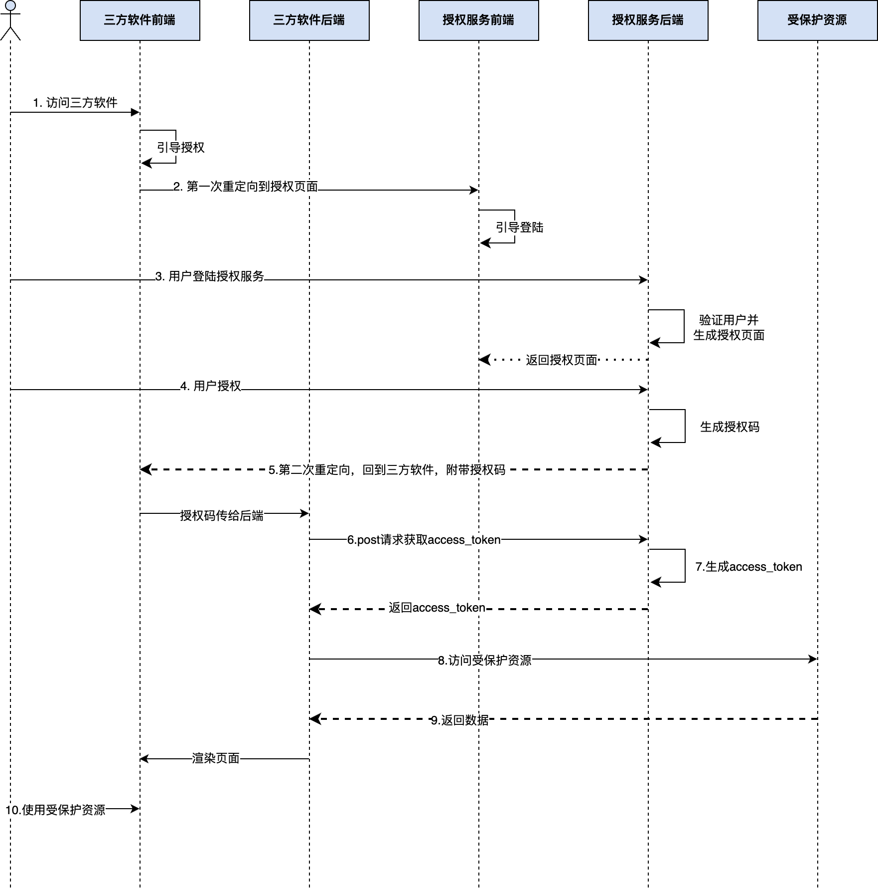

简单来说，OAuth2.0是一种**授权协议**，它通过颁发访问令牌的机制而不是使用用户名和密码来请求交互，保证第三方应用只有在**成功获取授权之后**才可以访问授权者的数据。通过这套协议，用户仅仅通过授权操作就可以免去重复注册的流程，是目前web上重要的安全手段。

OAuth2.0提供了四种许可类型：

- **授权码许可（Authorization Code）**
- 隐式许可（Implicit）
- 客户端凭据许可（Client Credentials）
- 资源拥有者凭据许可（Resource Owner Password Credentials）

# OAuth2.0的基本流程

OAuth2.0里有4种角色，分别是资源所有者、三方软件、授权服务和受保护资源。

 

## 重定向的必要性

如果没有重定向，只有纯粹后端逻辑的交互，那么用户在第三方平台跳转到授权服务后，用户与三方平台的连接关系就中断了，相当于用户一直停留在授权服务的页面。

## 授权码的必要性

用户在不同平台千万另一个平台时，由于域名的不同，需要使用重定向功能讲用户引导过去。与此同时由于域名的不同，cookie这些保存登陆态的信息无法携带跳转，即使用户在一个平台授权登录后其他平台仍然无法感知，因此需要携带一些信息告诉其他平台，用户已经授权过了。为了保证信息的安全性，携带的信息不能是用户密钥，于是使用了授权码机制（一种临时的、间接的凭证）。

第三方软件最终是需要拿到安全保密性要求极高的访问令牌才能操作用户数据，而两次重定向操作是暴露在浏览器上的，有了授权码的参与，保证了访问令牌只在后端服务之间传输。

## 授权服务的流程

# 进阶
