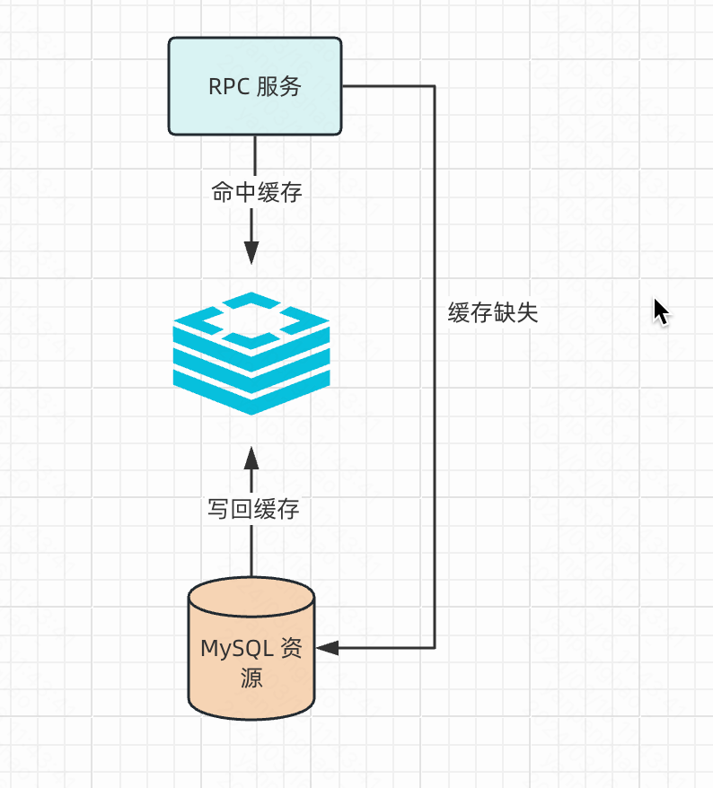
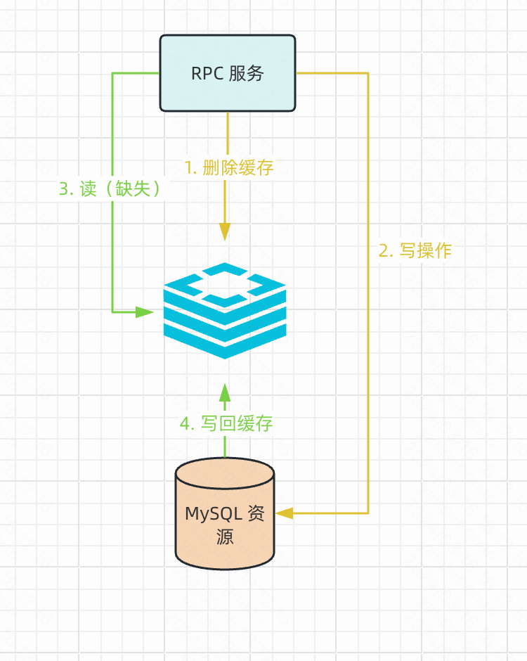
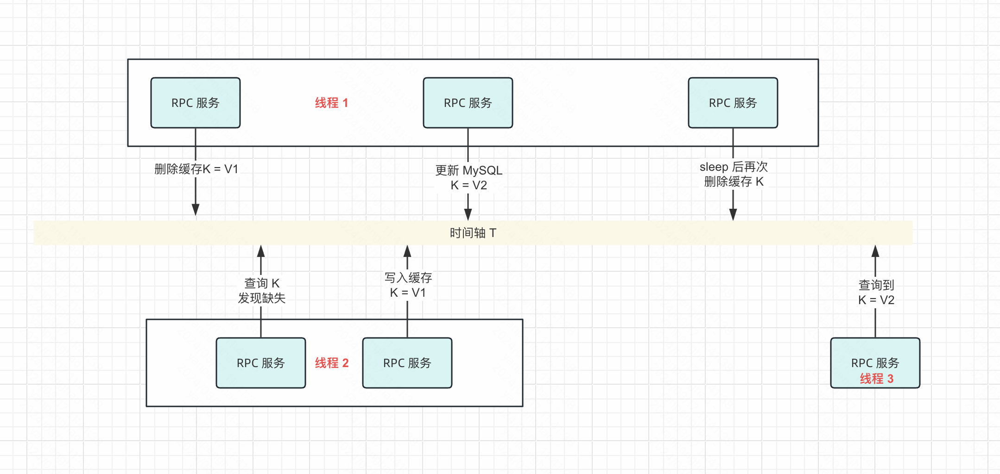
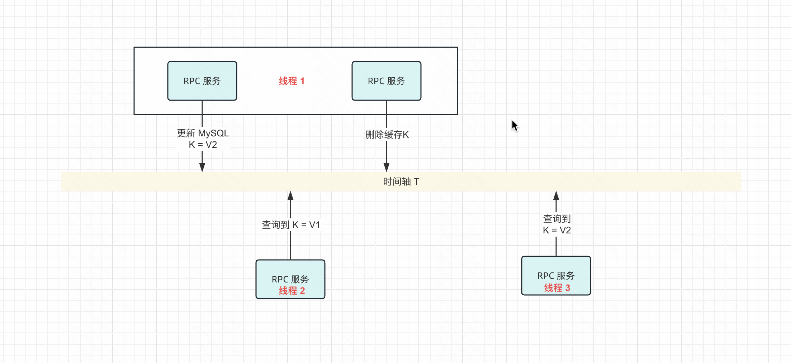
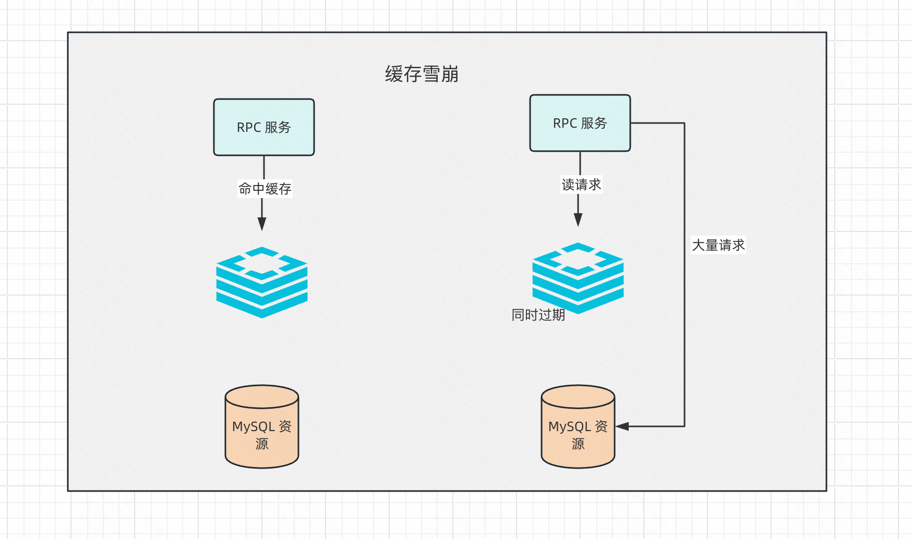
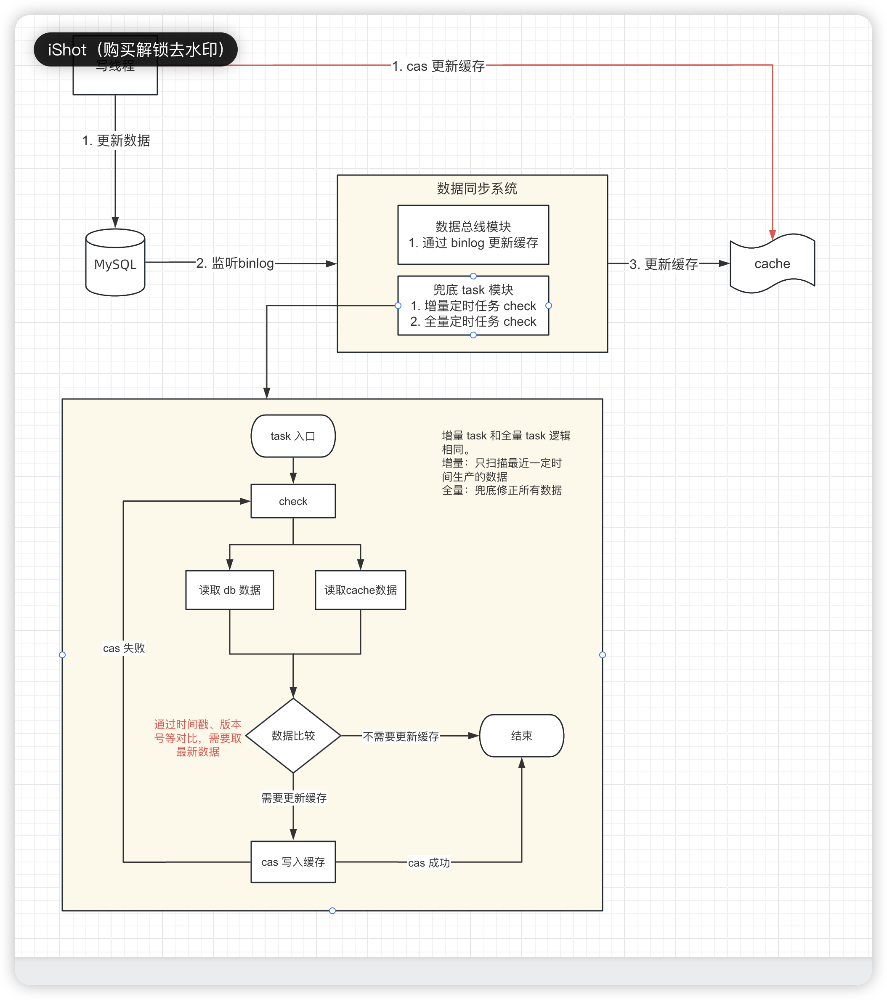

## 为什么要使用缓存

在互联网的高流量、高并发场景下，MySQL 集群能够扛住的 QPS 通常在 1W 量级，数据库在达到压力瓶颈时会明显出现慢尾效应，即原有执行速度很快的 sql 耗时也会显著增加，拖累使用了此集群的所有服务，最终导致整个数据库集群的崩溃。

相比于 redis 缓存来说，MySQL 集群的资源更加珍贵，为了保护数据库集群且让服务能够承受更高的流量，我们通常使用缓存来减少数据库的压力，对那些热点数据进行缓存来分担 MySQL 的压力。对于 redis 集群来说，可以轻松承担 10 W+的 QPS，并且可以很方便的进行扩容。

## 缓存可能出现的问题

### 只读缓存

Redis 缓存通常放在 MySQL 集群的前置链路，下图是缓存的**只读操作（缓存不接受RPC 的直接数据修改）**。

在服务流量非常高的情况下缓存出现缺失，一瞬间所有请求都打到 MySQL 集群上，这时候需要评估数据库能否扛住，通常情况下是只让一个请求访问 db，其余全部阻塞来保护 MySQL 集群。缓存雪崩、缓存击穿、缓存穿透都有可能发生以上问题。

常用的避免手段有：

1. cacheSetter
2. 分布式锁

#### 延迟双删-先删除缓存后修改 db（不建议）

发生写操作时**先删除缓存，然后去修改数据库**，由下一个请求触发缓存缺失来更新缓存。这种有可能在写数据库时下次请求把旧数据刷新到缓存中，导致缓存中保存了脏数据。

这种解决办法也比较简单：更新操作的线程在更新完数据库后，让线程短暂 sleep 一段时间，然后再次删除缓存，这样就解决了更新操作时被其他线程写入缓存的脏数据，这种操作被称为**延迟双删**。需要评估线程 sleep 的时间，需要保证时间大于线程 2 的时间。

这种办法的缺点是：

1. 中间会有一些线程读取到了脏数据，但是保证了缓存最终一致性。
2. 需要 sleep 且需要准确评估时间。

#### 先修改 db 再删除缓存

在线程 1 完成之前，线程 2 的都只能查询到缓存中的脏数据，在线程 1 修改结束后线程 3 可以查询到新数据。

缺点：中间线程读取到了脏数据。

优点：省去了线程 sleep 的时间，在对数据一致性要求不严的情况下通常也会选择先更新数据库再删除缓存的办法。

#### 删除操作可能失效

无论是先修改数据库还是先删除缓存，都有可能碰到操作失效的情况。如果发生这种情况，缓存的数据有可能永远都不会被更新，导致以后的线程读取到的都是脏数据。

这种情况的解决办法是：把删除缓存的操作和数据库更新**操作放在消息中间件中**，利用中间件的失败重试策略，保证最终一定消费成功。

### 读写缓存

当 RPC 服务发生数据更新操作时，这时需要保持缓存和 db 的一致性，通常采取的办法是删除缓存并写入数据库，等待下次查询操作来临时发现缓存缺失，重新从 MySQL 中读取数据并放入缓存中，此时可能由于**缓存缺失**导致上述问题。这种缓存即接收读请求、也有写请求的方式被称为读写缓存。

读写缓存保证数据库和缓存一致性有以下方式：

- 写操作发生在缓存，同时事务性的修改数据库。可以保证数据一致性，但是请求需要阻塞等待两部操作都完成。
- 缓存写操作结束后立即返回，在缓存失效时或者定期用缓存中的数据去更新数据库。这种有可能由于缓存断电导致数据丢失。

### 缓存雪崩

大量的数据请求无法在缓存中处理，所有请求全部打到数据库上，这种情况发生主要是因为缓存都会设置对应的过期时间，如果某一大批数据被同时设置了相同的过期时间，那么在缓存过期的瞬间，大量的请求会落到数据库上，可能造成数据库宕机。

对应的有两种解决办法：

1. 缓存的过期时间随机增加一个随机数，避免在同一时刻这些数据一同过期。
2. 进行服务降级：同时过期的这些数据，只允许核心数据回源数据库查询，其余不重要的数据准备一个默认值。这样就能减少一部分请求打到数据库上，进而保护数据库资源。

除此之外，Redis 集群直接挂掉也会导致所有请求落到数据库上。也有两种办法：

1. 缓存系统宕机后，进行服务熔断和服务限流，当一段时间间隔内，多次发生访问redis失败，就进入熔断状态。一段时间之后允许少量请求通过，如果请求都执行成功，则退出熔断状态，如果请求仍旧失败，在下一个时间段，再次允许少量请求通过，试探服务是否恢复。
2. 缓存系统避免使用单点系统，使用主从节点构造高可用集群，防止主节点宕机导致整个服务不可用。

### 缓存击穿

缓存击穿指的是非常热门的数据忽然失效了，导致热点请求落到数据库上，这种行为让数据库压力激增，进而影响到数据库其他请求，拖累整个服务。

为了避免缓存击穿给数据库带来的激增压力，对于访问特别频繁的热点数据，不设置过期时间。这样一来，对热点数据的访问请求，都可以在缓存中进行处理，而 Redis 的高吞吐量可以很好地应对大量的并发请求访问。

### 缓存穿透

缓存击穿和缓存雪崩发生时，数据库都保存了对应的值，因此可以通过重新加载缓存来保护数据库。而缓存穿透则是数据库和缓存都不存在这个值，无效的请求频繁打穿缓存到数据库上，数据库执行查询后返回了空数据，如果持续有这种**恶意请求**，就会对缓存服务和数据库服务造成大量浪费。有几种解决办法：

1. 对于空值也进行缓存
2. 使用布隆过滤器进行过滤
3. 前端拦截掉非法请求

## 数据一致性保证

### 旁路缓存的问题

多个线程更新缓存操作的**时序行**不同导致缓存出现脏数据。

| 时间 |         线程  1          |    线程 2     |
| :--: | :----------------------: | :-----------: |
|  t1  |      读缓存 k 缺失       |               |
|  t2  |     查询 db，k = v1      |               |
|  t3  |                          | 写 db，k = v2 |
|  t4  |                          |               |
|  t5  |                          |  删除缓存 k   |
|  t6  | 写缓存，k = v1（脏数据） |               |

缓存删除操作失败，导致缓存中出现脏数据。

| 时间 |       线程  1        |          线程 2          |
| :--: | :------------------: | :----------------------: |
|  t1  |    写 db，k = v2     |                          |
|  t2  |                      |                          |
|  t3  | 删除缓存（删除失败） |                          |
|  t4  |                      | 读缓存，k = v1（脏数据） |

### 方案

为了解决缓存缓存不一致 && 把缓存和业务系统解构，采用以下方案：

1. 引入 binlog 模块，监听 MySQL 的数据日志进行缓存更新，此举带来两个新问题
   1. 可能存在很多业务逻辑只更新无关字段（比如数据更新时间），这样会带来大量的 binlog ，导致数据中线消费不过来，最终导致缓存和 db 的数据不一致。**这种延迟通过时间可以被修复**。
   2. binlog 数据总线模块宕机，数据完全无法同步。**这种情况缓存没有修复可能性**。
2. binlog 消费不过来可以不监听无关字段（由业务决定），写MySQL 时同步 cas 的写入缓存。
3. 宕机可以通过增量定时任务 && 全量定时任务来进行兜底保证缓存的最终一致性。

