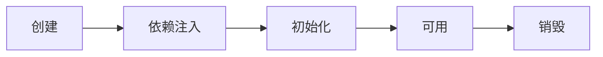
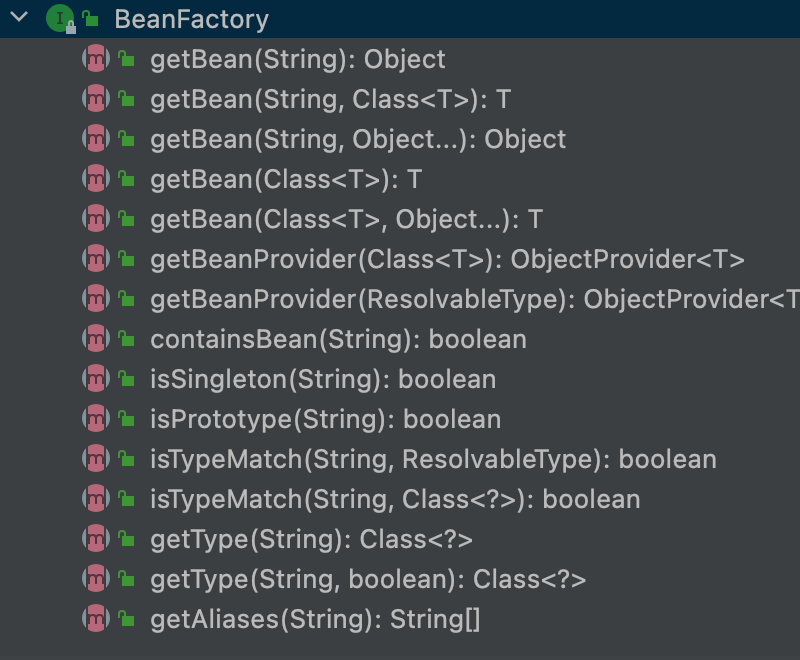
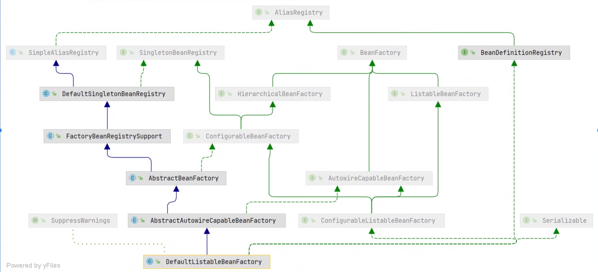
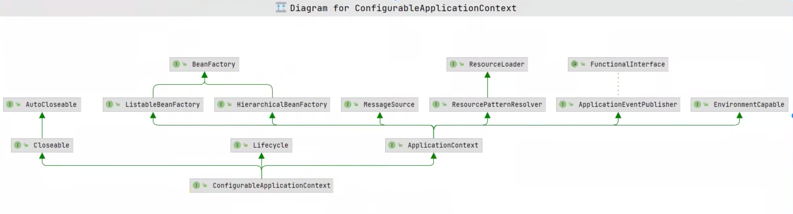
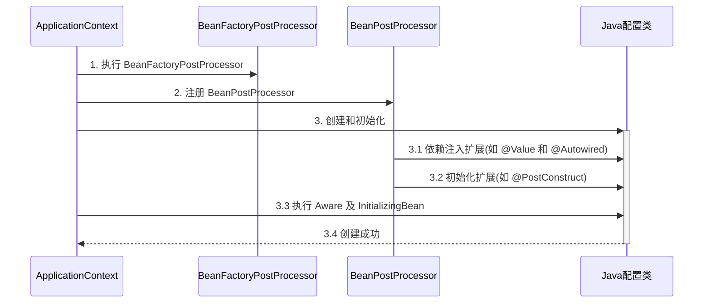
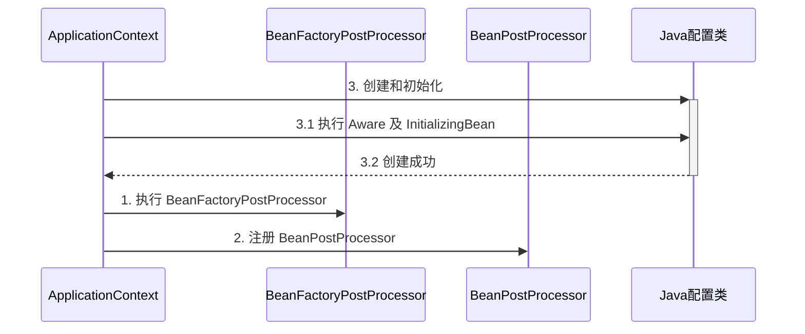
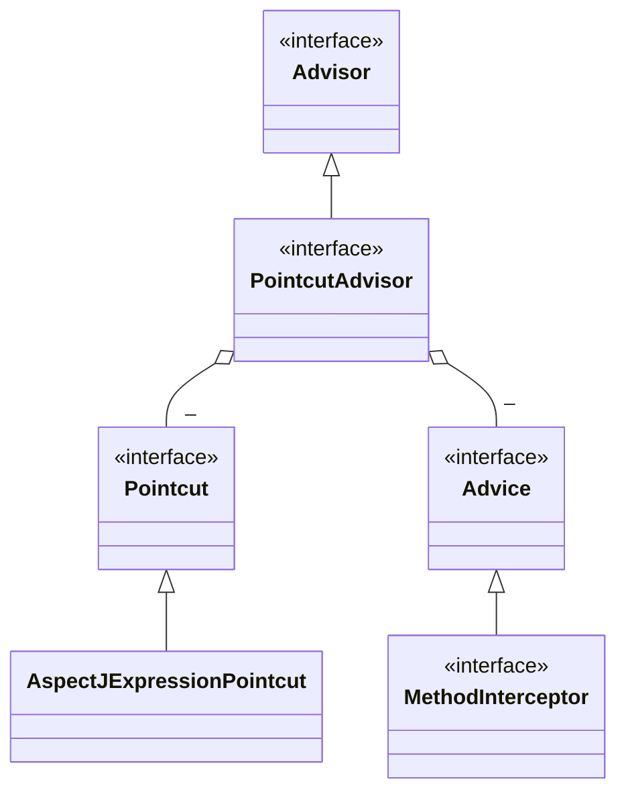
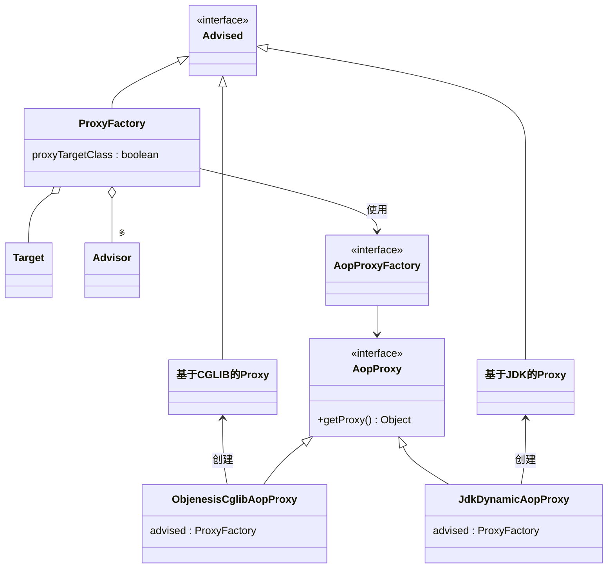

# IOC
IoC（Inverse of Control:控制反转） 是一种设计思想，而不是一个具体的技术实现。IoC 的思想就是将原本在程序中手动创建对象的控制权，交由 Spring 框架来管理。IoC 容器实际上就是个 Map（key，value），Map 中存放的是各种对象。
- 控制 ：指的是对象创建（实例化、管理）的权力
- 反转 ：控制权交给外部环境（Spring 框架、IoC 容器）

IOC 解决了以下问题：
1. 创建了许多重复对象，造成大量资源浪费；
2. 更换实现类需要改动多个地方；
3. 创建和配置组件工作繁杂，给组件调用方带来极大不便。

IOC容器职责：
1. 依赖处理
	1. 依赖查找
	2. 依赖注入
2. 生命周期管理
	1. 容器
	2.  托管的资源(bean或其他)
3. 配置 
	1. 容器
	2. 外部化资源
	3. 托管的资源(bean或其他)

## bean

spring中有三种类型的bean，其中前两种都可以通过getbean方法获取到，第三种无法直接获取，是容器自己所使用的对象。

1. 用户自定义的bean
2. 容器自己的bean（内建bean对象），也是通过正常的bean注册流程生产的
3. spring的内建依赖，无法通过自动注入方式设置对象 

### bean自动装配
使用bean标签的**autowire属性**设置自动装配效果

**byType：根据类型匹配IOC容器中的某个兼容类型的bean，为属性自动赋值**

若在IOC中，没有任何一个兼容类型的bean能够为属性赋值，则该属性不装配，即值为默认值null

若在IOC中，有多个兼容类型的bean能够为属性赋值，则抛出异常NoUniqueBeanDefinitionException

**byName：将自动装配的属性的属性名，作为bean的id在IOC容器中匹配相对应的bean进行赋值**

### Bean的生命周期
#### **bean的装载过程：**

xml（注解）->bean defination -> bean factory -> 实例化出bean。

1. `BeanDefinitionReader`：从不同格式的定义bean信息中读取，完成从xml文件到bean defination的转变
2. `BeanDefinition`：其中保存了从配置文件中读取到的该bean的各种信息，包括bean的名字、类型、依赖关系、作用域等等，以后所有的操作都是对这个对象的操作。**Bean Definition从加载、解析、处理、注册到BeanFactory的过程，也就是IOC容器的初始化过程**
3. `BeanFactory`：是Spring bean容器的根接口.**提供获取bean,是否包含bean,是否单例与原型,获取bean类型,bean 别名的方法** 。BeanFactory是一个接口，Spring为BeanFactory提供了多种实现
4. `ApplicationContext`：ApplicationContext由BeanFactory派生而来，提供了更多面向实际应用的功能。ApplicationContext的主要实现类是`ClassPathXmlApplicationContext`和`FileSystemXmlApplicationContext`，前者默认从类路径加载配置文件，后者默认从文件系统中加载配置文件

#### Spring 管理bean的生命周期主要阶段（doGetBean）：

1. 处理名称，检查缓存，若缓存中存在可以直接返回

   1. 先把别名解析为实际名称，再进行后续操作
   2. singletonObjects：一级缓存，存放单例成品对象
   3. singletonFactories：三级缓存，放单例工厂
   4. earlySingletonObjects：二级缓存，放单例工厂的产品，成为提前单例对象

2. 按照scope实例化Bean：Spring启动，查找并加载需要被Spring管理的bean，根据 bean 的**构造方法或者工厂方法**来创建 bean 实例对象

   1. singleton scope：从单例池中获取，如果没有就创建并放入单例池
   2. prototype scope：从不缓存bean，每次请求都创建新的
   3. request scope：从request对象范围内获取bean

3. 依赖注入：实例化后的对象被封装在BeanWrapper对象中，并且此时对象仍然是一个原生的状态，并没有进行依赖注入。紧接着，Spring根据BeanDefinition中的信息进行依赖注入。根据 @Autowired，@Value 或其它一些手段，为 bean 的成员变量填充值、建立关系

4. 初始化

   1. 注入Aware接口：检测该对象是否实现了xxxAware接口，并将相关的xxxAware实例注入给bean

   2. BeanPostProcessor：经过上述几个步骤后，bean对象已经被正确构造，但如果想要对象被使用前再进行一些自定义的处理，就可以通过BeanPostProcessor接口实现。

      - postProcessBeforeInitialzation()

      - postProcessAfterInitialzation()

      **BeanPostProcessor接口对IOC容器中所有bean都生效，耦合度高，spring建议使用@postconstruct**

   3. InitializingBean：此阶段无法修改对象本身，只能增加一些额外的逻辑。

   4. init-method：init-method本质上仍然使用了InitializingBean接口。

   四个初始化步骤的调用顺序：Aware接口-->@postconstruct-->InitializingBean接口-->指定init-method方法

5. 判断并登记可销毁bean

   1. 实现了DisposableBean或AutoCloseable接口，则为可销毁bean
   2. 自定义了destroyMethod
   3. 有@PreDestroy标注的方法

   singleton scope的可销毁bean存放于beanFactory的成员变量中

6. 销毁：在容器关闭时，会销毁所有单例对象（即调用它们的销毁方法）

   * prototype 对象也能够销毁，不过需要容器主动调用

   同一bean中不同形式销毁方法的调用顺序：@PreDestroy-->DisposableBean接口销毁-->destroyMethod方法销毁



创建前后的增强

* postProcessBeforeInstantiation
  * 这里返回的对象若不为 null 会替换掉原本的 bean，并且仅会走 postProcessAfterInitialization 流程
* postProcessAfterInstantiation
  * 这里如果返回 false 会跳过依赖注入阶段

依赖注入前的增强

* postProcessProperties
  * 如 @Autowired、@Value、@Resource 

初始化前后的增强

* postProcessBeforeInitialization
  * 这里返回的对象会替换掉原本的 bean
  * 如 @PostConstruct、@ConfigurationProperties
* postProcessAfterInitialization 
  * 这里返回的对象会替换掉原本的 bean
  * 如代理增强

销毁之前的增强

* postProcessBeforeDestruction
  * 如 @PreDestroy 

#### spring循环依赖解决：三级缓存（set方法进行依赖注入）
只有单例模式的bean会通过三级缓存提前暴露来解决循环依赖的问题，而非单例的bean每次请求都会创建一个新的对象，所以非单例的bean不会放在缓存中。

1. 三级缓存中存放的内容
   1. 一级缓存：成品对象--concurrenthashmap，每个bean在容器中只有一份即实现singleton
   2. 二级缓存：存放发生循环依赖时的半成品对象（可能是代理bean也可能是原始bean）--hashmap ，创造完成品对象删除 
   3. 三级缓存：存放工厂对象，发生循环依赖时会由工厂获取 产品。lambda表达式，**保证在容器的运行过程中同名的bean对象只有一个**--hashmap
2. 只有一级缓存无法解决：成品对象与半成品对象放在一起，会导致获取对象时获取到未初始化完成的对象
3. 二级缓存可以解决循环依赖的问题，但是无法实现aop的功能，在进行aop时，会导致获取到非最终的bean
4. 三级缓存作用：实现aop相关功能时需要创建代理对象，由于容器中只能存在单个实例，因此当一个对象需要被代理时就要使用代理对象对他进行覆盖，然而无法确定其时机。因此lambda完成了代理对象替换非代理对象的工作，确保返回的是唯一的对象。**所有的bean对象在创建的时候都要优先放在三级缓存中，在后续的使用过程中，根据是否需要代理，返回对应的对象**

三级缓存无法解决构造循环依赖，可以用@Lazy解决 
### Bean 后处理器

1. @Autowired 等注解的解析属于 bean 生命周期阶段（依赖注入, 初始化）的扩展功能，这些扩展功能由 bean 后处理器来完成
2. 不同后处理器负责增强不同功能
   * AutowiredAnnotationBeanPostProcessor 解析 @Autowired 与 @Value
   * CommonAnnotationBeanPostProcessor 解析 @Resource、@PostConstruct、@PreDestroy
   * ConfigurationPropertiesBindingPostProcessor 解析 @ConfigurationProperties
3. ContextAnnotationAutowireCandidateResolver 负责获取 @Value 的值，解析 @Qualifier、泛型、@Lazy 等

------

**@Autowired bean 后处理器运行分析**

1. AutowiredAnnotationBeanPostProcessor.findAutowiringMetadata 用来获取某个 bean 上加了 @Value @Autowired 的成员变量，方法参数的信息，表示为 InjectionMetadata
2. InjectionMetadata 可以完成依赖注入
3. InjectionMetadata 内部根据成员变量，方法参数封装为 DependencyDescriptor 类型
4. 有了 DependencyDescriptor，就可以利用 beanFactory.doResolveDependency 方法进行基于类型的查找

### 初始化和销毁顺序

Spring 提供了多种**初始化手段**，如果同一个 bean 用了声明了 3 个初始化方法，那么它们的执行顺序是

1. @PostConstruct 标注的初始化方法
2. InitializingBean 接口的初始化方法
3. @Bean(initMethod) 指定的初始化方法

> 被@PostConstruct 修饰的方法会在服务器加载Servlet的时候运行，并且只会被服务器执行一次。PostConstruct在构造函数之后执行，init（）方法之前执行。
Constructor >> @Autowired >> @PostConstruct

与初始化类似，Spring 也提供了多种**销毁手段**，执行顺序为

1. @PreDestroy 标注的销毁方法
2. DisposableBean 接口的销毁方法
3. @Bean(destroyMethod) 指定的销毁方法

### Scope
在当前版本的 Spring 和 Spring Boot 程序中，支持五种 Scope

* singleton，容器启动时创建（未设置延迟），容器关闭时销毁
* prototype，每次使用时创建，不会自动销毁，需要调用 DefaultListableBeanFactory.destroyBean(bean) 销毁
* request，每次请求用到此 bean 时创建，请求结束时销毁
* session，每个会话用到此 bean 时创建，会话结束时销毁
* application，web 容器用到此 bean 时创建，容器停止时销毁

对于单例对象来讲，依赖注入仅发生了一次，如果在 singleton 注入其它 scope 都会有问题，解决方法有
* @Lazy
* @Scope(proxyMode = ScopedProxyMode.TARGET_CLASS)
* ObjectFactory
* ApplicationContext.getBean

### bean的垃圾回收

1. 关闭spring容器
2. 执行GC
3.  spring  bean重写finalize()方法

## 容器

### 容器接口

#### FactoryBean
FactoryBean是Spring提供的一种整合第三方框架的常用机制。和普通的bean不同，配置一个FactoryBean类型的bean，在获取bean的时候得到的并不是class属性中配置的这个类的对象，而是getObject()方法的返回值。通过这种机制，Spring可以把复杂组件创建的详细过程和繁琐细节都屏蔽起来，只把最简洁的使用界面展示出来。

比如Spring就是通过继承FactoryBean并重写相关方法的机制来创建SqlSessionFactory对象。
```java
public interface FactoryBean<T> {

    @Nullable
    T getObject() throws Exception;
    
    @Nullable
    Class<?> getObjectType();
    
}
```
#### BeanFactory

是ApplicationContext的父接口，是spring的核心容器。实际上的控制反转、依赖注入、Bean生命周期的各种功能都由它的实现类提供。



BeanFactory的主要实现类



#### ApplicationContext
BeanFactory是底层的IOC容器，ApplicationContext是 BeanFactory 的子接口。它**组合**（类似于代理模式，核心的方法都是BeanFactory进行操作）并扩展了 BeanFactory 的功能，不仅仅是继承关系，如：

* 国际化

  语言支持：`applicationContext.getMessage()`

* 通配符方式获取一组 Resource 资源

  `applicationContext.getResources("classpath*:META-INF/spring.factories")`

* 整合 Environment 环境（能通过它获取各种来源的配置信息）

  ```java
  ConfigurableEnvironment environment = context.getEnvironment();
  String java_home = environment.getProperty("java_home");
  ```

* 事件发布与监听，实现组件之间的解耦

  ```java
  //定义事件
  public class MyEvent extends ApplicationEvent {
      public MyEvent(Object source) {
          super(source);
      }
  }
  
  //发送事件
  context.publishEvent(new MyEvent(context));
  
  //接受事件
      @EventListener
      public void listen(MyEvent event) {
          System.out.println("接受事件" + event);
      }
  ```

  




### 容器实现

Spring 容器的实现

* DefaultListableBeanFactory，是 BeanFactory 最重要的实现，像**控制反转**和**依赖注入**功能，都是它来实现
* ClassPathXmlApplicationContext，从类路径查找 XML 配置文件，创建容器（旧）
* FileSystemXmlApplicationContext，从磁盘路径查找 XML 配置文件，创建容器（旧）
* XmlWebApplicationContext，传统 SSM 整合时，基于 XML 配置文件的容器（旧）
* AnnotationConfigWebApplicationContext，传统 SSM 整合时，基于 java 配置类的容器（旧）
* AnnotationConfigApplicationContext，Spring boot 中非 web 环境容器（新）
* AnnotationConfigServletWebServerApplicationContext，Spring boot 中 servlet web 环境容器（新）
* AnnotationConfigReactiveWebServerApplicationContext，Spring boot 中 reactive web 环境容器（新）

另外要注意的是，后面这些带有 ApplicationContext 的类都是 ApplicationContext 接口的实现，但它们是**组合**了 DefaultListableBeanFactory 的功能，并非继承而来

####  DefaultListableBeanFactory实现

是 BeanFactory 最重要的实现，像**控制反转**和**依赖注入**功能，都是它来实现。

* beanFactory 可以通过 registerBeanDefinition 注册一个 bean definition 对象
  * 平时使用的配置类、xml、组件扫描等方式都是生成 bean definition 对象注册到 beanFactory 当中
  * bean definition 描述了这个 bean 的创建蓝图：scope 是什么、用构造还是工厂创建、初始化销毁方法是什么，等等
* beanFactory 需要手动调用 beanFactory 后处理器对它做增强
  * 例如通过解析 @Bean、@ComponentScan 等注解，来补充一些 bean definition
* beanFactory 需要手动添加 bean 后处理器，以便对后续 bean 的创建过程提供增强
  * 例如 @Autowired，@Resource 等注解的解析都是 bean 后处理器完成的
  * bean 后处理的添加顺序会对解析结果有影响，如同时加 @Autowired，@Resource 
* beanFactory 需要手动调用方法来初始化单例
* beanFactory 需要额外设置才能解析 ${} 与 #{}

#### 常见 ApplicationContext 实现

1. AnnotationConfigApplicationContext，Spring boot 中非 web 环境容器
2. AnnotationConfigServletWebServerApplicationContext，Spring boot 中 servlet web 环境容器

### BeanFactory 后处理器

* ConfigurationClassPostProcessor 可以解析
  * @ComponentScan
  * @Bean
  * @Import
  * @ImportResource
* MapperScannerConfigurer 可以解析
  * Mapper 接口

这些扩展功能由不同的BeanFactory 后处理器来完成，完成了对核心容器的扩展。

1. @ComponentScan, @Bean, @Mapper 等注解的解析属于核心容器（即 BeanFactory）的扩展功能
2. Mapper 接口被 Spring 管理的本质：实际是被作为 MapperFactoryBean 注册到容器中
3. 这些扩展功能由不同的 BeanFactory 后处理器来完成，其实主要就是补充了一些 bean 定义

### Aware 接口

1. Aware 接口提供了一种【内置】 的注入手段，例如
   * BeanNameAware 注入 bean 的名字
   * BeanFactoryAware 注入 BeanFactory 容器
   * ApplicationContextAware 注入 ApplicationContext 容器
   * EmbeddedValueResolverAware 注入 ${} 解析器
2. InitializingBean 接口提供了一种【内置】的**初始化手段**
3. 对比
   * 内置的注入和初始化不受扩展功能的影响，总会被执行
   * 而**扩展功能受某些情况影响可能会失效**
   * 因此 Spring 框架内部的类常用内置注入和初始化

#### 配置类 @Autowired 失效分析

Java 配置类不包含 BeanFactoryPostProcessor 的情况



Java 配置类包含 BeanFactoryPostProcessor 的情况，因此要创建其中的 BeanFactoryPostProcessor 必须提前创建 Java 配置类，而此时的 BeanPostProcessor 还未准备好，导致 @Autowired 等注解失效



对应代码

```java
@Configuration
public class MyConfig1 {

    private static final Logger log = LoggerFactory.getLogger(MyConfig1.class);

    @Autowired
    public void setApplicationContext(ApplicationContext applicationContext) {
        log.debug("注入 ApplicationContext");
    }

    @PostConstruct
    public void init() {
        log.debug("初始化");
    }

    @Bean //  ⬅️ 注释或添加 beanFactory 后处理器对应上方两种情况
    public BeanFactoryPostProcessor processor1() {
        return beanFactory -> {
            log.debug("执行 processor1");
        };
    }

}
```

> ***注意***
>
> 解决方法：
>
> * 用内置依赖注入和初始化取代扩展依赖注入和初始化
> * 用静态工厂方法代替实例工厂方法，避免工厂对象提前被创建


# AOP

AOP 底层实现方式之一是代理，由代理结合通知和目标，提供增强功能

除此以外，aspectj 提供了两种另外的 AOP 底层实现：

* 第一种是通过 ajc 编译器在**编译** class 类文件时，就把通知的增强功能，织入到目标类的字节码中
* 第二种是通过 agent 在**加载**目标类时，修改目标类的字节码，织入增强功能

简单比较的话：

* aspectj 在编译和加载时，修改目标字节码，性能较高
* aspectj 因为不用代理，能突破一些技术上的限制，例如对构造、对静态方法、对 final 也能增强
* 但 aspectj 侵入性较强，且需要学习新的 aspectj 特有语法，因此没有广泛流行

AOP(术语)
1. 连接点:类中可以被增强的方法
2. 切入点:实际增强的方法
3. 通知(增强):
		- 前置通知 before
		- 后置通知 afterreturning(有异常不执行)
		- 环绕通知 around
		- 异常通知 afterthrowing
		- 最终通知 after(有异常也执行)
4. 切面:把通知应用到切入点过程
## jdk 动态代理

### 使用jdk 动态代理

```java
public class JdkProxyDemo {

    interface Foo {
        void foo();
    }

    static class Target implements Foo {
        public void foo() {
            System.out.println("target foo");
        }
    }

    public static void main(String[] param) {
        // 目标对象
        Target target = new Target();
        // 代理对象
        Foo proxy = (Foo) Proxy.newProxyInstance(
                Target.class.getClassLoader(), new Class[]{Foo.class},
                (p, method, args) -> {
                    System.out.println("proxy before...");
                    Object result = method.invoke(target, args);
                    System.out.println("proxy after...");
                    return result;
                });
        // 调用代理
        proxy.foo();
    }
}
```

jdk 动态代理要求目标**必须**实现接口，生成的代理类实现相同接口，因此代理与目标之间是平级兄弟关系

### 实现 jdk 动态代理

```java
public class A12 {

    interface Foo {
        void foo();
        int bar();
    }

    static class Target implements Foo {
        public void foo() {
            System.out.println("target foo");
        }

        public int bar() {
            System.out.println("target bar");
            return 100;
        }
    }

    public static void main(String[] param) {
        // ⬇️1. 创建代理，这时传入 InvocationHandler
        Foo proxy = new $Proxy0(new InvocationHandler() {    
            // ⬇️5. 进入 InvocationHandler
            public Object invoke(Object proxy, Method method, Object[] args) throws Throwable{
                // ⬇️6. 功能增强
                System.out.println("before...");
                // ⬇️7. 反射调用目标方法
                return method.invoke(new Target(), args);
            }
        });
        // ⬇️2. 调用代理方法
        proxy.foo();
        proxy.bar();
    }
}


//模拟代理实现
import java.lang.reflect.InvocationHandler;
import java.lang.reflect.Method;
import java.lang.reflect.Proxy;
import java.lang.reflect.UndeclaredThrowableException;

// ⬇️这就是 jdk 代理类的源码, 秘密都在里面
public class $Proxy0 extends Proxy implements A12.Foo {

    public $Proxy0(InvocationHandler h) {
        super(h);
    }
    // ⬇️3. 进入代理方法
    public void foo() {
        try {
            // ⬇️4. 回调 InvocationHandler
            h.invoke(this, foo, new Object[0]);
        } catch (RuntimeException | Error e) {
            throw e;
        } catch (Throwable e) {
            throw new UndeclaredThrowableException(e);
        }
    }

    @Override
    public int bar() {
        try {
            Object result = h.invoke(this, bar, new Object[0]);
            return (int) result;
        } catch (RuntimeException | Error e) {
            throw e;
        } catch (Throwable e) {
            throw new UndeclaredThrowableException(e);
        }
    }

    static Method foo;
    static Method bar;
    static {
        try {
            foo = A12.Foo.class.getMethod("foo");
            bar = A12.Foo.class.getMethod("bar");
        } catch (NoSuchMethodException e) {
            throw new NoSuchMethodError(e.getMessage());
        }
    }
}
```

代理利用了多态、反射的知识

1. 方法重写可以增强逻辑，只不过这【增强逻辑】千变万化，不能写死在代理内部
2. 通过接口回调将【增强逻辑】置于代理类之外
3. 配合接口方法反射（是多态调用），就可以再联动调用目标方法
4. 限制⛔：代理增强是借助多态来实现，因此成员变量、静态方法、final 方法均不能通过代理实现

## cglib 代理

```java
public class CglibProxyDemo {

    static class Target {
        public void foo() {
            System.out.println("target foo");
        }
    }

    public static void main(String[] param) {
        // 目标对象
        Target target = new Target();
        // 代理对象
        Target proxy = (Target) Enhancer.create(Target.class, 
                (MethodInterceptor) (p, method, args, methodProxy) -> {
            System.out.println("proxy before...");
            Object result = methodProxy.invoke(target, args);
            // 另一种调用方法，不需要目标对象实例
//            Object result = methodProxy.invokeSuper(p, args);
            System.out.println("proxy after...");
            return result;
        });
        // 调用代理
        proxy.foo();
    }
}
```

* cglib 不要求目标实现接口，它生成的代理类是目标的子类，因此代理与目标之间是子父关系
* 限制⛔：根据上述分析 final 类无法被 cglib 增强

## jdk 和 cglib 在 Spring 中的统一

Spring 中对切点、通知、切面的抽象如下

* 切点：接口 Pointcut，典型实现 AspectJExpressionPointcut
* 通知：典型接口为 MethodInterceptor 代表环绕通知
* 切面：Advisor，包含一个 Advice 通知，PointcutAdvisor 包含一个 Advice 通知和一个 Pointcut



代理相关类图

* AopProxyFactory 根据 proxyTargetClass 等设置选择 AopProxy 实现
* AopProxy 通过 getProxy 创建代理对象
* 图中 Proxy 都实现了 Advised 接口，能够获得关联的切面集合与目标（其实是从 ProxyFactory 取得）
* 调用代理方法时，会借助 ProxyFactory 将通知统一转为环绕通知：MethodInterceptor




1. ProxyFactory 用来创建代理
   * 如果指定了接口，且 proxyTargetClass = false，使用 JdkDynamicAopProxy
   * 如果没有指定接口，或者 proxyTargetClass = true，使用 ObjenesisCglibAopProxy
     * 例外：如果目标是接口类型或已经是 Jdk 代理，使用 JdkDynamicAopProxy

> ***注意***
>
> * 要区分本章节提到的 MethodInterceptor，它与之前 cglib 中用的的 MethodInterceptor 是不同的接口

# 设计模式

## 模板方法设计模式
模板方法模式是一种行为设计模式，它定义一个操作中的算法的骨架，而将一些步骤延迟到子类中。 模板方法使得子类可以不改变一个算法的结构即可重定义该算法的某些特定步骤的实现方式。

Spring 中 jdbcTemplate、hibernateTemplate 等以 Template 结尾的对数据库操作的类，它们就使用到了模板模式。一般情况下，我们都是使用继承的方式来实现模板模式

```java
public class TestMethodTemplate {

    public static void main(String[] args) {
        MyBeanFactory beanFactory = new MyBeanFactory();
        beanFactory.addBeanPostProcessor(bean -> System.out.println("解析 @Autowired"));
        beanFactory.addBeanPostProcessor(bean -> System.out.println("解析 @Resource"));
        beanFactory.getBean();
    }

    // 模板方法  Template Method Pattern
    static class MyBeanFactory {
        public Object getBean() {
            Object bean = new Object();
            System.out.println("构造 " + bean);
            System.out.println("依赖注入 " + bean); // @Autowired, @Resource
            for (BeanPostProcessor processor : processors) {
                processor.inject(bean);
            }
            System.out.println("初始化 " + bean);
            return bean;
        }

        private List<BeanPostProcessor> processors = new ArrayList<>();

        public void addBeanPostProcessor(BeanPostProcessor processor) {
            processors.add(processor);
        }
    }
    
    static interface BeanPostProcessor {
        public void inject(Object bean); // 对依赖注入阶段的扩展
    }
```

## 单例模式
单例bean借鉴了思想，严格意义上并不是单例模式。因为只保证了一个容器有一个唯一bean，但是系统可以有多个容器

Spring 通过`ConcurrentHashMap`实现单例注册表的特殊方式实现单例模式。
```java
// 通过 ConcurrentHashMap（线程安全） 实现单例注册表

private final Map<String, Object> singletonObjects = new ConcurrentHashMap<String, Object>(64);


public Object getSingleton(String beanName, ObjectFactory<?> singletonFactory) {

        Assert.notNull(beanName, "'beanName' must not be null");

        synchronized (this.singletonObjects) {

            // 检查缓存中是否存在实例  

            Object singletonObject = this.singletonObjects.get(beanName);

            if (singletonObject == null) {

                //...省略了很多代码

                try {

                    singletonObject = singletonFactory.getObject();

                }

                //...省略了很多代码

                // 如果实例对象不存在，就注册到单例注册表中。

                addSingleton(beanName, singletonObject);

            }

            return (singletonObject != NULL_OBJECT ? singletonObject : null);

        }

    }

    //将对象添加到单例注册表

    protected void addSingleton(String beanName, Object singletonObject) {

            synchronized (this.singletonObjects) {

                this.singletonObjects.put(beanName, (singletonObject != null ? singletonObject : NULL_OBJECT));


            }

        }

}
```
## 建造者模式

链式调用，在build之前对象不可用

## 工厂模式
Spring使用工厂模式可以通过 BeanFactory 或 ApplicationContext 创建 bean 对象。


## 适配器模式

HandlerAdapter--控制器实现有多种

## 组合模式

将分散的调用组合起来，统一调用接口，它的特征是与具体工作的实现实现同一个接口，当调用组合对象的接口方法时，其实是委托具体干活的实现来完成

## 代理模式
使用 AOP 之后我们可以把一些通用功能抽象出来，在需要用到的地方直接使用即可，这样大大简化了代码量。我们需要增加新功能时也方便，这样也提高了系统扩展性。日志功能、事务管理等等场景都用到了 AOP 。

## 装饰器模式

## 观察者模式

事件与监听者

# refresh

```java
	public void refresh() throws BeansException, IllegalStateException {
		synchronized (this.startupShutdownMonitor) {
			/* 完成context的初始化准备工作.
			1. 创建和准备了Environment对象:
				1. systemProperties	Java虚拟机等提供的
				2. systemEnvironment 操作系统提供的
				3. 自定义Properties  自定义properties yml文件中提供的
			2. 作用:如@value注入,使用的就是Environment对象中的值
			*/
			prepareRefresh();
            //---------------------------------------------------------------------

            
			/* 生成一个beanFactory供context使用,容器的核心功能都由beanFactory提供.
			1. ApplicationContext扩展了beanFactory的功能,但是并没有重复实现beanFactory已有功能.
			2. beanFactory的作用是负责bean的创建,依赖注入和初始化.其中包含
				1. beanDefinationMap:作为bean的设计蓝图,规定了bean的特征,如依赖关系,单例多例,初始化销毁方法.
				2. singletonObjects
			*/
			ConfigurableListableBeanFactory beanFactory = obtainFreshBeanFactory();

            
			/* 完成context中的beanFactory初始化准备工作.
			1. 对beanFactory的一些成员变量进行初始化赋值:
				1. beanExpressionResolver	spring内部类型转换器,如解析${}
				2. resolvableDependencies	存放特殊的bean以供使用,如applicationContext,beanFactory等
				3. beanPostProcessors	提供对各种注解的支持
				4. ApplicationContextAwareProcessor	用来解析Aware接口
			*/
			prepareBeanFactory(beanFactory);

			try {
				/* 空实现提供给子类进行扩展.允许在上下文子类中对beanFactory进行增强,如web环境下需要更多功能.模板方法设计模式
				beanFactory的一个扩展点
				*/
				postProcessBeanFactory(beanFactory);

                
				/* 调用注册好的beanFactory后处理器,可以用来补充或修改BeanDefination.
				beanFactory的一个扩展点
				如提供@Bean,@Configuration等注解的支持
				*/
				invokeBeanFactoryPostProcessors(beanFactory);

                
				/* 添加一些bean的后处理器,充当bean的扩展点,可以工作在bean的实例化,依赖注入,初始化阶段
				从beanDefinationMap中找到实现了BeanPostProcessors接口的对象并注册,在后续需要相应功能时提供支持
				如@Autowired,@Aspect,@PostContstruct
				*/
				registerBeanPostProcessors(beanFactory);
                //BeanFactory增强结束-----------------------------------------------------------
                

				// 实现国际化功能,查找容器中是否存在一个MessageSource的bean(实现相关接口),如果没有则提供空实现
				initMessageSource();
                

				/* 初始化事件广播器,查找容器中是否存在一个ApplicationEventMulticaster的bean,如果没有则新建默认的广播器
				调用ApplicationContext.publishEvent()来发布事件
				*/
				initApplicationEventMulticaster();
                

				// 空实现,供子类扩展使用.如spring boot中可以在此准备WebServer容器
				onRefresh();
                

				/* 注册事件监听器
				监听器可以通过编程添加,从容器中获取,或来自与@EventListener的解析
				实现ApplicationListener接口,重写其onApplicationEvent()方法即可接收事件
				*/
				registerListeners();
                

				/* 完成非延迟单例bean的创建和初始化.其中会使用到上文中准备的beanPostProcessors
				1. 单例池中缓存所有非延迟单例bean,对象的创建包含三个阶段:创建-依赖注入-初始化.每个阶段都有不同的bean后处理器参与
				*/
				finishBeanFactoryInitialization(beanFactory);

				/* Last step: publish corresponding event.
				1. 控制容器内需要生命周期管理的bean
				2. 调用context的start,即可触发所有实现LifeCycle接口bean的start
				*/
				finishRefresh();
			}

			catch (BeansException ex) {
				if (logger.isWarnEnabled()) {
					logger.warn("Exception encountered during context initialization - " +
							"cancelling refresh attempt: " + ex);
				}

				// Destroy already created singletons to avoid dangling resources.
				destroyBeans();

				// Reset 'active' flag.
				cancelRefresh(ex);

				// Propagate exception to caller.
				throw ex;
			}

			finally {
				// Reset common introspection caches in Spring's core, since we
				// might not ever need metadata for singleton beans anymore...
				resetCommonCaches();
			}
		}
	}
```

# spring事件

Spring提供了事件机制，其本质是JDK提供的事件机制的应用，利用的是观察者设计模式。
在一个完整的事件体系中存在以下的角色：
1. 事件：描述发生了什么事情、比如说请求处理完成、Spring 容器刷新完毕
2. 事件源：事件的产生者、任何一个事件都必须有一个事件源。比如请求处理完成的事件源就是 DispatcherServlet 、Spring 容器刷新完毕的事件源就是 ApplicationContext
3. 事件广播器：事件和事件监听器的桥梁、负责把事件通知给事件监听器
4. 事件监听器：监听事件的发生、可以在监听器中做一些处理

## 事件

常见的事件可能就是 ApplicationContextEvent ，抽象类，继承了JDK的EventObject接口，起到包装事件源的作用。它的子类 ContextRefreshedEvent 是常见的事件类型、在 Spring 将所有非延迟加载的 bean 实例化之后发布。
```java
public abstract class ApplicationEvent extends EventObject {

	/** use serialVersionUID from Spring 1.2 for interoperability */
	private static final long serialVersionUID = 7099057708183571937L;

	/** System time when the event happened */
	private final long timestamp;


	/**
	 * Create a new ApplicationEvent.
	 * @param source the object on which the event initially occurred (never {@code null})
	 */
	public ApplicationEvent(Object source) {
		super(source);
		this.timestamp = System.currentTimeMillis();
	}


	/**
	 * Return the system time in milliseconds when the event happened.
	 */
	public final long getTimestamp() {
		return this.timestamp;
	}

}
```

## 监听器

ApplicationListener可以通用地声明它感兴趣的事件类型。当在Spring ApplicationContext中注册时，事件将被相应地过滤，只有匹配的事件对象才会调用侦听器
```java
public interface ApplicationListener<E extends ApplicationEvent> extends EventListener {

	/**
	 * Handle an application event.
	 * @param event the event to respond to
	 */
	void onApplicationEvent(E event);

}
```

# 用法

## 启动之后直接执行某一段代码

```java
@Component  //此类要交给spring管理
@Order(value=1) //首先执行
//@Order(value=2) //其次执行
public class ConsumerRunner implements ApplicationRunner{
	@Oberride
	public void run(ApplicationArgumers args) throws Exception{
		//代码
		System.out.println("需要在springBoot项目启动时执行的代码---");
	}
}
```
## 注入Application容器

两种方式：
1. 实现ApplicationContextAware接口
2. @Autowired ApplicationContext
```java
@Component
public class ApplicationContextProvider implements ApplicationContextAware {

    private LoggerWithMDC logger = LoggerWithMDC.getLogger(this.getClass(), "assets-event");

    private ApplicationContext applicationContext;

    @Override
    public void setApplicationContext(ApplicationContext applicationContext) throws BeansException {
        this.applicationContext = applicationContext;
        logger.info("setApplicationContext:{}", applicationContext);

    }
}
```
两种最终结果相同，实现接口可以封装更多方法，如getBean，getBeansWithAnnotation等。

# spring常见操作

