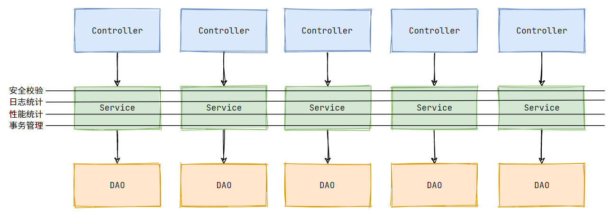

# spring

[到底为什么要用 IoC 和 AOP](https://www.cnblogs.com/RudeCrab/p/14365296.html)
IoC 解决了以下问题：

1. 创建了许多重复对象，造成大量资源浪费；
2. 更换实现类需要改动多个地方；
3. 创建和配置组件工作繁杂，给组件调用方带来极大不便。

AOP 解决了以下问题：

1. 切面逻辑编写繁琐，有多少个业务方法就需要编写多少次。

## IOC
IoC（Inverse of Control:控制反转） 是一种设计思想，而不是一个具体的技术实现。IoC 的思想就是将原本在程序中手动创建对象的控制权，交由 Spring 框架来管理。IoC 容器实际上就是个 Map（key，value），Map 中存放的是各种对象。

- **控制** ：指的是对象创建（实例化、管理）的权力
- **反转** ：控制权交给外部环境（Spring 框架、IoC 容器）

1. BeanFactory:  IOC容器基本实现，是spring内部的使用接口，不提供给开发人员使用
   * 加载配置文件时不会创建对象，获取对象时采取创建对象。
2. ApplicationContext：  BeanFactory的子接口，提供更多的功能。
   * 加载配置文件时候就会把对象创建

### Spring两种类型Bean

1. 普通Bean
   配置文件中定义bean类型就是返回类型
2. 工厂Bean
   配置文件中定义bean类型可以和返回类型不一样
   (1)创建类，让这个类作为工厂bean，实现接口FactoryBean
   (2)实现接口里的方法，在实现的方法中定义返回的bean类型

### ioc操作Bean管理(xml方式)

1. 概念

   * Spring创建对象
   * Spring注入属性

2. 管理方式

   * 基于xml配置文件方式实现
         1. 无参构造方法实例化
                 <bean id="userDao" class="com.it.dao.impl.UserDaoImp" init-method="init" destroy-method="destory"></bean> 

         2. 工厂静态方法实例化
                 <bean id="userDao" class="com.it.factory.StaticFactory" factory-method="getUserDao"></bean>
         3. 工厂实例方法实例化
                 <bean id="factory" class="com.it.factory.DynamicFactory"></bean>
                 <bean id="userDao" factory-bean="factory" factory-method="getUserDao"></bean>
         #### Bean的依赖注入分析
         将对象的依赖关系交给spring来实现，简单地说，就是坐等框架把持久层对象传入业务层，而不用自己去获取。
         1. Bean的依赖注入方式
         * 构造方法
                 <bean id="userService" class="com.it.service.impl.UserServiceImpl">
                 <constructor-arg name="userDao" ref="userDao"></constructor-arg>
                 </bean>
         * set方法
                 <bean id="userDao" class="com.it.dao.impl.UserDaoImp" scope="prototype"></bean>
                 <bean id="userService" class="com.it.service.impl.UserServiceImpl">
                 <property name="userDao" ref="userDao"></property>
                 </bean>
         2. Bean的依赖注入数据类型
            * 普通数据类型
            * 引用数据类型
            * 集合数据类型
            * CDATA:
               <![CDATA[   特殊的符号或字符    ]]>

   * 基于注解方式实现

3. Bean作用域
   单实例或者多实例
   scope标签： single或prototype，request或session
                <!--    single时  加载xml文件即创建对象
                                  只要容器在 对象就一直在
                                  销毁容器时，对象销毁-->
                <!--    prototype时   getbean创建对象
                                      使用就一直在-->

4. Bean生命周期

   1. 通过构造器创建Bean实例(无参数构造)
   2. 为bean的属性设置值和其他bean引用
   3. 把bean实例传递给bean后置处理器(接口：BeanPostProcessor)的方法postProcessBeforeInitialization
   4. 调用bean的初始化方法(需要配置初始化的方法)
   5. 把bean实例传递给bean后置处理器的方法postProcessAfterInitialization
   6. bean可以使用了
   7. 当容器关闭时，调用bean的销毁方法(需要进行配置销毁的方法)
   8. 自动装配:根据指定装配规则(属性名称和属性类型)，spring自动将匹配的属性值进行注入
      <!--autowire="byName"配置自动装配
        autowire常用两个取值
       byName根据属性名称注入，注入值bean的id值和类属性名称一样
       byType根据属性注入
      -->

5. 外部属性文件

   1. 直接配置数据库信息
      (1)配置德鲁伊连接池
      (2)导入jar包
   2. 引用外部属性文件配置数据库连接
      (1)引入context名称空间    xmlns:context="http://www.springframework.org/schema/context"
      (2)spring配置文件使用标签引入外部属性文件   <context:property-placeholder location="classpath:path"/>
      (3)bean标签中加入           
        <bean id="dataSourse" class="com.alibaba.druid.pool.DruidDataSource">
        <property name="username" value="${username}"></property>
        </bean>

### 注解方式

1. Spring中针对Bean管理创建对象提供注解

   * @Component
   * @Service
   * @Controller
   * @Repository
     注意： 上述四个注解功能一样，但是用于不同位置

2. 基于注解方式实现对象创建

   1. 引入依赖
   2. 开启组件扫描
      <context:component-scan base-package="com.zhujie"></context:component-scan>
   3. 创建类，在类上添加对象注解
      //注解里面value值可以省略不写，
      //默认值是类名称，首字母小写
      @Component(value = "UserService")   //<bean id="UserService" class=""/>

   *    <!--   use-default-filters="false"表实不使用默认filter，自己配置filter
               context:include-filter，设置扫描哪些内容
           -->
        <context:component-scan base-package="com.zhujie"></context:component-scan>
        <context:component-scan base-package="com.zhujie" use-default-filters="false">
                <context:include-filter type="annotation" expression="org.springframework.stereotype.Controller"/>
        </context:component-scan>
   *    <!--设置哪些内容不进行扫描-->
        <context:component-scan base-package="com.zhujie"></context:component-scan>
        <context:component-scan base-package="com.zhujie">
                <context:exclude-filter type="annotation" expression="org.springframework.stereotype.Controller"/>
        </context:component-scan>

3. 基于注解方式实现属性注入

   * @Autowired：根据属性类型进行自动装配
   * @Qualifier：根据属性名称进行注入（与第一个联合使用）
   * @Resourse：根据类型或名称注入
   * @Value：注入普通类型

4. 属性注入步骤

   1. 创建对象
   2. 在需要注入的属性上添加Autowired注解

5. 完全注解开发
   创建配置类，替代xml文件
      @Configuration  //作为配置类，替代xml文件
      @ComponentScan(basePackages = {"com.zhujie"})
      public class SpringConfig {
      }

## AOP
传统复用的都是核心业务逻辑，并不能复用一些辅助逻辑，比如：日志记录、性能统计、安全校验、事务管理，等等。这些边缘逻辑往往贯穿整个核心业务，传统 OOP 很难将其封装

AOP 不是 OOP 的对立面，它是对 OOP 的一种补充。OOP 是纵向的，AOP 是横向的。AOP 技术，能够不修改原有代码，便能让切面逻辑在所有业务逻辑中生效。


1. 概念
   面向切面(方面)编程，对业务逻辑的各个部分进行隔离，从而使得业务逻辑各部分之间耦合度降低，提高程序的可重用性。
2. 原理
   aop底层使用动态代理
         1. 有接口情况，使用JDK动态代理
            创建接口实现类代理对象，增强类中的方法
         2. 无接口情况，使用CGLIB动态代理
            创建当前类子类的代理对象
3. AOP(术语)
   1. 连接点:类中可以被增强的方法
   2. 切入点:实际增强的方法
   3. 通知(增强):
      * 前置通知  before
      * 后置通知  afterreturning(有异常不执行)
      * 环绕通知  around
      * 异常通知  afterthrowing
      * 最终通知  after(有异常也执行)
   4. 切面:把通知应用到切入点过程

### JDK动态代理(java.lang.reflect.Proxy)
`static Object newProxyInstance(ClassLoader loader, Class<?>[] interfaces, InvocationHandler h) `

1. 调用newProxyInstance方法
   该方法有三个参数
   * 类加载器
   * 增强方法所在的类，这个类实现的接口，支持多个接口
   * 实现接口InvocationHandler，创建代理对象，写增强的方法
2. 创建接口实现类，实现方法
3. 使用Proxy类创建接口代理对象 

### AOP操作(注解方式)

1. Spring框架一般都是基于AspectJ实现AOP操作
   1. 什么是AspectJ
      AspectJ不是Spring组成部分，独立于AOP框架，一般把两者结合使用进行aop操作
   2. 基于AspectJ实现aop操作
      * xml方式
      * 注解方式
2. 引入相关依赖
3. 进行通知的配置
   1. 在spring配置文件中，开启注释扫描
   2. 使用注解创建User和UserProxy对象
   3. 在增强类上添加注解@Aspect
   4. 在spring配置文件中开启生成代理对象
4. 配置不同类型的通知
   1. 在增强类的里面，在作为通知方法上添加通知类型注解，使用切入点表达式配置
      1. 切入点表达式:知道对哪个类里的哪个方法进行增强
      2. 语法结构
         * execution([权限修饰符][返回类型(可省略)][类全路径][方法名称][参数列表])
         * execution(* com.it.dao.BookDao.add())

## JdbcTemplate

1. 概念
   Spring框架对jdbc进行封装，使用JdbcTemplate可以方便的实现对数据库操作
2. 步骤
   1. 引入依赖
   2. 在spring配置文件中配置数据库连接池
   3. 配置JdbcTemplate对象，注入DataSourse
   4. 创建service类，dao类，在dao注入JdbcTemplate对象

## 事务

1. 概念
   事务是数据库操作的最基本单元，逻辑上的一组操作，要么都成功，如果有一个失败所有操作都失败
2. 事务四个特性
   * 原子性
   * 一致性
   * 隔离性
   * 持久性
3. 在spring中进行事务管理操作
   1. 编程式事务管理和声明式事务管理
   2. spring中声明式事务管理，底层使用aop原理
4. spring事务管理相关api
   1. 提供一个接口PlatformTransactionManager，代表事务管理器，这个接口对不同框架提供不同实现类

# 设计模式

## 工厂设计模式

Spring使用工厂模式可以通过 `BeanFactory` 或 `ApplicationContext` 创建 bean 对象。

**两者对比：**

- `BeanFactory` ：延迟注入(使用到某个 bean 的时候才会注入),相比于`BeanFactory`来说会占用更少的内存，程序启动速度更快。
- `ApplicationContext` ：容器启动的时候，不管你用没用到，一次性创建所有 bean 。`BeanFactory` 仅提供了最基本的依赖注入支持，`ApplicationContext` 扩展了 `BeanFactory` ,除了有`BeanFactory`的功能还有额外更多功能，所以一般开发人员使用`ApplicationContext`会更多。

## 单例设计模式

在系统中，有一些对象其实只需要一个，比如：线程池、缓存、对话框、注册表、日志对象、充当打印机、显卡等设备驱动程序的对象。

**使用单例模式的好处:**

- 对于频繁使用的对象，可以省略创建对象所花费的时间，这对于那些重量级对象而言，是非常可观的一笔系统开销；
- 由于 new 操作的次数减少，因而对系统内存的使用频率也会降低，这将减轻 GC 压力，缩短 GC 停顿时间。

**Spring 中 bean 的默认作用域就是 singleton(单例)的。**Spring 中 bean 还有下面几种作用域：
- prototype : 每次请求都会创建一个新的 bean 实例。 
- request : 每一次HTTP请求都会产生一个新的bean，该bean仅在当前HTTP request内有效。 
- session : 每一次HTTP请求都会产生一个新的 bean，该bean仅在当前 HTTP session 内有效。 
- global-session： 全局session作用域，仅仅在基于portlet的web应用中才有意义，Spring5已经没有了。Portlet是能够生成语义代码(例如：HTML)片段的小型Java Web插件。它们基于portlet容器，可以像servlet一样处理HTTP请求。但是，与 servlet 不同，每个 portlet 都有不同的会话

Spring 通过`ConcurrentHashMap`实现单例注册表的特殊方式实现单例模式。
```java
// 通过 ConcurrentHashMap（线程安全） 实现单例注册表
private final Map<String, Object> singletonObjects = new ConcurrentHashMap<String, Object>(64);

public Object getSingleton(String beanName, ObjectFactory<?> singletonFactory) {
        Assert.notNull(beanName, "'beanName' must not be null");
        synchronized (this.singletonObjects) {
            // 检查缓存中是否存在实例  
            Object singletonObject = this.singletonObjects.get(beanName);
            if (singletonObject == null) {
                //...省略了很多代码
                try {
                    singletonObject = singletonFactory.getObject();
                }
                //...省略了很多代码
                // 如果实例对象不存在，就注册到单例注册表中。
                addSingleton(beanName, singletonObject);
            }
            return (singletonObject != NULL_OBJECT ? singletonObject : null);
        }
    }
    //将对象添加到单例注册表
    protected void addSingleton(String beanName, Object singletonObject) {
            synchronized (this.singletonObjects) {
                this.singletonObjects.put(beanName, (singletonObject != null ? singletonObject : NULL_OBJECT));

            }
        }
}
```
## 代理设计模式

使用 AOP 之后我们可以把一些通用功能抽象出来，在需要用到的地方直接使用即可，这样大大简化了代码量。我们需要增加新功能时也方便，这样也提高了系统扩展性。日志功能、事务管理等等场景都用到了 AOP 。

## 模板方法

模板方法模式是一种行为设计模式，它定义一个操作中的算法的骨架，而将一些步骤延迟到子类中。 模板方法使得子类可以不改变一个算法的结构即可重定义该算法的某些特定步骤的实现方式。

Spring 中 `jdbcTemplate`、`hibernateTemplate` 等以 Template 结尾的对数据库操作的类，它们就使用到了模板模式。一般情况下，我们都是使用继承的方式来实现模板模式

## 适配器模式

适配器模式(Adapter Pattern) 将一个接口转换成客户希望的另一个接口，适配器模式使接口不兼容的那些类可以一起工作，其别名为包装器(Wrapper)。