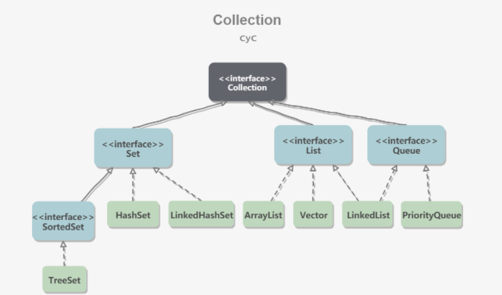
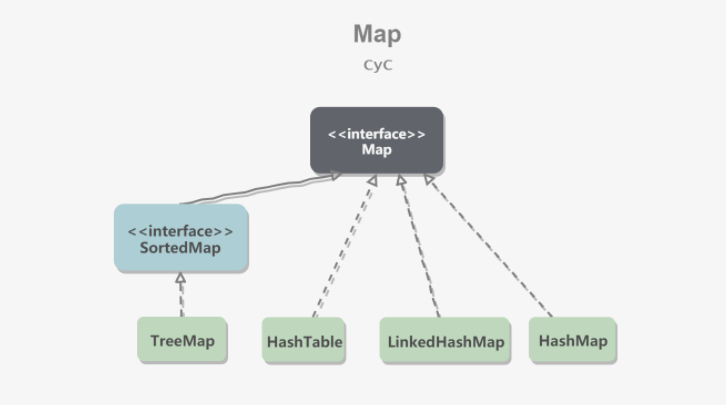
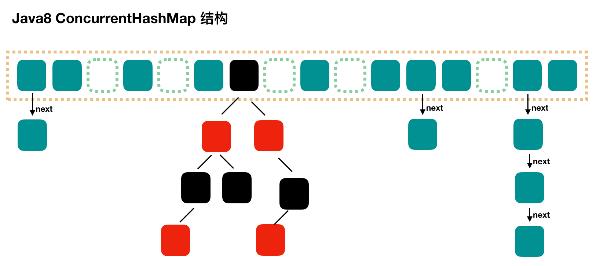

# 1. 概述

容器主要包括 Collection 和 Map 两种，Collection 存储着对象的集合，而 Map 存储着键值对（两个对象）的映射表。

## Collection



### 1. Set(无序的、不可重复的)

- TreeSet(有序，唯一,不能存储null): 基于红黑树(自平衡的排序二叉树)实现，支持有序性操作，例如根据一个范围查找元素的操作。但是查找效率不如 HashSet，HashSet 查找的时间复杂度为 O(1)，TreeSet 则为 O(logN)。
- HashSet(无序，唯一，可以存储一个null)：基于`HashMap`实现，支持快速查找，底层采用`HashMap`来保存元素，但不支持有序性操作。并且失去了元素的插入顺序信息，也就是说使用 Iterator 遍历 HashSet 得到的结果是不确定的。
- LinkedHashSet(可以存储一个null)：具有 HashSet 的查找效率，并且内部使用双向链表维护元素的插入顺序。是 `HashSet` 的子类，并且其内部是通过 `LinkedHashMap` 来实现的

### 2. List(有序的、可重复的，可以存储多个null值)

- ArrayList：基于动态数组`Object[]`实现，支持随机访问，线程不安全。
- Vector：和 ArrayList 类似`Object[]`实现，但它是线程安全的。
- LinkedList：基于**双向链表**实现，只能顺序访问，但是可以快速地在链表中间插入和删除元素。不仅如此，LinkedList 还可以用作栈、队列和双向队列。

java.util.Arrays.asList() 可以把数组类型转换为 List 类型。

```java
public static <T> List<T> asList(T... a)
/*
注意的是 asList() 的参数为泛型的变长参数，不能使用基本类型数组作为参数，只能使用相应的包装类型数组。
*/
```

### 3. Queue(有序的、可重复的)

- LinkedList：可以用它来实现双向队列。
- PriorityQueue：基于堆结构实现，可以用它来实现优先队列。


## Map



- TreeMap：基于红黑树实现。
- HashMap
- ~~HashTable~~
- LinkedHashMap：继承自 `HashMap`，使用双向链表来维护元素的顺序，顺序为插入顺序或者最近最少使用（LRU）顺序。

### HashMap分析
**HashMap 的性能表现非常依赖于哈希码的有效性**
1. JDK1.8之前
   JDK1.8之前 HashMap 底层是 数组和链表 结合在一起使用也就是链表散列。
   HashMap 通过 key 的 hashCode 经过扰动函数处理过后得到 hash 值，然后通过 (n - 1) & hash 判断当前元素存放的位置（这里的 n 指的是数组的长度），如果当前位置存在元素的话，就判断该元素与要存入的元素的 hash 值以及 key 是否相同，如果相同的话，直接覆盖，不相同就通过拉链法解决冲突。链表插入节点时使用头插法插入。扩容则是需要元素个数大于等于阈值且要插入的节点没有空位时才会扩容。

2. JDK1.8之后
   JDK1.8 之后在解决哈希冲突时有了较大的变化，当链表长度大于阈值（默认为 8）时，会首先调用 treeifyBin()方法。这个方法会根据 HashMap 数组来决定是否转换为红黑树。只有当数组长度大于或者等于 64 的情况下，才会执行转换红黑树操作，以减少搜索时间。否则，就是只是执行 resize() 方法对数组扩容。使用尾插法进行链表操作。

```java
public class HashMap<K,V> extends AbstractMap<K,V> implements Map<K,V>, Cloneable, Serializable {
    // 序列号
    private static final long serialVersionUID = 362498820763181265L;
    // 默认的初始容量是16
    static final int DEFAULT_INITIAL_CAPACITY = 1 << 4;
    // 最大容量
    static final int MAXIMUM_CAPACITY = 1 << 30;
    // 默认的填充因子
    static final float DEFAULT_LOAD_FACTOR = 0.75f;
    // 当桶(bucket)上的结点数大于这个值时会转成红黑树
    static final int TREEIFY_THRESHOLD = 8;
    // 当桶(bucket)上的结点数小于这个值时树转链表
    static final int UNTREEIFY_THRESHOLD = 6;
    // 桶中结构转化为红黑树对应的table的最小大小
    static final int MIN_TREEIFY_CAPACITY = 64;
    // 存储元素的数组，总是2的幂次倍
    transient Node<k,v>[] table;
    // 存放具体元素的集
    transient Set<map.entry<k,v>> entrySet;
    // 存放元素的个数，注意这个不等于数组的长度。
    transient int size;
    // 每次扩容和更改map结构的计数器
    transient int modCount;
    // 临界值 当实际大小(容量*填充因子)超过临界值时，会进行扩容
    int threshold;
    // 加载因子
    final float loadFactor;
}
```

- loadFactor 加载因子
  loadFactor 加载因子是控制数组存放数据的疏密程度，loadFactor 越趋近于 1，那么 数组中存放的数据(entry)也就越多，也就越密，也就是会让链表的长度增加，loadFactor 越小，也就是趋近于 0，数组中存放的数据(entry)也就越少，也就越稀疏。

  loadFactor 太大导致查找元素效率低，太小导致数组的利用率低，存放的数据会很分散。loadFactor 的默认值为 0.75f 是官方给出的一个比较好的临界值。

  给定的默认容量为 16，负载因子为 0.75。Map 在使用过程中不断的往里面存放数据，当数量达到了 16 * 0.75 = 12 就需要将当前 16 的容量进行扩容，而扩容这个过程涉及到 rehash、复制数据等操作，所以非常消耗性能。

- threshold  临界值
  threshold = capacity * loadFactor，当 Size>=threshold的时候，那么就要考虑对数组的扩增了，也就是说，这个的意思就是 衡量数组是否需要扩增的一个标准。

# 2. 疑难点
## Collection疑难点

[ArrayList源码分析](https://javaguide.cn/java/collection/arraylist-source-code/)
### Arraylist 与 LinkedList 区别

1. 是否保证线程安全： `ArrayList`和`LinkedList`都是不保证线程安全
2. 底层数据结构：`Arraylist`底层使用的是`Object`数组；`LinkedList`底层使用的是**双向链表**数据结构
3. 插入和删除是否受元素位置的影响：  
	- ArrayList 采用数组存储，所以插入和删除元素的时间复杂度受元素位置的影响。 比如：执行add(E e)方法的时候， ArrayList 会默认在将指定的元素追加到此列表的末尾，这种情况时间复杂度就是 O(1)。但是如果要在指定位置 i 插入和删除元素的话（add(int index, E element)）时间复杂度就为 O(n-i)。
	- LinkedList 采用链表存储，所以对于add(E e)方法的插入，删除元素时间复杂度不受元素位置的影响，近似 O(1)，如果是要在指定位置i插入和删除元素的话（(add(int index, E element)） 时间复杂度近似为o(n))因为需要先移动到指定位置再插入。
4. 是否支持快速随机访问： LinkedList 不支持高效的随机元素访问，而 ArrayList 支持。
5. 内存空间占用： ArrayList 的空间浪费主要体现在在 list 列表的结尾会预留一定的容量空间，而 LinkedList 的空间花费则体现在链表的结构上

### ArrayList 扩容机制
#### 1. 构造函数
（JDK8）ArrayList 有三种方式来初始化
```java
   /**
     * 默认初始容量大小
     */
    private static final int DEFAULT_CAPACITY = 10;


    private static final Object[] DEFAULTCAPACITY_EMPTY_ELEMENTDATA = {};

    /**
     *默认构造函数，构造一个空列表(无参数构造)
     */
    public ArrayList() {
        this.elementData = DEFAULTCAPACITY_EMPTY_ELEMENTDATA;
    }

    /**
     * 带初始容量参数的构造函数。（用户自己指定容量）
     */
    public ArrayList(int initialCapacity) {
        if (initialCapacity > 0) {//初始容量大于0
            //创建initialCapacity大小的数组
            this.elementData = new Object[initialCapacity];
        } else if (initialCapacity == 0) {//初始容量等于0
            //创建空数组
            this.elementData = EMPTY_ELEMENTDATA;
        } else {//初始容量小于0，抛出异常
            throw new IllegalArgumentException("Illegal Capacity: "+
                                               initialCapacity);
        }
    }


   /**
    *构造包含指定collection元素的列表，这些元素利用该集合的迭代器按顺序返回
    *如果指定的集合为null，throws NullPointerException。
    */
     public ArrayList(Collection<? extends E> c) {
        elementData = c.toArray();
        if ((size = elementData.length) != 0) {
            // c.toArray might (incorrectly) not return Object[] (see 6260652)
            if (elementData.getClass() != Object[].class)
                elementData = Arrays.copyOf(elementData, size, Object[].class);
        } else {
            // replace with empty array.
            this.elementData = EMPTY_ELEMENTDATA;
        }
    }
```
**以无参数构造方法创建 ArrayList 时，实际上初始化赋值的是一个空数组。当真正对数组进行添加元素操作时，才真正分配容量。即向数组中添加第一个元素时，数组容量扩为 10。**
#### 2. 扩容
##### 2.1. `add`方法
```java
    /**
     * 将指定的元素追加到此列表的末尾。
     */
    public boolean add(E e) {
   //添加元素之前，先调用ensureCapacityInternal方法
        ensureCapacityInternal(size + 1);  // Increments modCount!!
        //这里看到ArrayList添加元素的实质就相当于为数组赋值
        elementData[size++] = e;
        return true;
    }
```
`add`方法调用了`ensureCapacityInternal(size + 1)`
##### 2.2. `ensureCapacityInternal()`方法
```java
   //得到最小扩容量
    private void ensureCapacityInternal(int minCapacity) {
        if (elementData == DEFAULTCAPACITY_EMPTY_ELEMENTDATA) {
              // 获取默认的容量和传入参数的较大值
            minCapacity = Math.max(DEFAULT_CAPACITY, minCapacity);
        }

        ensureExplicitCapacity(minCapacity);
    }
```
当 要 add 进第 1 个元素时，minCapacity 为 1，在 Math.max()方法比较后，minCapacity 为 10。
否则直接进入`ensureExplicitCapacity()`方法
##### 2.3. `ensureExplicitCapacity()`方法
```java
  //判断是否需要扩容
    private void ensureExplicitCapacity(int minCapacity) {
        modCount++;

        // overflow-conscious code
        if (minCapacity - elementData.length > 0)
            //调用grow方法进行扩容，调用此方法代表已经开始扩容了
            grow(minCapacity);
    }
```
- 当 add 进第 1 个元素到 ArrayList 时，elementData.length 为 0 （因为还是一个空的 list），因为执行了 ensureCapacityInternal() 方法 ，所以 minCapacity 此时为 10。此时，minCapacity - elementData.length > 0成立，所以会进入 grow(minCapacity) 方法。
- 当 add 第 2 个元素时，minCapacity 为 2，此时 elementData.length(容量)在添加第一个元素后扩容成 10 了。此时，minCapacity - elementData.length > 0 不成立，所以不会进入 （执行）grow(minCapacity) 方法。
- 添加第 3、4···到第 10 个元素时，依然不会执行 grow 方法，数组容量都为 10。
- 直到添加第 11 个元素，minCapacity(为 11)比 elementData.length（为 10）要大。进入 grow 方法进行扩容。
##### 2.4. `grow()`方法
```java
    /**
     * 要分配的最大数组大小
     */
    private static final int MAX_ARRAY_SIZE = Integer.MAX_VALUE - 8;

    /**
     * ArrayList扩容的核心方法。
     */
    private void grow(int minCapacity) {
        // oldCapacity为旧容量，newCapacity为新容量
        int oldCapacity = elementData.length;
        //将oldCapacity 右移一位，其效果相当于oldCapacity /2，
        //位运算的速度远远快于整除运算，整句运算式的结果就是将新容量更新为旧容量的1.5倍，
        int newCapacity = oldCapacity + (oldCapacity >> 1);
        //然后检查新容量是否大于最小需要容量，若还是小于最小需要容量，那么就把最小需要容量当作数组的新容量，
        if (newCapacity - minCapacity < 0)
            newCapacity = minCapacity;
       // 如果新容量大于 MAX_ARRAY_SIZE,进入(执行) `hugeCapacity()` 方法来比较 minCapacity 和 MAX_ARRAY_SIZE，
       //如果minCapacity大于最大容量，则新容量则为`Integer.MAX_VALUE`，否则，新容量大小则为 MAX_ARRAY_SIZE 即为 `Integer.MAX_VALUE - 8`。
        if (newCapacity - MAX_ARRAY_SIZE > 0)
            newCapacity = hugeCapacity(minCapacity);
        // minCapacity is usually close to size, so this is a win:
        elementData = Arrays.copyOf(elementData, newCapacity);
    }
```
**int newCapacity = oldCapacity + (oldCapacity >> 1),所以 ArrayList 每次扩容之后容量都会变为原来的 1.5 倍左右**
- 当 add 第 1 个元素时，oldCapacity 为 0，经比较后第一个 if 判断成立，newCapacity = minCapacity(为 10)。但是第二个 if 判断不会成立，即 newCapacity 不比 MAX_ARRAY_SIZE 大，则不会进入 hugeCapacity 方法。数组容量为 10，add 方法中 return true,size 增为 1。
- 当 add 第 11 个元素进入 grow 方法时，newCapacity 为 15，比 minCapacity（为 11）大，第一个 if 判断不成立。新容量没有大于数组最大 size，不会进入 hugeCapacity 方法。数组容量扩为 15，add 方法中 return true,size 增为 11。

#### 3. System.arraycopy() 和 Arrays.copyOf()
```java
    /**
    *   复制数组
    * @param src 源数组
    * @param srcPos 源数组中的起始位置
    * @param dest 目标数组
    * @param destPos 目标数组中的起始位置
    * @param length 要复制的数组元素的数量
    */
    public static native void arraycopy(Object src,  int  srcPos,
                                        Object dest, int destPos,
                                        int length);

	//主要是为了给原有数组扩容
    public static int[] copyOf(int[] original, int newLength) {
    	// 申请一个新的数组
        int[] copy = new int[newLength];
	// 调用System.arraycopy,将源数组中的数据进行拷贝,并返回新的数组
        System.arraycopy(original, 0, copy, 0,
                         Math.min(original.length, newLength));
        return copy;
    }

```
## Map疑难点
[重新认识HashMap](https://tech.meituan.com/2016/06/24/java-hashmap.html)

### HashMap和HashTable的区别
1. 线程是否安全：HashMap 是非线程安全的，Hashtable 是线程安全的,因为 Hashtable 内部的方法基本都经过synchronized 修饰。
2. 效率：因为线程安全的问题，HashMap 要比 Hashtable 效率高一点，Hashtable基本被淘汰
3. 对 Null key 和 Null value 的支持： HashMap 可以存储 null 的 key 和 value，但 null 作为键只能有一个，null 作为值可以有多个；Hashtable 不允许有 null 键和 null 值，否则会抛出 NullPointerException。
4. 初始容量大小和每次扩充容量大小的不同 ： ① 创建时如果不指定容量初始值，Hashtable 默认的初始大小为 11，之后每次扩充，容量变为原来的 2n+1。HashMap 默认的初始化大小为 16。之后每次扩充，容量变为原来的 2 倍。② 创建时如果给定了容量初始值，那么 Hashtable 会直接使用你给定的大小，而 HashMap 会将其扩充为 2 的幂次方大小。
5. 底层数据结构： JDK1.8 以后的 HashMap 在解决哈希冲突时有了较大的变化，当链表长度大于阈值（默认为 8）（将链表转换成红黑树前会判断，如果当前数组的长度小于 64，那么会选择先进行数组扩容，而不是转换为红黑树）时，将链表转化为红黑树，以减少搜索时间。Hashtable 没有这样的机制。

```java
	//带容量与负载因子的构造函数
    public HashMap(int initialCapacity, float loadFactor) {
        if (initialCapacity < 0)
            throw new IllegalArgumentException("Illegal initial capacity: " +
                                               initialCapacity);
	//确保不会超出最大容量
        if (initialCapacity > MAXIMUM_CAPACITY)
            initialCapacity = MAXIMUM_CAPACITY;

	//确保负载因子合法
        if (loadFactor <= 0 || Float.isNaN(loadFactor))
            throw new IllegalArgumentException("Illegal load factor: " +
                                               loadFactor);
        this.loadFactor = loadFactor;
        this.threshold = tableSizeFor(initialCapacity);
    }
	//tableSizeFor()返回一个大于等于当前cap的一个数字，并且这个数字一定是2的次方数
    static final int tableSizeFor(int cap) {
        int n = cap - 1;
        n |= n >>> 1;
        n |= n >>> 2;
        n |= n >>> 4;
        n |= n >>> 8;
        n |= n >>> 16;
        return (n < 0) ? 1 : (n >= MAXIMUM_CAPACITY) ? MAXIMUM_CAPACITY : n + 1;
    }
	

	//带容量的构造函数
     public HashMap(int initialCapacity) {
        this(initialCapacity, DEFAULT_LOAD_FACTOR);
    }
```

### `hashCode()`与 `equals()` 的相关规定：
1. 如果两个对象相等，则 `hashcode` 一定也是相同的
2. 两个对象相等,对两个 `equals()` 方法返回 true
3. 两个对象有相同的 `hashcode` 值，它们也不一定是相等的
4. `equals()` 方法被覆盖过，则 `hashCode()` 方法也必须被覆盖
5. `hashCode()`的默认行为是对堆上的对象产生独特值。如果没有重写 `hashCode()`，则该 class 的两个对象无论如何都不会相等（即使这两个对象指向相同的数据）。

HashMap 通过 key 的 hashCode **经过扰动函数（hash函数）处理过后得到 hash 值，然后通过 (n - 1) & hash 判断当前元素存放的位置（这里的 n 指的是数组的长度）**。使用 hash 方法也就是扰动函数是为了防止一些实现比较差的`hashCode()`方法，也就是说**使用扰动函数之后可以减少碰撞**。
```java
	//JDK 1.8 HashMap 的 hash 方法
    static final int hash(Object key) {
      int h;
      // 让h的高16位也参与运算
      // ^ ：按位异或，相同返回0，不同返回1
      // >>>:无符号右移16位，忽略符号位，空位都以0补齐
      return (key == null) ? 0 : (h = key.hashCode()) ^ (h >>> 16);
  }
```
右移16位，正好是hashcode的一半，自己的高半区和低半区异或运算就是**为了混合原始哈希码的高位和低位，以此来加大低位的随机性**。混合后的低位掺杂了高位的部分特征，这样高**位的信息也会变相保留下来**。

### HashMap 的长度为什么是 2 的幂次方
**++为了加快哈希计算以及减少哈希冲突++**

**加快计算**：为了找到 KEY 的位置在哈希表的哪个槽里面，需要计算 hash(KEY) % 数组长度，但是 % 计算比 & 慢很多，所以用 & 代替 %，为了保证 & 的计算结果等于 % 的结果需要把 length 减 1，也就是 hash(KEY) & (length - 1)
因为扩容为 2 的倍数，根据 hash 桶的计算方法，元素哈希值不变而通过 % 计算的方式会因为 length 的变化导致计算出来的 hash 桶的位置不断变化。数据一致在漂移，影响性能！

**减少冲突**：当length 为偶数时，length-1 为奇数，奇数的二进制最后一位是 1，这样便保证了 hash &(length-1) 的最后一位可能为 0，也可能为 1（这取决于 h 的值），即 & 运算后的结果可能为偶数，也可能为奇数，这样便可以保证散列的均匀性；当length 为奇数的话，很明显 length-1 为偶数，它的最后一位是 0，这样 hash & (length-1) 的最后一位肯定为 0，即只能为偶数，这样任何 hash 值都只会被散列到数组的偶数下标位置上，这便浪费了近一半的空间

因此，length 取 2 的整数次幂，是为了使不同 hash 值发生碰撞的概率较小，这样就能使元素在哈希表中均匀地散列

### HashMap使用红黑树原因
#### 为什么不使用二叉排序树
问题主要出现在二叉排序树在添加元素的时候极端情况下会出现线性结构。由于二叉排序树左子树所有节点的值均小于根节点的特点，如果我们添加的元素都比根节点小，会导致左子树线性增长，这样就失去了用树型结构替换链表的初衷，导致查询时间增长。
#### 为什么不使用平衡二叉树
红黑树不追求"完全平衡"，即不像AVL那样要求节点的 |balFact| <= 1，它只要求部分达到平衡，但是提出了为节点增加颜色，红黑是用非严格的平衡来换取增删节点时候旋转次数的降低，任何不平衡都会在三次旋转之内解决，而AVL是严格平衡树，因此在增加或者删除节点的时候，根据不同情况，旋转的次数比红黑树要多。
AVL更平衡，结构上更加直观，时间效能针对读取而言更高；维护稍慢，空间开销较大。
红黑树，读取略逊于AVL，维护强于AVL，空间开销与AVL类似，内容极多时略优于AVL，维护优于AVL。
### 树化与退化
**树化的两个条件：**
1. 链表长度超过树化阈值8
2. 数组容量>=64
> 出现红黑树的概率极小，正常情况下都是链表，阈值设置为8是为了减小树化的门槛，红黑树的节点占用空间比链表更大。链表过长的首要解决办法是数组扩容，只有数组长度够大才会进行树化操作。

**退化的两种情况：**
1. 在扩容拆分树时，树元素个数<=6会退化成链表
2. remove树节点时，若root、root.left、root.right、root.left.left中有一个为null，也会退化成链表


### get()
```java
public V get(Object key) {
    Node<K,V> e;
    return (e = getNode(hash(key), key)) == null ? null : e.value;
}

final Node<K,V> getNode(int hash, Object key) {
	//tab 引用当前散列表
	//first 桶中的头元素
	//e 临时node元素
	//n table数组长度
    Node<K,V>[] tab; Node<K,V> first, e; int n; K k;
    if ((tab = table) != null && (n = tab.length) > 0 &&
        (first = tab[(n - 1) & hash]) != null) {
        // 数组元素相等
        if (first.hash == hash && // always check first node
            ((k = first.key) == key || (key != null && key.equals(k))))
            return first;

        // 桶中不止一个节点，可能是链表 也可能是红黑树
        if ((e = first.next) != null) {
            // 在树中
            if (first instanceof TreeNode)
                return ((TreeNode<K,V>)first).getTreeNode(hash, key);

            // 在链表中
            do {
                if (e.hash == hash &&
                    ((k = e.key) == key || (key != null && key.equals(k))))
                    return e;
            } while ((e = e.next) != null);
        }
    }
    return null;
}
```

### put


1. 如果定位到的数组位置没有元素 就直接插入。
2. 如果定位到的数组位置有元素就和要插入的 key 比较，如果 key 相同就直接覆盖，如果 key 不相同，就判断 p 是否是一个树节点，如果是就调用红黑树插入方法`e = ((TreeNode<K,V>)p).putTreeVal(this, tab, hash, key, value)`，如果不是就遍历链表插入(插入的是链表尾部)。

```java
public V put(K key, V value) {
    return putVal(hash(key), key, value, false, true);
}

final V putVal(int hash, K key, V value, boolean onlyIfAbsent,boolean evict) {
    //引用当前hashmap的散列表
    Node<K,V>[] tab; 
    //表示当前Node元素
    Node<K,V> p; 
    //n:散列表数组的长度
    //i:当前键值对存放在散列表桶位的下标
    int n, i;
    //table:类的成员变量，散列表。
    //延迟初始化，第一次调用put时会初始化hashmap对象中最耗费内存的散列表
    if ((tab = table) == null || (n = tab.length) == 0)
        n = (tab = resize()).length;

	//如果散列表的当前桶位是null，那么直接创建一个链表头部节点即可。
    if ((p = tab[i = (n - 1) & hash]) == null)
        tab[i] = newNode(hash, key, value, null);
	//当前桶位已经有值了,并且这个桶位的值已经赋值给变量p。

    else {
        //e:桶位中要存放的键值对
        //k:临时变量key
        Node<K,V> e; K k;

	//表示桶位中的元素key与要插入的key完全一致，后续需要进行替换操作
        if (p.hash == hash &&
            ((k = p.key) == key || (key != null && key.equals(k))))
            e = p;

	//如果当前桶位的节点已经是红黑树了，那么直接往树里面添加新的节点
        else if (p instanceof TreeNode)
            e = ((TreeNode<K,V>)p).putTreeVal(this, tab, hash, key, value);
        else {
            //否则肯定就是链表，此时链表的头节点已经比较完毕，与key不同
            for (int binCount = 0; ; ++binCount) {
                //判断是否已经到达链表的尾部
                if ((e = p.next) == null) {
                    //创建一个新的节点链接到链表尾部
                    p.next = newNode(hash, key, value, null);
                    //判断是否链表已经达到树化的条件，桶位外挂链表达到8就树化
                    if (binCount >= TREEIFY_THRESHOLD - 1) //binCount从0开始，因此减一
                        treeifyBin(tab, hash);
                    break;
                }
                //循环比较链表中每一个元素，看是否能找到key相等的。
                if (e.hash == hash &&
                    ((k = e.key) == key || (key != null && key.equals(k))))
                    break;
                //建立循环条件
                p = e;
            }
        }

        //发现有key相同的键值对
        if (e != null) { 
            V oldValue = e.value;
            if (!onlyIfAbsent || oldValue == null)
                //替换为新值
                e.value = value;
            //回调函数
            afterNodeAccess(e);
            return oldValue;
        }
    }
	//表示散列表结构被修改的次数，替换node元素的value不计数
    ++modCount;
    //插入元素，size自增，判断现在是否需要扩容
    if (++size > threshold)
        resize();
    //回调函数
    afterNodeInsertion(evict);
    return null;
}
```

### resize
resize方法是将散列表进行初始化，或者基于当前容量扩大一倍。扩容会伴随着一次重新 hash 分配，并且会遍历 hash 表中所有的元素，是非常耗时的。
Java8中扩容只需要满足一个条件：当前**存放**新值（注意不是替换已有元素位置时）的时候已有元素的个数大于等于阈值（已有元素等于阈值，下一个存放后必然触发扩容机制）,此刻触发扩容机制，将其容量扩大为2倍。

```java
final Node<K,V>[] resize() {
    //引用扩容前的散列表
    Node<K,V>[] oldTab = table;
    //扩容前table数组的长度
    int oldCap = (oldTab == null) ? 0 : oldTab.length;
    //扩容前的扩容阈值,触发本次扩容的阈值
    int oldThr = threshold;
    //newCap:新的table数组的长度
    //newThr:下次触发扩容的条件
    int newCap, newThr = 0;

    //散列表已经初始化过了，表示一次正常的扩容
    if (oldCap > 0) {
        if (oldCap >= MAXIMUM_CAPACITY) {
            //当扩容到一定程度，就不再扩容，且设置扩容条件为int最大值
            threshold = Integer.MAX_VALUE;
            return oldTab;
        }
        // 左移运算符，num << 1,相当于乘以2
        else if ((newCap = oldCap << 1) < MAXIMUM_CAPACITY &&
                 oldCap >= DEFAULT_INITIAL_CAPACITY)
            //oldCap*2小于最大容量且oldCap大于等于默认容量，那么下次扩容阈值就扩大1倍。
            newThr = oldThr << 1; // double threshold
    }

    // 【暗含oldCap=0，散列表还未初始化】
    // 1.new HashMap(initCap,loadFactor)
    // 2.new HashMap(initCap)
    // 3.new HashMap(map)
    else if (oldThr > 0) 
        newCap = oldThr;
	//【暗含oldCap=0且oldThr=0】
	//使用了默认的构造方法 new HashMap()
    else {               
        newCap = DEFAULT_INITIAL_CAPACITY;
        newThr = (int)(DEFAULT_LOAD_FACTOR * DEFAULT_INITIAL_CAPACITY);
    }

    //当newThr=0时，计算新的扩容阈值
    if (newThr == 0) {
        float ft = (float)newCap * loadFactor;
        newThr = (newCap < MAXIMUM_CAPACITY && ft < (float)MAXIMUM_CAPACITY ?
                  (int)ft : Integer.MAX_VALUE);
    }
    threshold = newThr;

    @SuppressWarnings({"rawtypes","unchecked"})
    //创建扩容后的散列表
    Node<K,V>[] newTab = (Node<K,V>[])new Node[newCap];
    table = newTab;

	//本次扩容之前，table不为null
    if (oldTab != null) {
        //遍历oldTab中所有的桶位
        for (int j = 0; j < oldCap; ++j) {
            //当前node节点
            Node<K,V> e;
            //当前桶位有数据
            if ((e = oldTab[j]) != null) {
                //此时oldTab[j]已经用e引用过了，可以垃圾回收oldTab[j]
                oldTab[j] = null;
                //数组上没有外挂结点，直接将这个元素搬到新的散列表的某个位置中
                if (e.next == null)
                    newTab[e.hash & (newCap - 1)] = e;
                //该桶位已经树化
                else if (e instanceof TreeNode)
                    ((TreeNode<K,V>)e).split(this, newTab, j, oldCap);
                //链表的情况
                else { 
                    //低位链表：存放扩容之后的数组的下标位置，与扩容前下标位置一致
                    Node<K,V> loHead = null, loTail = null;
                    //高位链表：存放扩容之后的数组的小标位置：当前数组下标位置 + 扩容前数组的长度
                    Node<K,V> hiHead = null, hiTail = null;
                    Node<K,V> next;
                    
                    //循环遍历整个链表
                    do {
                        next = e.next;
                        //低位链表
                        if ((e.hash & oldCap) == 0) {
                            if (loTail == null)
                                loHead = e;
                            else
                                loTail.next = e;
                            loTail = e;
                        }
                        //高位链表
                        else {
                            if (hiTail == null)
                                hiHead = e;
                            else
                                hiTail.next = e;
                            hiTail = e;
                        }
                    } while ((e = next) != null);
                    
                    if (loTail != null) {
                        loTail.next = null;
                        newTab[j] = loHead;
                    }
                    if (hiTail != null) {
                        hiTail.next = null;
                        newTab[j + oldCap] = hiHead;
                    }
                }
            }
        }
    }
    return newTab;
}
```

### ConcurrentHashMap 和 Hashtable 的区别
主要体现在实现线程安全的方式上不同

- JDK1.8 ConcurrentHashMap 采用的数据结构跟 HashMap1.8 的结构一样，**数组+链表/红黑二叉树**.Hashtable的底层数据结构类似都是采用 **数组+链表**的形式，数组是 HashMap 的主体，链表则是主要为了解决哈希冲突而存在的
- 在 JDK1.7 的时候，ConcurrentHashMap（分段锁） 对整个桶数组进行了分割分段(Segment)，每一把锁只锁容器其中一部分数据，多线程访问容器里不同数据段的数据，就不会存在锁竞争，提高并发访问率。到了 JDK1.8 的时候已经摒弃了 Segment 的概念，而是直接用 Node 数组+链表+红黑树的数据结构来实现，并发控制使用 synchronized 和 CAS 来操作；而Hashtable使用synchronized 来保证线程安全，效率非常低下。



JDK1.8后的`ConcurrentHashMap`取消了 Segment 分段锁，采用 CAS 和 synchronized 来保证并发安全。数据结构跟 HashMap1.8 的结构类似，数组+链表/红黑二叉树。Java 8 在链表长度超过一定阈值（8）时将链表（寻址时间复杂度为 O(N)）转换为红黑树（寻址时间复杂度为 O(log(N))） synchronized 只锁定当前链表或红黑二叉树的首节点，这样只要 hash 不冲突，就不会产生并发，效率又提升 N 倍。

### ConcurrentHashMap和SynchronizedMap的区别
SynchronizedMap 是 Collections 集合类的私有静态内部类，其定义和构造方法如下：
```java
private static class SynchronizedMap<K,V> implements Map<K,V>, Serializable {
        private static final long serialVersionUID = 1978198479659022715L;
          // 用于接收传入的Map对象，也是类方法操作的对象
        private final Map<K,V> m;     
          // 锁对象
        final Object mutex;   
  
              // 以下是SynchronizedMap的两个构造方法
        SynchronizedMap(Map<K,V> m) {
            this.m = Objects.requireNonNull(m);
            mutex = this;
        }
        SynchronizedMap(Map<K,V> m, Object mutex) {
            this.m = m;
            this.mutex = mutex;
        }
//主要方法
public int size() {
    synchronized (mutex) {return m.size();}
}
public boolean isEmpty() {
    synchronized (mutex) {return m.isEmpty();}
}
public boolean containsKey(Object key) {
    synchronized (mutex) {return m.containsKey(key);}
}
public V get(Object key) {
    synchronized (mutex) {return m.get(key);}
}
public V put(K key, V value) {
    synchronized (mutex) {return m.put(key, value);}
}
public V remove(Object key) {
    synchronized (mutex) {return m.remove(key);}
}
}
```
SynchronizedMap 实现线程安全的方法也是比较简单的，所有方法都是先对锁对象 mutex 上锁，然后再直接调用 Map 类型成员变量 m 的相关方法。这样一来，线程在执行方法时，只有先获得了 mutex 的锁才能对 m 进行操作。因此，跟 Hashtable 一样，在同一个时间点，只能有一个线程对 SynchronizedMap 对象进行操作，虽然保证了线程安全，却导致了性能低下。
# 3. 集合的线程安全

## ArrayList线程安全

故障现象：`java.util.ConcurrentModificationException`

```java
//1
List<String> synList = Collections.synchronizedList(new ArrayList<>());
//2高频
List<String> list = new CopyOnWriteArrayList<>();
//3
List<String> list = new Vector<>();
```

`CopyOnWriteArrayList`:
写操作在一个复制的数组上进行（容量+1），读操作还是在原始数组中进行，读写分离，互不影响。
写操作需要加锁，防止并发写入时导致写入数据丢失。
写操作结束之后需要把原始数组指向新的复制数组。

## HashSet线程安全

```java
//1
List<String> synSet = Collections.synchronizedSet(new HashSet<>());
//2，底层直接new CopyOnWriteArrayList<>()
Set<String> set = new CopyOnWriteArraySet<>();
```

## HashMap线程安全

```java
//1
Map<String, String> map = Collections.synchronizedMap(new HashMap<>());
//2
Map<String, String> map=new ConcurrentHashMap<>();
```

# 4. 容器操作

## 集合转数组
```java
	//很少使用
    public Object[] toArray() {
        return Arrays.copyOf(elementData, size);
    }

	//传入泛型	list.toArray(new String[0]);
    public <T> T[] toArray(T[] a) {
        if (a.length < size)
            // Make a new array of a's runtime type, but my contents:
            return (T[]) Arrays.copyOf(elementData, size, a.getClass());
        System.arraycopy(elementData, 0, a, 0, size);
        if (a.length > size)
            a[size] = null;
        return a;
    }
```
`new String[0]`就是起一个模板的作用，指定了返回数组的类型，0 是为了节省空间，因为它只是为了说明返回的类型。

## 数组转集合
1. `Arrays.asList()`方法返回的是`java.util.Arrays`的一个内部类,这个内部类并没有实现集合的修改方法，修改会抛出异常。
2. `List list = new ArrayList<>(Arrays.asList("a", "b", "c"))`
3. `Arrays.stream(myArray).collect(Collectors.toList())`

## 集合遍历
1. 使用普通 for 循环
2. foreach循环里不能进行增加删除操作，Iterator 的 remove/add方法可以安全删除