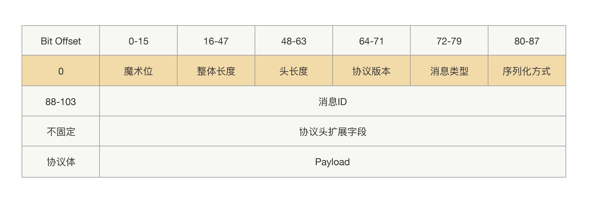
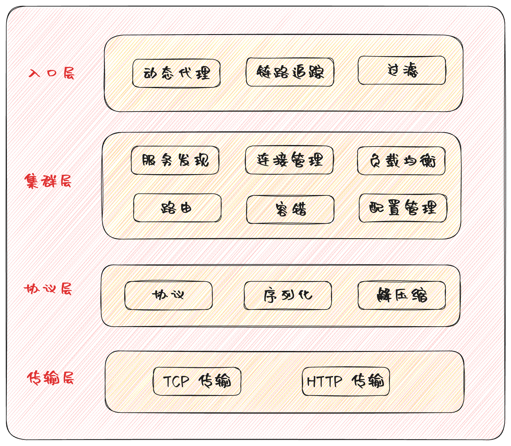

## RPC 的定义

RPC 的全称是 Remote Procedure Call，即远程过程调用，实现了跨网络调用其他服务就像调用本地服务一样的模式。简单来说 RPC 替我们封装了网络层繁琐的开发开发，通过增强代理的方式嵌入进去，这样我们只需要编写业务逻辑即可调用远程服务。RPC 的使用范围非常广泛，不仅仅约束在接口维度，包括MQ Client 和 MQ Server 间的通信、Redis Client 和 Redis Server 间的通信、JDBC 和 MySQL 间的通信都属于 RPC 通信。

### 协议

由于跨网络的特性，一次 RPC 调用通常要经过序列化、协议编码、解码、反序列化的过程。当被调用者接收到一堆二进制字节后首先要对这些二进制进行解码和反序列化，这样才能定位到本次调用的具体方法。基于性能的考虑，RPC 调用通常是基于 TCP 层，TCP 接收到的二进制数据是没有分隔的，TCP 窗口可能会对多次调用进行合并，下游必须解析出合并前的数据边界，这就需要指定的协议格式了。也就是说 **RPC 协议是为了避免语义不一致的事情发生，需要在发送请求的时候设定一个边界，然后在收到请求的时候按照这个设定的边界进行数据分割**。这个边界语义的表达，就是所说的协议。

RPC 协议和 http 协议一样，同属于应用层协议。多数框架不使用 http 作为通信协议主要有以下几个考虑：

1. RPC 调用的每个请求都需要有响应，而 http 请求是无状态协议，无法对每次请求调用关联上对应的相应，每次请求都要重建链接。
2. http 的协议头过于臃肿，存在不少无用的内容，基于性能的考虑。

一个完善的协议通常包括固定部分、不定长的协议头、不定长的协议体

### 序列化

序列化就是将对象转换成二进制数据的过程，而反序列就是反过来将二进制转换为对象的过程。接口的请求对象需要序列化为二进制数据，然后交给 RPC 协议进行编码，这样才能进行网络发送。

序列化协议有多种：JDK 原生序列化、JSON、Hessian、Protobuf等。考虑选择序列化协议的考虑点：

1. 性能：生成的二进制内容越少，网络传输速度越快，序列化速度越快性能越好。
2. 兼容：跨语言、跨版本的向后兼容能力。
3. 安全性：是否存在安全漏洞。

### 网络 IO

网络通信是整个 RPC 调用流程的基础。一次 RPC 调用，本质就是服务消费者与服务提供者间的一次网络信息交换的过程。服务调用者通过网络 IO 发送一条请求消息，服务提供者接收并解析，处理完相关的业务逻辑之后，再发送一条响应消息给服务调用者，服务调用者接收并解析响应消息，处理完相关的响应逻辑，一次 RPC 调用便结束了。

常见的网络 IO 模型分为四种：同步阻塞 IO（BIO）、同步非阻塞 IO（NIO）、IO 多路复用和异步非阻塞 IO（AIO）。在这四种 IO 模型中，只有 AIO 为异步 IO，其他都是同步 IO。

RPC 通信中一般都会选择 IO 多路复用方案。为了保证可靠的传输，底层的通信协议通常选择 TCP 协议。

### 动态代理

项目中使用 RPC 的时候通常通过 maven 引入一个服务提供方的依赖后，就可以进行依赖注入了，接着调用依赖中的方法即可拿到方法结果。服务提供方不会把接口的具体实现放在依赖中，但是我们还是调用到了服务方部署的服务，这用的就是动态代理技术。

RPC 会自动给接口生成一个代理类，当我们在项目中注入接口的时候，运行过程中实际绑定的是这个接口生成的代理类。这样在接口方法被调用的时候，它实际上是被生成代理类拦截到了，这样就可以在生成的代理类里面，加入远程调用逻辑。

RPC 框架选择动态代理方案的时候会从三个角度去考虑：

- 因为代理类是在运行中生成的，那么代理框架生成代理类的速度、生成代理类的字节码大小等等，都会影响到其性能——生成的字节码越小，运行所占资源就越小。
- 生成的代理类，是用于接口方法请求拦截的，所以每次调用接口方法的时候，都会执行生成的代理类，这时生成的代理类的执行效率就需要很高效。
- 编码复杂度，如API设计是否好理解、社区活跃度、还有就是依赖复杂度等等。

一个完整的 RPC 框架包含以下部分。

- 入口层：在 RPC 调用的起点帮助用户屏蔽了远程调用的细节，同时可以按照权重、健康度、分组等对所有的可以调用的远程服务进行过滤找到最适合的一个调用服务，链路追踪则是在RPC调用端在访问服务端时，在发送请求消息前会触发分布式跟踪埋点，在接收到服务端响应时，也会触发分布式跟踪埋点，并且在服务端也会有类似的埋点。这些埋点最终可以记录一个完整的Span，而这个链路的源头会记录一个完整的Trace，最终Trace信息会被上报给分布式链路跟踪系统。
- 集群层：RPC 框架通过集群化消息总线，对服务发现、连接管理、路由等进行控制，使用推拉结合的方式不完全保障数据的强一致性，极大降低了集群的负载压力。
- 协议层：RPC 框架的协议由专门的插件负责，可以支持多种协议。
- 传输层：最终的网络传输模块，可以使用 TCP 或和 HTTP 传输。

