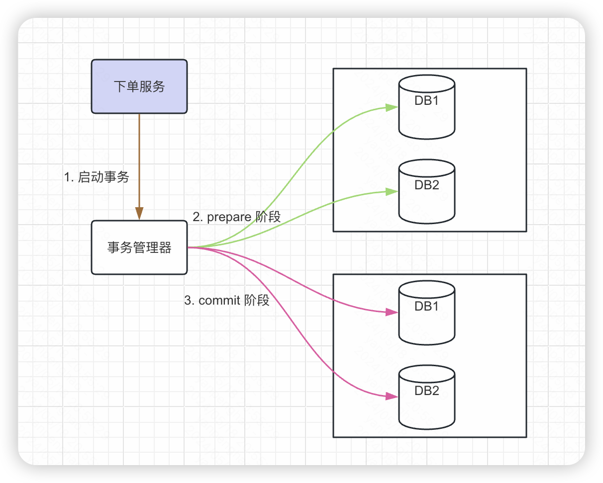
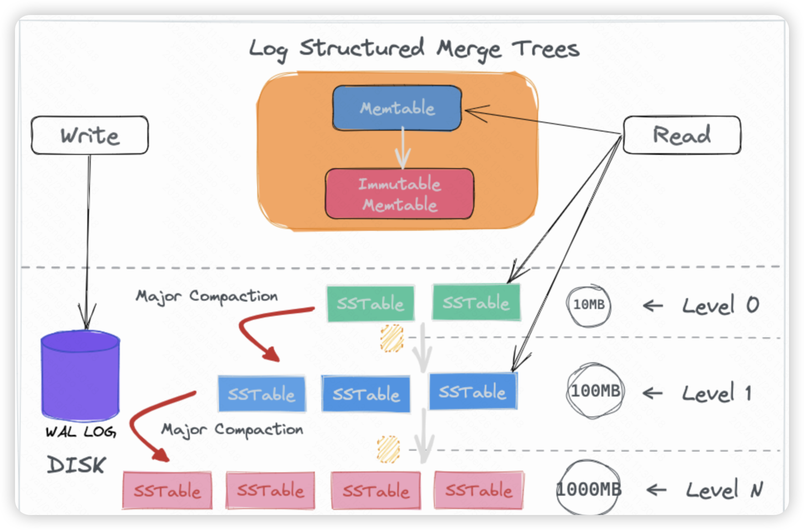

## 选择分布式数据库

以实际使用场景来看，假设有一个广告系统记录了所有用户在任何时刻触发不同广告的消耗明细，每天大约能产生 5000W 条用户消耗数据明细。现在需要实现一个供流量主可以实时查询这些数据的功能，此时应该选用哪种类型的数据库，在这个应用场景下数据库需要满足以下特点：

1. 数据量巨大，且面向 C 端用户查询。
2. 频繁写入且频繁查询，要支持范围查询，且查询性能需要在秒级以内。
3. 数据存在倾斜的可能性。

### 传统数据库的瓶颈

MySQL 数据库天生是单机数据库，即它只能运行在一台物理机器实例上，我们没有办法把他拆分开让同一个数据库同时运行在多台机器上。因此它的性能和物理机器实例的配置呈正相关，受到机器配置的制约，机器的天花板上限较低。但是它的好处就是架构较为简单，使用起来更加方便。

单体数据库面临高并发场景的时候，还是会碰到写入性能不足的问题，要解决这个问题，那么就是进行分库分表。分库分表本质是在多个单体数据库前增加一个代理层，由代理层进行数据路由。进而会带来这几个问题：

1. 分表键的选择。在数据存储时根据**分表键、分表的数量**进行路由，这两个参数一经选择很难改变，后续所有查询都要根据这个规则进行。如果以后发现分表数量不够需要增加或者分表键需要修改，那么存量的数据查询会产生问题。
2. 高并发写的支持。即使我们可以选择主从来分担主库的读压力，但是所有写操作都必须在主库进行**，多数情况下 MySQL 集群只有一个主库，所有写操作必须在主库进行，单机器实例面对超高并发的写事务、加锁操作会存在瓶颈。
3. 代码的侵入性。分库分表通常是在代码层面选择不同数据库，因此代码中通常会带上相关的硬编码，对后续业务迁移变化带来风险。


ks 当前的分库分表组件如下，通过独立的逻辑层（Shard-JDBC）建立数据分片和路由规则，使应用能够使用多个单体数据库，实现存储能力、并发能力的扩展。但是**组件耦合作为系统的一部分**，需要额外的维护分表配置，对应用侵入较严重。


由于底层的数据库仍然是一个个的单体架构组成，因此代理层需要额外实现以下功能来完成业务使用：

1. 全局性的事务支持（ks 分片组件不支持，需要把事务要都落在同一实例上，避免跨实例的事务，否则可能会有不一致）。
2. 额外的计算能力。由于数据存储在不同单体节点，每个数据节点只能看到一部分数据，有些查询运算是无法处理的，比如排序、多表关联等。所以，代理节点要增强查询计算能力，支持跨多个单体数据库的查询。
3. 分片信息管理。需要维护分片的数据信息，ks 通过 kconf 和 zk 来维护。

### 什么是分布式数据库

与上述介绍不同的是，分布式数据库把所有技术细节收敛到数据库内部，对外以一个整体面对系统应用。

分布式数据库就是一个提供高容量、高并发、高可用、可扩展的关系型数据库。

分布式数据库有两个方向：

1. 进化后的单体式数据库（PGXC）。上边说的 sharding-MySQL 继续进化其实就是一种分布式数据库，但是它的单一节点仍然是一个单体数据库。
2. 原生分布式数据库（NewSQL）。基础是一个 K/V 键值对数据库，其计算和存储分离，最小的存储单位称为一个分片，可以动态扩展。


单体式数据库实现高可用的一个重要手段：主从复制，这是一种粗粒度的完整复制整个主库的手段。而NewSQL采用了精细化的数据控制，每个分片空间通常控制在百 M 之内，通过以分片为单位采用 Paxos 或 Raft 等共识算法。这样NewSQL 就实现了更小粒度的高可靠单元，获得了更高的系统整体可靠性。

分布式数据库可以提供海量并发、海量存储的关键能力在于分片（Regin），分片根据特定规则将切分好的数据记录分布到多个节点上，从而实现更强的存储和计算能力。

#### 分片策略

#####  Hash 分片

根据数据记录中指定关键字的 Hash 值将数据记录映射到不同的分片中，关键在于 hash 键和 hash 函数的选择。

这种策略实现简单，且由于 hash 函数会屏蔽掉业务属性，所以通常情况在数据会**均匀**分布到所有分片中，这是它的优点。

但是如果分片数发生了变化，数据就要重新 Hash 计算，从而带来大规模的数据迁移。因此这种方式对于**扩展性是不友好**的。另外业务上的热点数据如果被分配到同一个分片上，也是系统的一个潜在瓶颈。

##### Range 分片

NewSQL 的 Range 分片，多数是用**主键**作为关键字来分片的，当然主键可以是系统自动生成的，也可以是用户指定的。但是**主键必须保证唯一性**，导致这种控制就会比较复杂，使用成本较高。所以如果使用自动生成主键的话基本可以认为，分片是一个系统自动处理的过程，用户是感知不到的。这样做的显然提升了系统的易用性。

#### 调度策略

当单个分片的数据量超过设定值时，分片可以一分为二，这样就可以保证每个分片的数据量较为均衡，避免了大量数据聚集在相同的分片中。多个数据量较少的分片，会在一定的周期内被合并为一个分片。同时分片也会被均衡地调度到各个节点上，节点间的数据量也保持总体平衡。

除了维持数据量的平衡外，分布式数据库还会控制节点的访问压力。如果R2、R3 中存储的数据都是热点数据，这时候系统会根据负载情况，将 R2 和 R3 分别调度到不同的节点，来均衡访问压力。

## 分布式数据库的ACID

### 原子性

一个事务必须被视为不可分割的最小工作单位，一个事务中的所有操作要么全部成功提交，要么全部失败回滚，对于一个事务来说不可能只执行其中的部分操作，这就是事务的原子性。分布式数据库实现原子性常见的有两种协议：TCC、2PC。

#### TCC

一种面向应用层的补偿式的分布式协议，核心步骤包括 try、confirm、cancel，对业务代码侵入较重。TCC 规定协议的参与方有两种角色，分别是**事务管理器和事务参与者，**其中事务管理器只能有一个，而事务参与者可以为多个。

> 补偿机制：
>
> 在分布式事务出现异常时，通过一系列的操作，尽可能使得分布式事务状态回滚到之前的状态，从而避免分布式事务产生不一致的情况。

- try 阶段：尝试执行阶段，检查所需要的资源，具有排他性。
- confirm 阶段：所有 try 分支都返回成功，事务管理器会进行confirm，此阶段不执行检查操作，会直接进行业务操作，如果因为网络原因导致 confirm 失败，会一直重试。
- cancel 阶段：如果所有分支的Try有一个失败了，则走到Cancel阶段。Cancel释放 Try 阶段预留的业务资源。如果由于网络问题，或者服务器临时故障，那么事务管理器会进行重试，最终成功。


可以看到 try、confirm、cancel 三个操作都需要业务来自己实现对应接口，由于相应的业务操作都需要编码实现，因此 TCC也叫做由业务方细粒度控制的**侵入式分布式事务**。

> https://seata.apache.org/zh-cn/docs/user/mode/tcc
>
> Seata TCC 模式

TCC的**优点**：

1. 完全不依赖底层数据库，可以实现跨数据库的分布式事务功能。
2. 自由编码实现，可以自己控制锁力度，并发量会更高一点。

缺点：

1. 需要业务系统自行实现 Try，Confirm，Cancel 三个操作，对业务系统有着非常大的入侵性，设计相对复杂。
1. 不同操作依赖网络进行交互，因此设计阶段操作接口必须满足幂等性，防止重试时造成数据不一致。

#### 2PC

又被称为两阶段提交，两个阶段分别是 prepare 和 commit，具有事务管理器、资源管理器两个角色。两阶段提交依赖底层数据库的事务能力，底层的单体数据库也被称为资源管理器。

借助于底层单体数据库的事务回滚和提交能力，使用一个全局的事务管理器就能实现一个分布式事务。

第一阶段：向数据库发送要执行的 sql，并得到是否可以提交的回复。

第二阶段：一阶段都返回成功则向数据库提交事务，否则向数据库提出回滚操作。



**优点：**利用了单体数据库的事务能力，不侵入业务代码，同时实现简单，这是它最大的优点。

缺点：

1. 事务管理器存在单点故障，如果数据库在 commit 前管理器挂了，那么所有单体数据库都会被阻塞。
2. 执行时数据库需要锁定对应的行，如果其他事务刚好也要操作这些数据行，那它们就只能等待。这种设计可能会导致分布式事务出现高延迟和性能的显著下降。
3. **事务管理器需要和所有单体数据库通信**，如果因为网络原因某些数据库没有收到 commit 指令，那么会出现数据不一致的情况。

#### Percolator （2PC 的改进）

Percolator模型是对 2PC 的改进，TIDB 的分布式事务就是基于这个模型实现的。针对 2PC 的单点故障、数据不一致、进行了改进。

准备阶段时事务管理器会给每个分片发送对应数据执行请求，每个分片收到请求后写入一个新记录，新纪录会被加上锁，只有当前事务才能读取到锁内容，所有分片的行锁只有一个主锁，主锁会随机分配到某个分片上，其余的锁指向主锁记录。与此同时还会写下本次操作日志。

准备阶段结束的时候，两个分片都增加了私有版本记录，余额正好是转账顺利执行后的数字。


之后进入提交阶段，其中事务管理器**只会和拥有主锁的分片**进行通信发出 commit 指令，相比于 2PC 模型，单独的网络通信就解决了网络通信造成的数据不一致现象。通过这种巧妙的设计减少了事务管理器和分片的通信次数，但是其余分片的副锁仍然存在，此时其他事务读取到分片数据时会根据指针去查找主锁记录，由于主锁已经释放，这条数据就对所有事务开放了，但是增加了一次指针读取操作。


因此Percolator模型增加了一个子线程，通过Lazy+异步线程更新非主锁的记录。


Percolator 通过日志和异步线程的方式弱化了单点故障。

一是，Percolator 引入的异步线程可以在事务管理器宕机后，回滚各个分片上的事务，提供了善后手段，不会让分片上被占用的资源无法释放。二是，事务管理器可以用记录日志的方式使自身无状态化，日志通过共识算法同时保存在系统的多个节点上。这样，事务管理器宕机后，可以在其他节点启动新的事务管理器，基于日志恢复事务操作。

### 隔离性

单体数据库通常使用 MVCC 来维护一份数据的历史版本，通过全局递增的**事务管理器**为每个事务分配一个事务 id，通过分配活跃的事务id 列表来实现不同的隔离方式。

分布式数据库的两种阵营采用了两种不同的方式满足隔离性

- PGXC：它的底层数据源就是由一个个单体数据库组成的，因此它的实现方式和单体数据库类似，区别在于分布式数据库需要一个全局事务管理器来颁发事务 id 和维护全局事务列表。这也是它的一个风险点-单点风险。
- NewSQL：NewSQL 架构的分布式数据库没有普遍使用快照处理读写事务。如TiDB 如果两个事务操作同一个数据项。其中，事务 T1 执行写操作，由 Prewrite 和 Commit 两个阶段构成，T2 在这两个阶段之间试图执行读操作，但是 T2 会被**阻塞**，直到 T1 完成后，T2 才能继续执行。

### 一致性

分布式事务的一致性可以根据是否跨节点分为两个场景：

- 不跨region：相当于传统的单节点数据库，和单实例一样，事务保证性即可，无需复杂的确认过程。至于多个副本之间的数据一致性，通过**raft协议**和事务日志应用保证leader和follower region之间的数据一致性。
- 跨region：通过两阶段提交，事务完成primary row后即可返回，后台线程和日志重试保证seconary row 异步提交

### 持久性

TiDB也通过将数据持久化到磁盘中来实现持久性，确保一旦事务提交成功，数据不会丢失。

## 分布式数据库的优化

由于分布式数据库的计算节点和数据存储节点是分离开来的，但是通常情况下查询数据都会带着查询语句，查询计算和数据存储密不可分。因此带来一个新的问题，即应该将数据传输到计算节点，还是应该将计算逻辑传输到数据节点。由于计算逻辑通常相对较轻，数据传输量比较大，因此多数分布式数据库都选择了把计算逻辑下沉到存储节点，这也叫做计算下推。

### 计算下推

如下图所示，当计算节点接收到客户端发来的查询条件时，会把查询条件发送到存储节点上，存储节点筛选数据通过网络传送到计算节点上，由计算节点进行 merge 操作并一起返回到客户端。


### 索引优化

计算下推是为了查询时减少无必要的网络 IO，本质是为了加速查询效率。单体数据库的索引可以分为一级索引（也叫主键索引或聚族索引）、二级索引，其中二级索引的叶子节点存储的是一级索引的值，如果一个查询命中了二级索引，通常需要进行一次回表来获取数据，这次回表会增加查询时间。

和单体数据库类似，分布式数据库按照索引的实现方式可以分为分区索引和全局索引。分布式数据库索引存在两个问题：

1. 索引和数据不在一个分区中：这也意味着如果使用索引需要增加一次网络 IO
2. 索引和数据在一个分区中，但是索引类型是分区索引（局部索引）。如果期望的是全局唯一性索引，那么分区索引就无法实现，只能通过全局索引。不可避免的读操作需要网络 IO 回表，写操作需要分布式事务。

所以，在使用分布式数据库时，是否有必要建立全局索引，是一个非常谨慎的决定。

为了尽可能实现索引和数据保存在同一个分区内，分布式数据库对索引进行了特殊的设计。分布式数据库的每个分区会对应存储一系列数据，通过 hash 或 range 方法最终会得到一个不重叠的 key 范围。当客户端进行操作时，相同的 key 最终都会落到同一个分区中。当新增一个键值对（Key/Value）时，系统会先判断这个 Key 与哪个分片的区间匹配，而后就分配到那个匹配的分片中保存，匹配算法一般采用左前缀匹配方式。

索引 key 的命名方式如下所示：


## TiDB 的简单介绍

### 整体架构

TiDB 是基于 KV 存储实现的一种关系型分布式数据库，兼容 MySQL 协议和 MySQL 生态，并支持完整的分布式事务。它有三大模块组成，分别是：TiDB Server、TiKV、PD，之间的交互关系如下图。


- TiDB Server：用于计算使用，是无状态的，负责解析执行客户端发送来的 sql 语句，并接收整合存储模块发送的数据一并返回给客户端。这个模块不会成为分布式数据库的瓶颈，容量不够可以迅速扩张。
- TiKV：分布式数据库的存储单元，所有数据最终都是保存在此，TiDB使用开源的高性能单体数据库RocksDB作为存储引擎。简单来说 TiDB 自己不会负责持久化数据到磁盘，而是交由RocksDB来实现，RocksDB 是一个单机的 Key-Value Map。
- PD：负责调度整个存储引擎，掌握全局信息，可以对全局进行调度，作为一个中心节点，实现对系统的整体状况进行把控和调整。比如新增节点时数据的分化迁移，主从节点数量的控制，请求负载均衡、管理节点状态，包括手动上线/下线节点，以及自动下线失效节点。PD 不断的通过 Store 或者 Leader 的心跳包收集信息，获得整个集群的详细数据，并且根据这些信息以及调度策略生成调度操作序列，每次收到 Region Leader 发来的心跳包时，PD 都会检查是否有对这个 Region 待进行的操作，通过心跳包的回复消息，将需要进行的操作返回给 Region Leader，并在后面的心跳包中监测执行结果。


为了保证数据的高可用，TiKV使用一致性协议 Raft 来实现主从节点的复制，其中客户端的每个数据变更都会落地转化为一条 Raft 日志，通过 Raft 的日志复制功能，将数据安全可靠地同步到 Group 的多数节点中。数据的写入是通过 Raft 这一层的接口写入，而不是直接写 RocksDB。基于此拥有了一个分布式的 KV存储系统。


接下来就是确定要把数据写入到哪个 KV 节点中，通常有两种方式：一种是按照 Key 做 Hash，根据 Hash 值选择对应的存储节点；另一种是**分 Range**，某一段连续的 Key 都保存在一个存储节点上。TiKV 选择了第二种方式，将整个 Key-Value 空间分成很多段，每一段是一系列连续的 Key，每段区间叫做一个 **Region**，并且通过 PD 模块尽量保持每个 Region 中保存的数据不超过一定的大小(这个大小可以配置，目前默认是 96mb)。每一个 Region 都可以用 StartKey 到 EndKey 这样一个左闭右开区间来描述。


PD 模块会均匀的把所有Region划分到不同节点上，其中一个节点上的多个 Region 共用一个RocksDB实例，这样设计的原因是因为随机 I/O 的性能远低于顺序 I/O，所以 TiKV 使用同一个 RocksDB 实例来存储这些数据，以便不同 Region 的写入可以合并在一次 I/O 中，并且尽量保证每个节点上服务的 Region 数量差不多。TiKV 是以 Region 为单位做数据的复制，也就是一个 Region 的数据会保存多个副本。Replica 之间是通过 Raft 来保持数据的一致，一个 Region 的多个 Replica 会保存在不同的节点上，构成一个 Raft Group。其中一个 Replica 会作为这个 Group 的 Leader，其他的 Replica 作为 Follower。**所有的读和写都是通过 Leader 进行**，再由 Leader 复制给 Follower。


### 实现细节

#### 读写实现（RocksDB）

[RocksDB](https://github.com/facebook/rocksdb) 是由 Facebook 基于 LevelDB 开发的一款提供键值存储与读写功能的 **LSM-tree** 架构引擎。用户写入的键值对会先写入磁盘上的 WAL (Write Ahead Log)，然后再写入内存中的跳表（SkipList，这部分结构又被称作 MemTable）。LSM-tree 引擎由于将用户的随机修改（插入）转化为了对 WAL 文件的顺序写，因此具有比 B 树类存储引擎更高的写吞吐。

> MemTable往往是一个跳表（Skip List）组织的有序数据结构。对比B+树，当数据量特别大时，由于B+树更新和删除数据时需要沿着B+树逐层进行页分裂和页合并，严重影响数据写入性能。
>
> Immutable：不可修改的MemTable，由MemTable到达一定容量后转化而成。
>
> SSTable：键值存储，有序，内部包含了一系列分割的 Block 块，每个 Block 块的index存储在SSTable的尾部，用于帮助快速查找特定的Block。当一个SSTable被打开的时候，index会被加载到内存，然后根据key在内存index里面进行一个二分查找，查到该key对应的磁盘的offset之后，然后去磁盘把响应的块数据读取出来。



写入步骤（删除也会转为写入标记）：

1. 当有一个数据写入请求时，RocksDB 通过使用两阶段提交写前日志的方式完成数据写入，此时数据会在 WAL LOG 中被标记写入完成，同时内存中的 Memtable 也会被更新（跳表结构）。
1. Memtable打到指定大小后会将其切换成 Immutable 并生成一个新的Memtable继续使用，后台线程会把Immutable持久化为SStable。**如果写入流量很大，同时上一个Immutable还未成功持久化，此时就会阻塞写请求**。
1. 内存中的数据达到一定阈值后，会刷到磁盘上生成 SST 文件 (Sorted String Table)，SST 又分为多层（默认至多 6 层），每一层的数据达到一定阈值后会挑选一部分 SST 合并到下一层，每一层的数据是上一层的 10 倍（因此 90% 的数据存储在最后一层）。此步骤也称为Major Compaction，这个阶段会**真正的清除掉被标记删除掉的数据以及多版本数据的合并，避免浪费空间**。

读取：为了提高读取性能以及减少对磁盘的读取，RocksDB 将存储在磁盘上的文件都按照一定大小切分成 block（默认是 64KB），读取 block 时先去**内存**中的 BlockCache 中查看该块数据是否存在（内存加速），然后在level 0 SSTable中查找，最后在level N SSTable中查找。如果数据一直到到最底层才被找到，LSM Tree把这种读取和查找了无关SSTable的现象叫做读放大。

合并需要将合并涉及的SSTable读入内存，并把合并后产生的新的SSTable写入磁盘，会增加磁盘IO和CPU的消耗，这种写入磁盘的数据量大于实际数据量现象成为写放大。

**读放大可以通过布隆过滤器来快速确定数据不在SSTable中，但是写放大由于内存原因通常无法避免。**

#### 索引实现

KV 模型通常实现的是一种非关系型数据库，关系型数据库作为当下存储主流，TiDB 基于 KV 模型通过具体的数据、索引映射关系实现了关系型数据库。在关系系数据库中通常要保存三种类型的数据：表的元信息、索引数据、表的行数据。

TiDB 对每个表分配一个 TableID，每一个索引都会分配一个 IndexID，每一行分配一个 RowID（如果表有整数型的 Primary Key，那么会用 Primary Key 的值当做 RowID），其中 TableID 在整个**集群内唯一**，IndexID/RowID 在**表内唯一**。其中编码规则必须实现 key 在全局内是唯一的。

表的行数据按照以下规则编码保存到 KV 模型中：

```json
Key: tablePrefix{tableID}_recordPrefixSep{rowID}
Value: [col1, col2, col3, col4]
```

由于索引存在唯一索引和非唯一索引，因此索引存在以下两种编码方式：

```json
// 唯一索引
Key: tablePrefix{tableID}_indexPrefixSep{indexID}_indexedColumnsValue
Value: rowID

// 非唯一索引
Key: tablePrefix{tableID}_indexPrefixSep{indexID}_indexedColumnsValue_rowID
Value: null
```

通过这种编码规则能够对每行数据构造出唯一的 Key，无论是 Row 还是 Index 的 Key 编码方案，一个 Table 内部所有的 Row 都有相同的前缀，一个 Index 的数据也都有相同的前缀。这样具体相同的前缀的数据，在 TiKV 的 Key 空间内，是排列在一起。同时保证编码前和编码后的比较关系不变，那么就可以将 Row 或者 Index 数据有序地保存在 TiKV 中。采用这种编码后，一个表的所有 Row 数据就会按照 RowID 的顺序排列在 TiKV 的 Key 空间中，某一个 Index 的数据也会按照 Index 的 ColumnValue 顺序排列在 Key 空间内。


#### 一致性协议

##### Paxos 协议

该协议中有三种角色：提议者（Proposer）、接受者（Acceptor）、学习者（Learner），分布式系统中的每个节点可以身兼数职，也就是说既可以当做提议者发起提议，也可以对提议进行投票。

- 提议者：提议一个值，尝试征求投票表决。
- 接受者：参与共识协商，对每个提议进行投票表决，并存储提议的值。
- 学习者：被动接受最终通票通过的决议，不参与投票表决，通常是 master-slave 中的 slave 角色。


在 Paxos 协议中每个提议包括一个提议编号 n 和提议值 v，计为 [n, v ] ，发起共识包括两个步骤：

1. 准备（Prepare）阶段：该阶段是为了获取到发起正式提议时的提议编号，**接受者只会接受提议编号大的提议**。（编号其实代表了系统中的全局逻辑时间，编号越大代表优先级越高）。准备阶段的意义，是发现接受者节点上，已经通过的提案的值。
2. 接受（Accept）阶段：只对编号最大的提议做回应，**如果之前接受过提议则把提议值作为相应结果返回**，否则返回空。

准备阶段提议者发出请求并带上自身提议号 ，各节点第一次收到请求时都会返回响应并记下当前提议号，并承诺不会接受比该提议号更小的提议


另外当接受者2、3收到提议编号为 3 的提议后，对比自身保存的最大提议号并更新，随后返回响应，并承诺不会接受比该提议号更小的提议。


此时三个接受者的最大提议号都是 3，准备阶段结束，进入接受阶段。


这种算法提出较早，存在一些缺陷，比如容易陷入活锁（即多数节点都在处于投票阶段，永远不会产生结果）；每次只能对一个值进行同步，且同步需要两个阶段，节点之间的 rpc 成本高。

##### Raft 协议（采用）

Raft 算法对Paxos 进行了简化，是现在分布式系统开发首选的共识算法。Raft 算法把每个节点分为领导者（Leader）、跟随者（Follower）和候选人（Candidate） 3 种状态，任何时候节点只会处于上述状态中的一种，整个集群中只能存在一个 leader，所有数据都要听从 leader 节点指挥。

- Leader：平常的主要工作内容就是 3 部分，处理写请求、管理日志复制和不断地发送心跳信息，通知其他节点“还在leader 节点还存活”。
- Follower：接受和处理来自 Leader 的信息，如果 leader 节点不存活了就站出来推举自己当 leader。
- Candidate：候选人将向其他节点发送请求投票（RequestVote）RPC 消息，通知其他节点来投票，如果赢得了大多数选票，就晋升当领导者。

1. 集群内的节点在初始阶段是没有 leader 的，此时所有节点都处于 follower 身份，Raft 算法实现了随机超时时间的特性。也就是说，每个节点等待领导者节点心跳信息的超时时间间隔是随机的。等待超时时间最小的会因为没有等到领导者的心跳信息，发生超时，此时节点会转化为Candidate身份。
2. 最先转化身份的节点给自己投票后，会携带上任期编号发送请求投票 rpc 给其他节点，其他节点如果在该编号的任期内还没投过票，就会把票投给他，并增加自己的任期编号。
3. 接受超过半数的票后，候选者会成为 leader，此后一直发送心跳信息来维持自己的 leader 身份。


Raft 算法中的任期是一个单调递增的数字，任期编号随着随着选举的变化而变化：

1. follower 在等待心跳超时后，推举自己为候选人时，会增加自己的任期号。
2. 任期编号的大小，会影响领导者选举和请求的处理。如果一个候选人或者领导者，发现自己的任期编号比其他节点小，那么它会立即恢复成跟随者状态。如果自己任期编号为 1，接收到了任期编号为 3 的投票请求，会更新自己的编号到较大的编号值。
3. 如果一个节点接收到一个包含较小的任期编号值的请求，那么它会直接拒绝这个请求。

选举的规则：

1. 领导者周期性地向所有跟随者发送心跳消息（即不包含日志项的日志复制 RPC 消息），阻止跟随者发起新的选举。
2. 如果在指定时间内，跟随者没有接收到来自领导者的消息，那么它就认为当前没有领导者，推举自己为候选人，发起领导者选举。
3. 在一次选举中，赢得大多数选票的候选人，将晋升为领导者。
4. 在一个任期内，领导者一直都会是领导者，直到它自身出现问题（比如宕机），或者因为网络延迟，其他节点发起一轮新的选举。
5. 在一次选举中，每一个服务器节点最多会对一个任期编号投出一张选票，并且按照“**先来先服务**”的原则进行投票。
6. 日志完整性高的跟随者（也就是最后一条日志项对应的任期编号值更大，索引号更大），拒绝投票给日志完整性低的候选人。


如果多个节点同时心跳超时进而发生选举，就会瓜分选票，导致需要不断重复选举。为了避免这种情况发生，Raft 采用了**随机超时时间**的办法，把超时时间都分散开来，在大多数情况下只有一个服务器节点先发起选举，而不是同时发起选举，这样就能减少因选票瓜分导致选举失败的情况。这些超时时间包括两个方面：

1. leader 的心跳超时时间
2. 候选者等待选举超时的时间间隔
