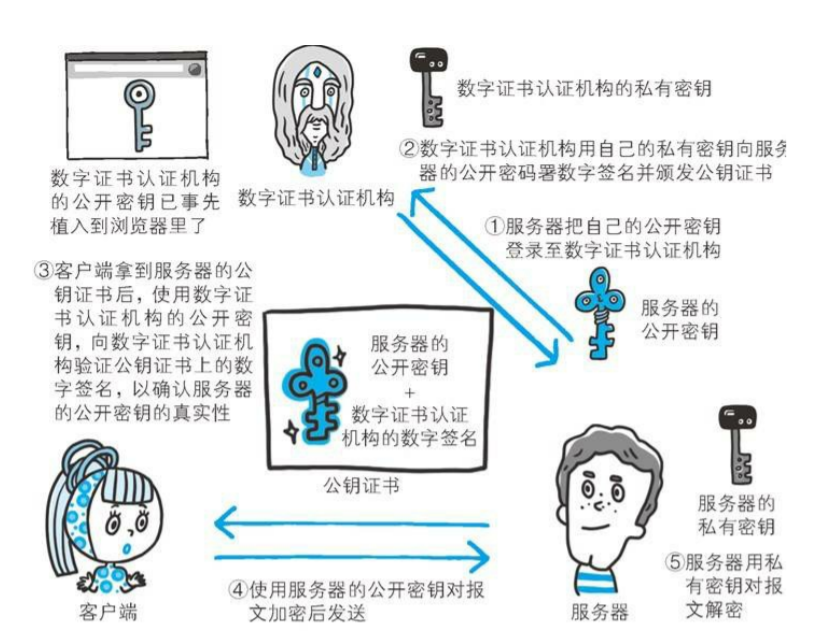

## http与https
**http的缺点：**
- 通信使用明文（不加密），内容可能会被窃听
- 不验证通信方的身份，因此有可能遭遇伪装
- 无法证明报文的完整性，所以有可能已遭篡改

用 SSL建立**安全通信线路**之后，就可以在这条线路上进行HTTP通信了。
**HTTP+ 加密 + 认证 + 完整性保护=HTTPS**，简言之，所谓 HTTPS，其实就是身披SSL协议这层外壳的 HTTP。

**加密方式：**
- 加密和解密同用一个密钥的方式称为共享密钥加密，也被叫做**对称加密**。
- 公开密钥加密使用一对**非对称**的密钥。一把叫做私有密钥，另一把叫做公开密钥。顾名思义，私有密钥不能让其他任何人知道，而公开密钥则可以随意发布，任何人都可以获得。

HTTPS 采用共享密钥加密和公开密钥加密两者并用的混合加密机制。

公开密钥加密方式还是存在一些问题的，那就是无法证明公开密钥本身就是货真价实的公开密钥。为了解决上述问题，可以使用由数字证书认证机构和其相关机关颁发的公开密钥证书。

首先服务器把经过认证机构的公开密钥发送给客户端，客户端对接收到的密钥进行验证，接着使用该密钥把对称加密的密钥加密后发送给服务器，接下来的通信过程都使用对称加密进行。

## cookie和session
> 转载 [cookie和session](https://www.cnblogs.com/ityouknow/p/10856177.html)

HTTP Cookie（也叫 Web Cookie或浏览器 Cookie）是服务器发送到用户浏览器并保存在本地的一小块数据，它会在浏览器下次向同一服务器再发起请求时被携带并发送到服务器上。通常，它用于告知服务端两个请求是否来自同一浏览器，如保持用户的登录状态。Cookie 使基于无状态的 HTTP 协议记录稳定的状态信息成为了可能。

Cookie 主要用于以下三个方面：
- 会话状态管理（如用户登录状态、购物车、游戏分数或其它需要记录的信息）
- 个性化设置（如用户自定义设置、主题等）
- 浏览器行为跟踪（如跟踪分析用户行为等）

Session 代表着服务器和客户端一次会话的过程。Session 对象存储特定用户会话所需的属性及配置信息。这样，当用户在应用程序的 Web 页之间跳转时，存储在 Session 对象中的变量将不会丢失，而是在整个用户会话中一直存在下去。当客户端关闭会话，或者 Session 超时失效时会话结束。

## http状态码含义
> [状态码](https://www.jianshu.com/p/b58025e61b2d)

## 数据库死锁
> [数据库死锁解决](https://blog.csdn.net/qq_16681169/article/details/74784193)
https://www.cnblogs.com/wezheng/p/8366029.html

## spring的aop是什么？如何实现的
> [aop](https://javaguide.cn/system-design/framework/spring/spring-knowledge-and-questions-summary/#%E8%B0%88%E8%B0%88%E8%87%AA%E5%B7%B1%E5%AF%B9%E4%BA%8E-aop-%E7%9A%84%E4%BA%86%E8%A7%A3)

## 面向对象的设计原则
> [设计原则](https://www.cnblogs.com/songgj/p/11297016.html)

## 实例变量可以是GC root 吗
> [什么是被 GC Roots 直接引用的对象](https://zhuanlan.zhihu.com/p/129607250)
[GC Roots 是什么](https://blog.csdn.net/weixin_38007185/article/details/108093716)

## Mybatis # 和 $ 的区别
> [Mybatis中#{}与${}的区别](https://juejin.cn/post/6844904017269620744)

##  mysql
1.MySQL事物有哪些特性?

2.简述一下MySQL事务两阶段提交的过程及故障恢复的过程？

3.MySQL事物隔离级别有哪几种？分别有哪些特性

4.描述一下MVCC的原理

5.InnoDB引擎有哪些特性及原理是什么

6.描述一下InnoDB Buffer  pool的工作机制以及有哪些逻辑链表，其中LRU链表的算法的原理是什么

7.描述一下Index Condition Pushdown(ICP)、Multi-Range Read (MRR)的原理及适用的场景

8.描述一下B树及B+树各自的优缺点？

9.什么情况下MySQL的索引"失效"不可用？

10.举几个你遇到的MySQL中的隐式转换案例

11.描述一下一条update sql语句在MySQL内部执行的过程？

12.MySQL执行sql时一个表只能用到一个索引吗？

13.描述一下MySQL多表关联中Join的算法的原理

14.MySQL常用的SQL调优手段或工具有哪些？

15.MySQL的启动方式有哪些？ 这几种启动方式间有什么关系

16.MySQL为什么需要设置双1才能保证主从数据的一致性？

17.描述一下主从复制模式after_sync与after_commit的原理及优缺点

18.描述一下主从复制的原理及SQL_thread对索引的利用

19.如果线上从库延迟时间太久，如何快速恢复延迟

20.show slave status状态中second behind计算方式

21.主从复制线程均正常（为Yes，也没报错），Master的binlog已到binlog.00080，但slave上看到Master_Log_File却只到binlog.00070，可能的原因有哪些?

22.在主从服务器上，同一个表的表空间文件大小相差特别大，可能原因是什么，怎么解决？

23.描述一下MySQL并行复制的原理及5.6、5.7版本并行复制的区别

24.MySQL GTID工作原理及不支持的操作

25.MHA、MGR、PXC各自的优缺点及使用场景，简述一下MGR的数据同步原理

26.创建表的各种规范

27.MySQL 数据库CPU使用率突然升到100%该如何处理

28.MySQL有哪些行锁，是如何解决幻读的？

29.explain出来的各种item的意义

30.用xtrabackup做mysql物理备份，建议授予哪些权限？

31.监控MySQL的性能，应该主要观察那几个监控项？

32 MySQL 8.0有哪些新特性？

33.项目选型中确定要使用MySQL，你做为MySQL DBA需要准备什么?